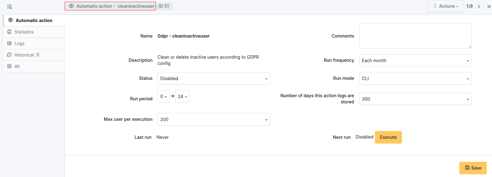

GDPR Tools
==========

Requirements (on-premise)
-------------------------

============ =========== ===========
GLPI Version Minimum PHP Recommended
============ =========== ===========
10.0.x       8.1         8.2
============ =========== ===========

.. note::
   A `basic license <https://services.glpi-network.com/#offers>`__ (or higher) is required. This plugin is also available from the `Cloud <https://glpi-network.cloud/fr/>`__.

Install the plugin
--------------------

-  Go to the marketplace. Download and install the **GDPR Tools** plugin.

.. figure:: images/GDRP-1.png
   :alt: Install the plugin

Configure the plugin
--------------------

-  From **Setup > General > GDPR tools**

Cleaning up inactive users
~~~~~~~~~~~~~~~~~~~~~~~~~~

There are two possible ways of managing inactive users:

-  Clearing the user’s data
-  Deleting the user

Cleaning up user data
~~~~~~~~~~~~~~~~~~~~~

When the plugin is configured in **Clean** mode, the following
actions will be performed:

-  Delete all references to the user from the GLPI history
-  Delete all associated emails
-  Reset all user fields and profiles
-  Move the user to the recycle bin

Delete the user
~~~~~~~~~~~~~~~

When the plugin is configured in “Delete” mode, the following actions
will be performed:

-  Delete all references to the user from the GLPI history
-  Delete all associated emails
-  Delete the user

.. warning::
   Deletion is permanent, the user cannot be recovered

Scope restriction
~~~~~~~~~~~~~~~~~

The automated deletion process can be restricted to the following
scopes:

-  All inactive users
-  Inactive users with no current tickets
-  Inactive users without tickets

Automated action
~~~~~~~~~~~~~~~~

Deletion will take place via a standard GLPI automatic action that can be configured to run as often as you like.

-  Go to **Setup > Automatic actions**, and select the **cleaninactiveuser** action then configure it according to your needs.

FAQ
---

If you have any questions about using the plugin, please consult `our faq <https://faq.teclib.com/04_Plugins/GDRP/>`__