OAuth SSO with Entra
====================

Requirements (on-premise)
-------------------------

============ =========== ===========
GLPI Version Minimum PHP Recommended
============ =========== ===========
10.0.x       8.1         8.2
============ =========== ===========

External authentication configuration
-------------------------------------

The plugin uses GLPI’s **External Authentication** functionality and to
be functional, it needs some initial configuration.

-  Go to **Configuration > Authentication > Other authentication methods**
-  In the **Other authentication transmitted in the HTTP request** section
-  The **Storage fields for the identifier in the HTTP request** field must be defined, usually **HTTP_AUTH_USER**.
-  The **Delete the domain from identifiers of the form identifier@domain** field can be set to **Yes** or **No**.

.. note::
   In the case of authentication via SSO, the option **Delete the domain of identifiers in the form identifier@domain** can be set to **Yes**, which will allow 2 user records to be merged if they are already present in the database (internal or LDAP(S)).

   .. Danger::
      Be careful because this option is subject to identity theft. If your application is open to users other than your own, it is possible that one user could be merged with another.
      For example, **john.doe@mydomain.com** has a namesake but a different email address **john.doe@anotherdomain.com**. By deleting the domain, the 2 records will be merged and the John Does will have the same account.

The users who are going to authenticate themselves will not be known to GLPI, so it is necessary to populate certain fields to create their record in GLPI with a minimum of information.

The fields that can be retrieved by SSO are as follows:

-  Last name : **givenName**
-  First name: **familyName**
-  Email: **email**
-  Email2: **email2**
-  Telephone number: **phone**
-  Mobile: **mobile**
-  Title: **title**
-  Language: **language**

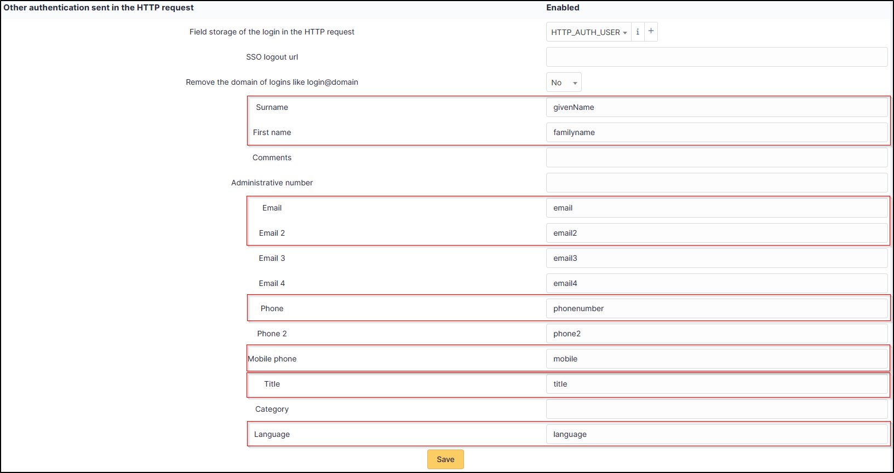

-  Save your configuration

You must also activate the automatic addition of users in GLPI to create them in GLPI at the time of authentication

- In the **Setup > Authentication > Setup** menu
- The **Automatically add users from external authentication sources** field must be changed to **Yes**.

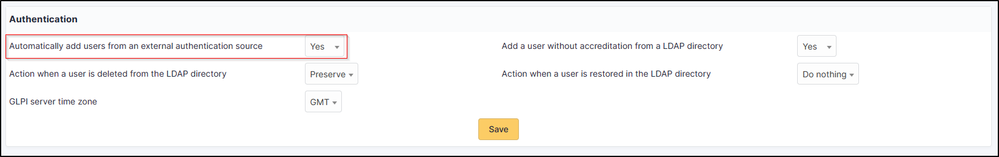

Inscribe your application in Entra
----------------------------------

First, register your application with your Entra Active Directory (Entra AD) client. This will provide you with an application ID for your application and allow it to receive tokens.

-  Connect to the `Entra portal <https://portal.Entra.com/>`__.

-  Choose your Entra AD tenant by selecting your account in the top right corner of the page. Then select the **Change directory** navigation bar, then the desired tenant.
-  Skip this step if you only have one Entra AD tenant under your account or if you have already selected one.

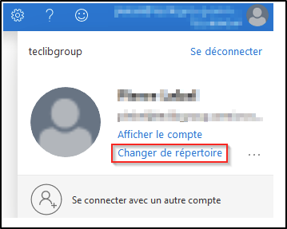

-  In the Entra Portal, search for and select **Entra Active Directory**.

-  From the left-hand **Active Directory** menu, select **Application Registrations**, then **New Registration**.

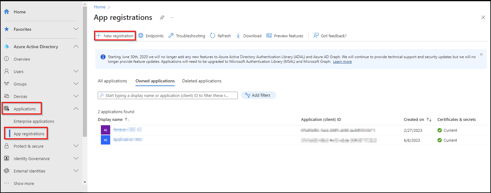

-  Enter **web** in the redirect URI and paste the return URL of your GLPI instance:

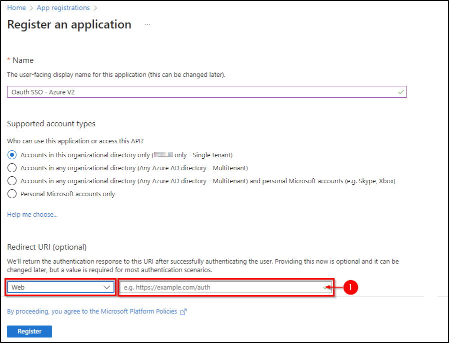

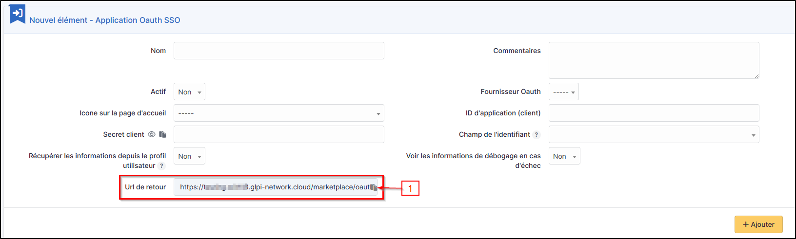

Secret and certificate
~~~~~~~~~~~~~~~~~~~~~~

-  In the **Certificates and secrets** tab, create a new secret that will need to be transferred to your Oauth SSO application on the GLPI side:

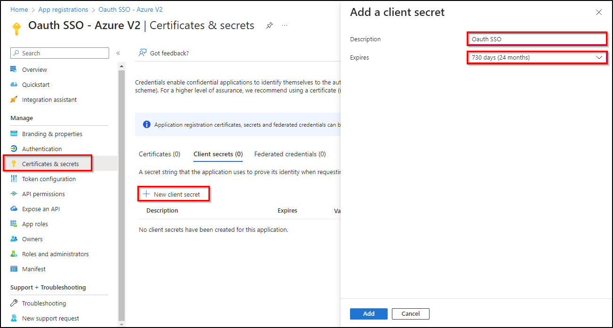

.. Danger::
   When you click on **add**, **the secret will only be available once**. As soon as you leave this page, **the secret will be hidden** and we will no longer be able to access it. Remember to **store it in a safe place** as we will need it later.
   .. figure:: images/oauth-Entra-5bis.png
   :alt:

Claims
~~~~~~

.. Warning::
   If you are using **SSO V2**, an additional step is required. The **claims** on the Entra side **must be entered manually** and should preferably be of type **ID**.

- In the **Token configuration** tab, click on **Add an optional claim** and add the 4 claims below:

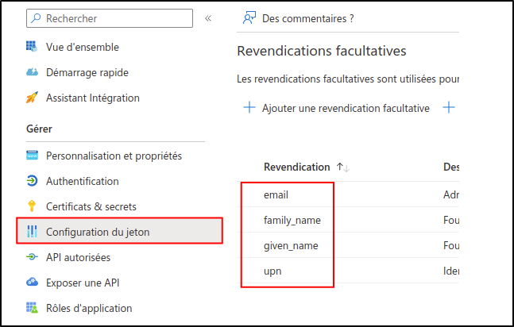

OAuth configuration on GLPI side
--------------------------------

-  Entra AD provides a description with the essential information you need:

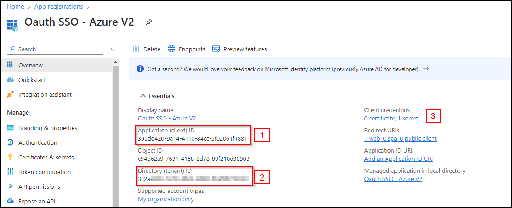

-  Specify an application **name** visible to end users.

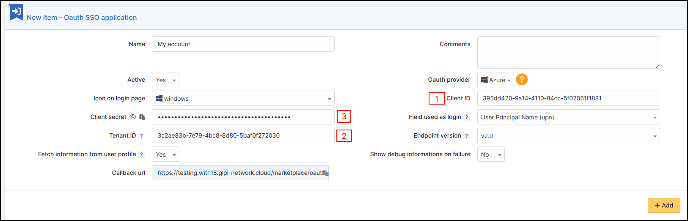

Copy the values from the fields above:

- Application ID,
- The holder ID
- The **value** of the secret copied in the previous step

.. Warning::
   Please check that the **value** of the secret is filled in correctly.If the ID of the secret is copied, your application will fall into error.

API authorisations
''''''''''''''''''

GLPI must be able to read user information in order to use it for connection.

- In **API permissions**, click on the API already present (Microsoft Graph for our example)

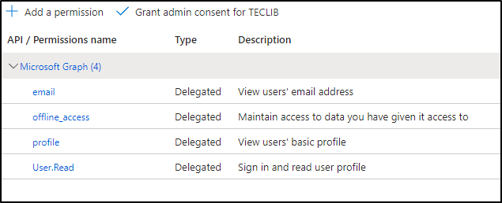

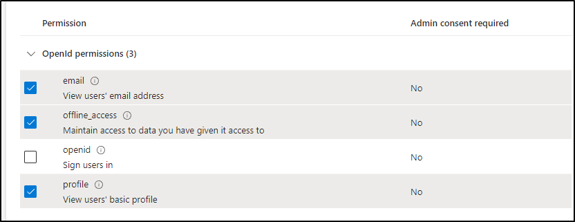

Select :

- email
- offline_access
- profile
- user.read

-  Then remember to save your changes.

Explanation of ID field
'''''''''''''''''''''''

-  3 values are available in this insert:

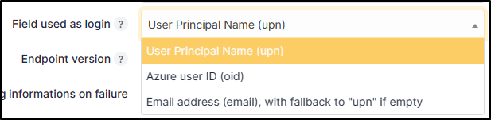

1) **User Principal Name (UPN)**: this option will show the full username of the user logging in (name@mydomain.com for example). If you want only the username to be visible (without the @mydomain.com, see the **XXXXXXXXXX** paragraph).
2) **Entra user ID (OID)**: this option takes the object ID from the Entra AD. This ID will be used for the user login

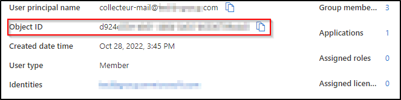

3) **Email address**: This option specifies the user’s email address. This field will be used for the login. If it is empty, the UPN will be used.

If you need to find your application in the Entra portal, select **Application subscriptions**, then **Display all applications**.

Rules for assigning authorisations
----------------------------------

Remember that Oauth SSO authentication allows **only authentication**, in the sense that no user management is carried out following authentication.

In most cases, it will therefore be necessary to establish rules for assigning authorisations to your users (to give them a profile, for example).

-  To do this, go to **Administration > Rules > Rules for assigning authorisations to a user**.

There are no ‘mandatory’ rules, it’s up to you to create the rule(s) that you feel best suit your needs according to your available criteria.

For example, a very simple rule

-  A very simple rule > *I want my users with SSO authentication to obtain the Self-Service profile*.

So I set my criteria and my action :

.. figure:: images/oauhtsso-7.png
   :alt:

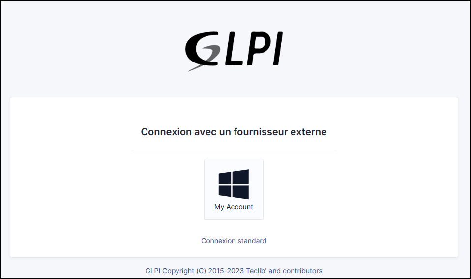

Forcing SSO authentication
--------------------------

Using the Oauth SSO application configuration longlet, you can mask the internal database connection field to **force** the connection with your SSO application

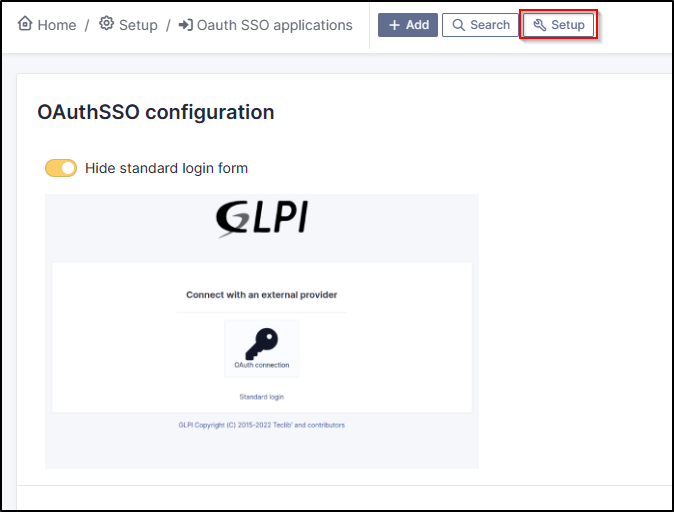

References
----------

`Documentation Oauth SSO client for GLPI <https://services.glpi-network.com/documentation/1731/file/README.md>`__
`Documentation Microsoft "Configure your App Service Or Entra Functions app to use Entra AD
login <https://learn.microsoft.com/en-us/Entra/app-service/configure-authentication-provider-aad?tabs=workforce-tenant>`__

