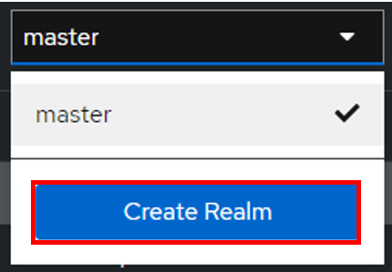
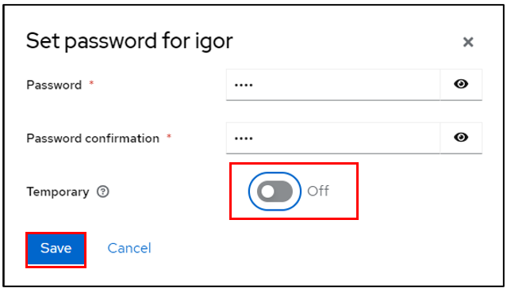
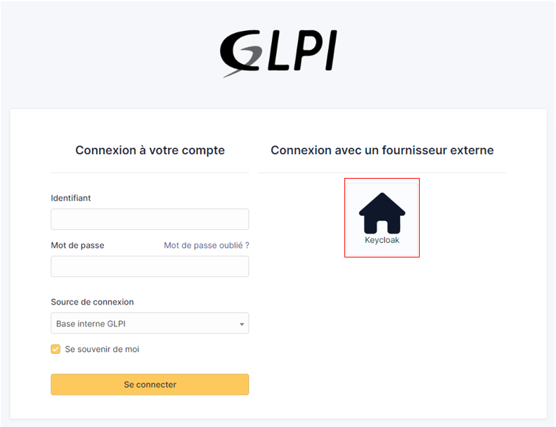
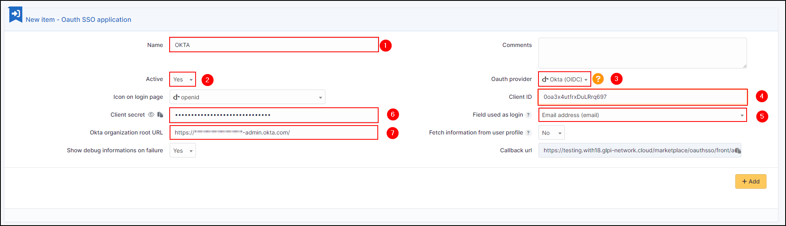

Oauth SSO
==========

Requirements (on-premise)
-------------------------

============ =========== ===========
GLPI Version Minimum PHP Recommended
============ =========== ===========
10.0.x       8.1         8.2
============ =========== ===========

.. note::
   A `basic licence <https://services.glpi-network.com/#offers>`__ (or higher) is required. This plugin is also available from the `Cloud <https://glpi-network.cloud/fr/>`__.

External authentication configuration
-------------------------------------

The plugin uses GLPI’s **External Authentication** functionality and to be functional, it needs some initial configuration.

-  Go to **Configuration > Authentication > Other authentication methods**
-  In the **Other authentication transmitted in the HTTP request** section
-  The **Storage fields for the identifier in the HTTP request** field must be defined, usually **HTTP_AUTH_USER**.
-  The **Delete the domain from identifiers of the form identifier@domain** field can be set to **Yes** or **No**.

.. Note::
   In the case of authentication via SSO, the option **Delete the domain of identifiers in the form identifier@domain** can be set to **Yes**, which will allow 2 user records to be merged if they are already present in the database (internal or LDAP(S)).

   .. warning::
      Be careful because this option is subject to identity theft. If your application is open to users other than your own, it is possible that one user could be merged with another.
      For example, **john.doe@mondomaine.fr** has a namesake but a different email address **john.doe@unautredomaine.fr**. By deleting the domain, the 2 records will be merged and the John Does will have the same account.

The users who are going to authenticate themselves will not be known to GLPI, so it is necessary to populate certain fields to create their record in GLPI with a minimum of information.

The fields that can be retrieved by SSO are as follows:

-  Last name : **givenName**
-  First name: **familyName**
-  Email: **email**
-  Email2: **email2**
-  Telephone number: **phone**
-  Mobile: **mobile**
-  Title: **title**
-  Language: **language**

.. figure:: images/oauhtsso-3.png
   :alt:

-  Save your configuration

You must also activate the automatic addition of users in GLPI to create them in GLPI at the time of authentication
- In the **Configuration> Authentication> Configuration** menu
- The **Automatically add users from external authentication sources** field must be changed to **Yes**

.. figure:: images/oauhtsso-4.png
   :alt:

Entra
-----

Inscribe your application in Entra
~~~~~~~~~~~~~~~~~~~~~~~~~~~~~~~~~~

First, register your application with your Entra Active Directory (Entra AD) client. This will provide you with an application ID for your application and allow it to receive tokens.

-  Connect to the `Entra portal <https://portal.Entra.com/>`__
-  Choose your Entra AD tenant by selecting your account in the top right corner of the page. Then select the **Change directory** navigation bar, then the desired tenant
-  Skip this step if you only have one Entra AD tenant under your account or if you have already selected one

.. figure:: images/oauth-Entra-1.png
   :alt:

-  In the Entra Portal, search for and select **Entra Active Directory**
-  From the left-hand **Active Directory** menu
-  select **Application Registrations**
-  Then **New Registration**.

.. figure:: images/oauth-Entra-2.png
   :alt:

-  Enter **web** in the redirect URI and paste the return URL of your GLPI instance:

.. figure:: images/oauth-Entra-4.png
   :alt:

Secret and certificate
~~~~~~~~~~~~~~~~~~~~~~

-  In the **certificates and secrets** tab, create a new secret that will need to be transferred to your Oauth SSO application on the GLPI side:

.. figure:: images/oauth-Entra-5.png
   :alt:

.. Warning::
   When you click on **add**, **the secret will only be available once**. As soon as you leave this page, **the secret will be hidden** and we will no longer be able to access it. Remember to **store it in a safe place** as we will need it later
   .. figure:: images/oauth-Entra-5bis.png
   :alt:

Claims
~~~~~~

.. Warning::
   If you are using **SSO V2**, an additional step is required. The **claims** on the Entra side **must be entered manually** and should preferably be of type **ID**.

- In the **Token configuration** tab
- Click on **Add an optional claim**
- Add the 4 claims below:

.. figure:: images/oauth-Entra-7.png
   :alt:

API authorisations
~~~~~~~~~~~~~~~~~~

GLPI must be able to read user information in order to use it for connection
- In **API permissions**
- Click on the API already present (Microsoft Graph for our example)

.. figure:: images/oauth-Entra-12.png
   :alt:

Select :

- email
- offline_access
- profile
- user.read

-  Then remember to save your changes.

Setup GLPI
----------

-  Entra AD provides a description with the essential information you need:

.. figure:: images/oauth-Entra-6.png
   :alt:

-  Specify an application **name** visible to end users.

Copy the values from the fields above:

- Application ID
- The holder ID
- The **value** of the secret copied in the previous step

.. Warning::
   Please check that the **value** of the secret is filled in correctly.If the ID of the secret is copied, your application will fall into error.

Explanation of ID field
'''''''''''''''''''''''

-  3 values are available in this insert:

.. figure:: images/oauth-Entra-8.png
   :alt:

1) **User Principal Name (UPN)**: this option will show the full username of the user logging in (nom.prenom@mondomaine.com for example). If you want only the username to be visible (without the @mondomaine.com, see the **XXXXXXXXXX** paragraph).
2) **Entra user ID (OID)**: this option takes the object ID from the Entra AD. This ID will be used for the user login

.. figure:: images/oauth-Entra-9.png
   :alt:

3) **Email address**: This option specifies the user’s email address. This field will be used for the login. If it is empty, the UPN will be used.

If you need to find your application in the Entra portal, select **Application subscriptions**, then **Display all applications**.

Google
------

Creating a project
~~~~~~~~~~~~~~~~~~

-  From your `Google console <https://console.cloud.google.com/>`__ (administrator access is required)
-  Go to your organisation then new project

-  Enter the name of your project
-  Click on **Create**

   .. figure:: images/oauth-sso-google-2.png
      :alt:

-  Return to your organisation,
-  Select your project

   .. figure:: images/oauth-sso-google-3.png
      :alt:

Setup Oauth access
~~~~~~~~~~~~~~~~~~~~~~~

-  From the :ti-menu-2: menu, click on **APIs & Services**
-  Then **OAuth consent screen**

   .. figure:: images/oauth-sso-google-4.png
      :alt:

-  select the type of access that will be granted to the application (internal or external users)
-  Then click on **Create**.

   .. figure:: images/oauth-sso-google-5.png
      :alt:

-  Enter (as a minimum) a name for the application, an email address for application support and the developer’s email address (this information is compulsory).
-  Click on **Save and continue**.

-  In the **Scope** section
-  Click on **Add or remove application fields**
-  Add **auth/userinfo.email** **auth/userinfo.profile** and **openid**

   .. figure:: images/oauth-sso-google-6.png
      :alt:

-  Click on **Update**
-  Then **Save and continue**

ID settings
~~~~~~~~~~~

-  From the **Credentials** menu
-  Click on **Create credentials**
-  Then **Oauth client ID**.

   .. figure:: images/oauth-sso-google-7.png
      :alt:

-  Select the type of application **Web application**
-  Enter an application name
-  In the **Authorized redirect URIs** section
-  Enter the GLPI **Callback URL**

.. note::
   Where can I find my callback URL?
   .. figure:: Pics/oauth-Entra-8.gif
   :alt:

-  Click on **Create**
-  A page appears with the identifier values. **Keep this information** as it will be requested in GLPI.

   .. figure:: images/oauth-sso-google-9.png
      :alt:

Setup GLPI
---------------

-  From **Setup > Oauth SSO applications**
-  Click on **Add**
-  Select **Google** in the **Oauth provider** field
-  Select the icon that will be visible on the home page
-  Enter the **Client ID** (number 1 on the previous screenshot)
-  Enter the **Client secret** (numbered 2 on the previous screenshot)
-  Enter the **field user ID**  [1]_

   .. figure:: images/oauth-sso-google-10.png
      :alt:

-  Click on **Add**

From the home page, the new Oauth SSO login option will be visible:

.. figure:: images/oauth-sso-google-11.png
   :alt:

.. note::
   The first time a user logs on, they will be asked to accept access authorisations for their profile

Keycloak
--------

Create a REALM
~~~~~~~~~~~~~~

-  After installing keycloak, go to the admin console:

http://XXXXXXXXXX:8080/admin or https://XXXXXXXXXX:8080/admin

- Create your **realm** by clicking on **master** at the top left of your screen
- Then **create Realm**
- Give it a name that suits you
- Click on **Create**

Create user
~~~~~~~~~~~

-  Then go to the **Users** tab
-  Then **Create new user** (we’ll use a local user, but you can synchronize your LDAP if necessary)

-  Create your user according to your needs, remembering to check the Email verified box
-  Click on **Create** once you’ve entered your details.

-  Stay in your user file and click on **Credentials**
-  Then **Set pasword**

- Configure the user password, taking care to indicate that the password is not temporary
- Click on save then **Save password**

You can check that your configuration is correct by logging on to the user account console:

http://XXXXXXXXXXX/realms/GLPI/account/#/ or
https://XXXXXXXXXXX/realms/GLPI/account/#/

(Remember to adapt the realm name if you haven’t named it GLPI).

You will then be able to connect to the record of the previously created user or one of your LDAP users.

Create client
~~~~~~~~~~~~~

Now we can register our GLPI application with Keycloak

- Go to **Clients**
- Create client

.. figure:: images/keycloak-7.png
   :alt:

- Give your application a client ID, which you’ll need to pass on to your GLPI Oauth SSO configuration
- Click on next and make sure on the next page that the **standard flow** and **client authentication** options are active
- Click on **Save**

Keep this page active, we’ll come back to it later.

.. figure:: images/keycloak-8.png
   :alt:

Setup GLPI
----------

- Go to GLPI
- In **Setup > Oauth SSO applications click on add** (at the top of your screen)

- Start by retrieving the return URL and pasting it into Keycloak’s **valid redirect URIs** field

.. figure:: images/keycloak-11.png
   :alt:

- Back in GLPI’s Oauth SSO plugin configuration, fill in the required fields:

1. Give your provider a name, which will appear on the login page for
users

2. Activate this plugin so that it is visible and usable on the login
page

3. Choose Keycloak as your Oauth provider

4. Enter the client name set above

5. Retrieve client secret from Keycloak (client, client_name, credentials)

.. figure:: images/keycloak-13.png
   :alt:

6: Enter the discovery URL:
http://mondomaine/realms/monrealms/.well-known/openid-configuration.

- Click on **add**

In the plugin, to see the approval message:

.. figure:: images/keycloak-14.png
   :alt:

Now that configuration is complete, you can test the connection with the user you created earlier, or with your LDAP user.

.. figure:: images/keycloak-17.png
   :alt:

OKTA
----

Create application
~~~~~~~~~~~~~~~~~~

-  First, go to GLPI and download the Oauthsso plugin
-  Navigate to the **Setup > Oauth SSO applications**
-  Click on **Add**

-  Keep this window active and retain the callback URL :

.. figure:: images/okta-3.png
   :alt:

-  In your OKTA interface, go to **Applications**
-  **Create App Integration**

-  Select option **OIDC – OpenID Connect** in the 1st insert and **Web Application** in the second
-  Click on **Next**

.. figure:: images/okta-5.png
   :alt:

-  Enter an application name and check the box **Client credentials**

-  Enter the return URL, retrieved above, in Sign-in redirect URIs.

.. figure:: images/okta-7.png
   :alt:

Assignments
~~~~~~~~~~~

-  In the last box, select the option that suits you best (here we authorize all users present in OKTA)
-  Finally, click on **Save**

.. figure:: images/okta-8.png
   :alt:

Setup GLPI
----------

-  In GLPI, go back to the Oauth SSO plugin configuration window and enter your OKTA tenant information :

1. Give your provider a name, which will appear on the login page.

2. Indicate this as active

3. Enter OKTA as provider Oauth

4. Enter the application ID found in the application previously created in OKTA

5. Specify the ID field to be mapped with OKTA

6. Specify the customer secret available in OKTA in the previously created application

7. Enter the name of your OKTA instance (https://XXXXXXXXX.okta.com), available in the account creation confirmation e-mail.

- Click on **Add**
- In the plugin, you will see the approval message:

.. figure:: images/okta-12.png
   :alt:

Now that the configuration is complete, you can test it with a user.

.. figure:: images/okta-14.png
   :alt:

Rules for assigning authorisations
----------------------------------

Remember that Oauth SSO authentication allows **only authentication**, in the sense that no user management is carried out following authentication.

In most cases, it will therefore be necessary to establish rules for assigning authorisations to your users (to give them a profile, for example).

-  To do this, go to **Administration > Rules > Rules for assigning authorisations to a user**.

There are no ‘mandatory’ rules, it’s up to you to create the rule(s) that you feel best suit your needs according to your available criteria.

For example, a very simple rule

-  A very simple rule -> *I want my users with SSO authentication to obtain the Self-Service profile*.

So I set my criteria and my action :

.. figure:: images/oauhtsso-7.png
   :alt:

.. figure:: images/oauth-Entra-10.png
   :alt:

Forcing SSO authentication
--------------------------

.. Note::
   Using the Oauth SSO application configuration longlet, you can mask the internal database connection field to **force** the connection with your SSO application
   .. figure:: images/oauth-Entra-11.png
   :alt:

References
----------

- `Documentation Oauth SSO client for GLPI <https://services.glpi-network.com/documentation/1731/file/README.md>`__
- `Documentation Microsoft Configure your App Service Or Entra Functions app to use Entra AD login <https://learn.microsoft.com/en-us/Entra/app-service/configure-authentication-provider-aad?tabs=workforce-tenant>`__
- `Documentation OKTA Configure single Sign-On options <https://help.okta.com/oie/en-us/content/topics/apps/apps_overview_of_managing_apps_and_sso.htm>`__
- `Documentation Keycloak Managing OpenID connect Clients <https://www.keycloak.org/docs/latest/server_admin/#_oidc_clients>`__

.. [1]
   the identifier field will be the user’s login. **Google user Id** represents the unique value for each user generated when the user is created.

