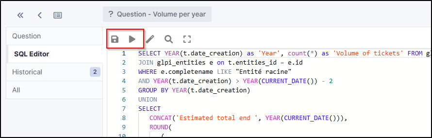

Advanced dashboards
===================

Requirements (on-premise)
-------------------------

============ =========== ===========
GLPI Version Minimum PHP Recommended
============ =========== ===========
10.0.x       8.1         8.2
============ =========== ===========

.. Note::
   A `standard licence <https://services.glpi-network.com/#offers>`__ (or higher) is required. This plugin is also available from the `Cloud <https://glpi-network.cloud/fr/>`__.

Install the plugin
------------------

*  Go to the marketplace. Download and install the “**Advanced dashboard**” plugin.

Setup the plugin
----------------

.. warning::

    This plugin requires **a minimum knowledge of SQL** in order to be able to set certain criteria for the various queries that will appear in the dashboards. It is also recommended that you **know the structure of GLPI tables**.

Create an SQL query
~~~~~~~~~~~~~~~~~~~

The below example gives us the number of tickets on the root entity over the last 2 years:

.. code-block:: sql

    SELECT YEAR(t.date_creation) as 'Year', count(*) as 'Volume of tickets'
    FROM glpi_tickets t
    JOIN glpi_entities e on t.entities_id = e.id
    WHERE e.completename LIKE "Root entity"
        AND YEAR(t.date_creation) > YEAR(CURRENT_DATE()) - 5
    GROUP BY YEAR(t.date_creation)
    UNION
    SELECT
        CONCAT('Estimated total end ', YEAR(CURRENT_DATE())),
        ROUND(
            (
                SELECT count(*)
                FROM glpi_tickets t4
                JOIN glpi_entities e4 on t4.entities_id = e4.id

                WHERE e4.completename LIKE "Entité racine" (root entity)
                    AND YEAR(t4.date_creation) = YEAR(CURRENT_DATE()) - 1
            ) *
            (
                (
                    SELECT count(*)
                    FROM glpi_tickets t3
                    JOIN glpi_entities e3 on t3.entities_id = e3.id
                    WHERE e3.completename LIKE "Root entity"
                        AND YEAR(t3.date_creation) = YEAR(CURRENT_DATE())
                )
                /
                (
                    SELECT count(*)
                    FROM glpi_tickets t2
                    JOIN glpi_entities e2 on t2.entities_id = e2.id
                    WHERE e2.completename LIKE "Root entity"
                        AND YEAR(t2.date_creation) = (YEAR(CURRENT_DATE()) - 1)
                        AND (
                            MONTH(t2.date_creation) < MONTH(CURRENT_DATE())
                            OR MONTH(t2.date_creation) = MONTH(CURRENT_DATE()) AND DAY(t2.date_creation) <= DAY(CURRENT_DATE())
                        )

                )
            )
        )

Setting query-related parameters
~~~~~~~~~~~~~~~~~~~~~~~~~~~~~~~~

* From **tools** > **SQL for dashboards**, click on **add**
* Name your query (the one that will be visible from the dashboards) and identify it as **active**.
* In the SQL Editor tab, paste the above query, taking care to change the name of the entity if you have changed it.
* Click on the floppy icon to save the query and then on play icon to run the query.

An insert at the bottom will display the result of the query:

* In the **set up fields** tab, define the label, the number and the main label (optional, this is the name your table will have). In our case, *the label will be "year"*, *the number will be "number of tickets"* and the *main label will be ""number of tickets per year"*.
* Select the type of graph (this is for information purposes only, so that you can preview your table; you will be asked to select the type of graph you want to appear in the tile later),
* You can limit the amount of data to be displayed.
* Then click on **Save fields and preview**.

Dashboard settings
~~~~~~~~~~~~~~~~~~

* From **Assistance** > **Dashboard**, select the dashboard that is to receive the new tile
* Click on edit icon
* Add a new tile with plus icon
* Select the query you have just created
* Choose a colour for your tile

* You will then be asked to select the chart type
* Some dashboards may ask you to use colours and display values and labels.

* Your tile is now ready

