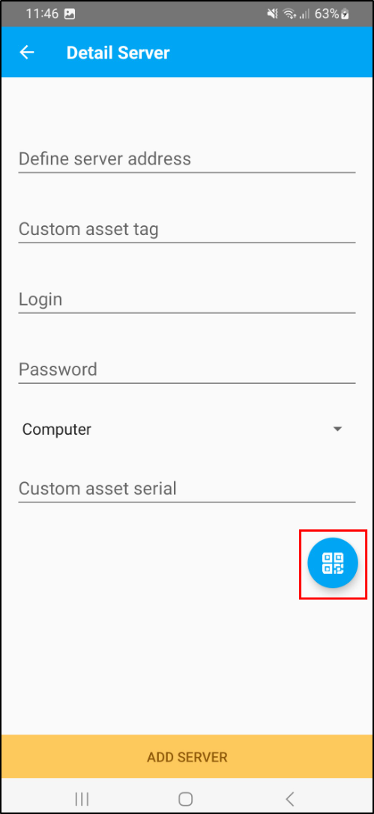

Agent Config
============

Requirements (on-premise)
-------------------------

============ =========== ===========
GLPI Version Minimum PHP Recommended
============ =========== ===========
10.0.x       8.1         8.2
============ =========== ===========

.. include:: ../tabs/basic_subscription.rst

Install the plugin
------------------

-  Go to the marketplace. Download and install the “`Agent config`”   plugin.

.. figure:: images/install_plugin.png
   :alt: Install the plugin
   :scale: 100%

Setting up the plugin
---------------------

In **Setup** > **General** > **GLPI Agent Contiguration**, select the options you want :

* By default, the URL of the inventory is indicated
* To secure your instance and limit feedback from your mobile devices, you can enter a **login** and **password** for each mobile device to be inventoried
* You can use a **tag entity** (choose **Yes** and indicate your **tag** if needed)
* Choose the **asset type** by default (computers or phones, this information indicates the type of device by default, but can be modified individually from each device)

* Display **QR Code** (on central page)
* Display **Deeplink** (on central page)
* Manage **automatic inventory and frequency** for android

Central page
~~~~~~~~~~~~

* On **Home** > **GLPI Agent Config** use Deep link or QR Code to preconfigure the agent :

.. tip:: When a factory reset is performed on the phone, the serial number automatically generated by the agent changes
   You can use **Deep Link** / **QR Code** to configure the agent with the serial number previously generated and inventoried in GLPI.

Setup mobile device
-------------------

* Download the **Agent GLPI** on the Google Store

With Deep Link
~~~~~~~~~~~~~~~

* Go to GLPI with your device web browser
* Click on the DeepLink

* App will open and pre-fill the fields for adding a server
* Then click on **Add server**

With QR Code
~~~~~~~~~~~~

* Open **GLPI Agent** on your device
* Go to **Advanced Settings** > **Open List Server** > **Add servers**
* Click on **QR Code** button
* Flash QR Code

* App pre-fill the fields for adding a server
* Then add server.

Category Global
~~~~~~~~~~~~~~~

* In mobile device, menu > advanced settings > Category global, select/unselect the informations you want to inventory

Contributing
------------

* Open a ticket for each bug/feature so it can be discussed
* Follow `development guidelines <http://glpi-developer-documentation.readthedocs.io/en/latest/plugins/index.html>`_
* Refer to `GitFlow <http://git-flow.readthedocs.io/>`_ process for branching
* Work on a new branch on your own fork
* Open a PR that will be reviewed by a developer
