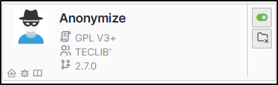
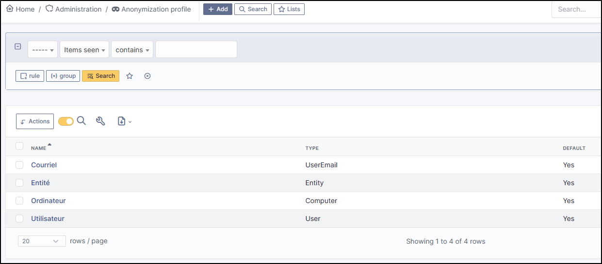
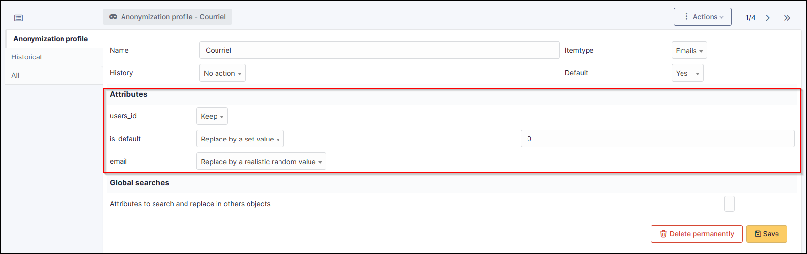
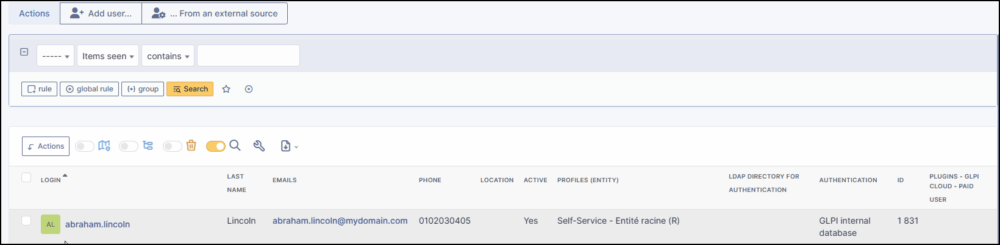

Anonymize
=========

Requirements (on-premise)
-------------------------

============ =========== ===========
GLPI Version Minimum PHP Recommanded
============ =========== ===========
10.0.x       8.1         8.2
============ =========== ===========

Install the plugin
------------------

!!! Info “information” A `basic
licence <https://services.glpi-network.com/#offers>`__ (or higher) is
required. This plugin is also available from the
`Cloud <https://glpi-network.cloud/fr/>`__.

-  Go to the marketplace. Download and install the “**Anonymize**”
   plugin.

   Alt text

Choice of profile
-----------------

Anonymisation works by profile. There are 4 profiles already created.
When you select a profile, a certain amount of data is already set. They
can, of course, be modified.

-  Go to :ti-shield-check:administration >
   :ti-spy:**``anonymization profile``** and select the profile best
   suited to your needs:

The 4 profiles you will find are :

-  Email,
-  Entity,
-  Computer
-  User profile

   Alt text

Anonymisable data per profile (predefined)
------------------------------------------

Each profile has an element assigned to it. You will need to define the
value of each attribute that it will be able to anonymise (or not)

   Alt text

Email
~~~~~

??? info “List of attributes” - **``users_id``** - **``is_default``** -
**``email``**

Entity
~~~~~~

??? info “List of attributes” - **``name``** - **``entities_id``** -
**``comment``** - **``level``** - **``sons_cache``** -
**``ancestors_cache``** - **``address``** - **``postcode``** -
**``town``** - **``state``** - **``country``** - **``website``** -
**``phonenumber``** - **``fax``** - **``email``** - **``admin_email``**
- **``admin_email_name``** - **``from_email``** -
**``from_email_name``** - **``noreply_email``** -
**``noreply_email_name``** - **``replyto_email``** -
**``replyto_email_name``** - **``notification_subject_tag``** -
**``ldap_dn``** - **``tag``** - **``authldaps_id``** -
**``mail_domain``** - **``entity_ldapfilter``** -
**``mailing_signature``** - **``cartridges_alert_repeat``** -
**``consumables_alert_repeat``** - **``use_licenses_alert``** -
**``send_licenses_alert_before_delay``** -
**``use_certificates_alert``** -
**``send_certificates_alert_before_delay``** -
**``certificates_alert_repeat_interval``** - **``use_contracts_alert``**
- **``send_contracts_alert_before_delay``** - **``use_infocoms_alert``**
- **``send_infocoms_alert_before_delay``** -
**``use_reservations_alert``** - **``use_domains_alert``** -
**``send_domains_alert_close_expiries_delay``** -
**``send_domains_alert_expired_delay``** - **``autoclose_delay``** -
**``autopurge_delay``** - **``notclosed_delay``** -
**``calendars_strategy``** - **``calendars_id``** -
**``auto_assign_mode``** - **``tickettype``** - **``max_closedate``** -
**``inquest_config``** - **``inquest_rate``** - **``inquest_delay``** -
**``inquest_URL``** - **``autofill_warranty_date``** -
**``autofill_use_date``** - **``autofill_buy_date``** -
**``autofill_delivery_date``** - **``autofill_order_date``** -
**``tickettemplates_strategy``** - **``tickettemplates_id``** -
**``changetemplates_strategy``** - **``changetemplates_id``** -
**``problemtemplates_strategy``** - **``problemtemplates_id``** -
**``entities_strategy_software``** - **``entities_id_software``** -
**``default_contract_alert``** - **``default_infocom_alert``** -
**``default_cartridges_alarm_threshold``** -
**``default_consumables_alarm_threshold``** - **``delay_send_emails``**
- **``is_notif_enable_default``** - **``inquest_duration``** -
**``date_mod``** - **``date_creation``** -
**``autofill_decommission_date``** - **``suppliers_as_private``** -
**``anonymize_support_agents``** - **``display_users_initials``** -
**``contracts_strategy_default``** - **``contracts_id_default``** -
**``enable_custom_css``** - **``custom_css_code``** - **``latitude``** -
**``longitude``** - **``altitude``** - **``transfers_strategy``** -
**``transfers_id``** - **``agent_base_url``**

Computer
~~~~~~~~

??? info “List of attributes” - **``entities_id``** - **``name``** -
**``serial``** - **``otherserial``** - **``contact``** -
**``contact_num``** - **``users_id_tech``** - **``groups_id_tech``** -
**``comment``** - **``date_mod``** - **``autoupdatesystems_id``** -
**``locations_id``** - **``networks_id``** - **``computermodels_id``** -
**``computertypes_id``** - **``template_name``** -
**``manufacturers_id``** - **``users_id``** - **``groups_id``** -
**``states_id``** - **``ticket_tco``** - **``uuid``** -
**``date_creation``** - **``last_inventory_update``** -
**``last_boot``**

User
~~~~

??? info “List of attributes” - **``name``** - **``password``** -
**``password_last_update``** - **``phone``** - **``phone2``** -
**``mobile``** - **``realname``** - **``firstname``** -
**``locations_id``** - **``language``** - **``use_mode``** -
**``is_active``** - **``comment``** - **``auths_id``** -
**``authtype``** - **``last_login``** - **``date_mod``** -
**``date_sync``** - **``profiles_id``** - **``entities_id``** -
**``usertitles_id``** - **``usercategories_id``** -
**``password_forget_token``** - **``password_forget_token_date``** -
**``user_dn``** - **``personal_token``** - **``personal_token_date``** -
**``api_token``** - **``api_token_date``** - **``cookie_token``** -
**``cookie_token_date``** - **``isd_ldap``** - **``picture``** -
**``begin_date``** - **``end_date``** - **``page_layout``** -
**``fold_menu``** - **``fold_search``** - **``savedsearches_pinned``** -
**``timeline_order``** - **``itil_layout``** - **``richtext_layout``** -
**``date_creation``** - **``groups_id``** - **``users_id_supervisor``**
- **``timezone``** - **``default_central_tab``** - **``nickname``** -
**``timeline_action_btn_layout``** - **``timeline_date_format``** -
**``use_flat_dropdowntree_on_search_result``**

Application strategy
--------------------

Several strategies are available for each element field (e.g. ‘Last
name’, ‘First name’, ‘Serial number’, ‘Location’, ‘Status’, etc.):

-  Keep the value,
-  delete the value,
-  replace with a fixed value,
-  replace with a standard random value,
-  replace with a realistic random value.

History
-------

Each profile allows you to choose the treatment to be applied to the
history(1) of items: { .annotate }

1. History tab for the item in question

-  Do nothing,
-  clean up values,
-  clean up recent values and delete the rest,
-  delete.

Global search
-------------

You can ask GLPI to anoymise an attribute in the whole database and not
only in the type of element you are in. The option
**``attributes to search and replace in others objects``** is at the
very bottom of your profile.

   Alt text

!!! Info “Information” You cannot change any values other than those
linked to the type of element you are in. For example, you will be able
to **``modify all email addresses``** in the database via the
**``Email``** profile, but you will not be able to modify all user phone
number via this profile.

Applying the profile
--------------------

Once you have completed your profile, you need to apply it. It can be
applied using 2 methods:

-  massive action via the web interface (*cloud and on-premise*)
-  in cli (*only on-premise*)

Mass action (Cloud and on-premise)
~~~~~~~~~~~~~~~~~~~~~~~~~~~~~~~~~~

In our example, we will be anonymising **``user data``**.

-  Go to :ti-shield-check:**``administration``** >
   :ti-user:**``users``**. Select the user(s) you wish to anonymise.
   Click on :ti-corner-left-down:**``actions``** then
   **``anonymise selected items``**.

   Alt text

!!! Success "To be adapted If your profile concerns entities, go to
:ti-shield-check:**``administration``** > :ti-stack:**``entities``** and
repeat the operation for the entities concerned. Do the same for
computers, email, etc.

Via CLI (on-premise only)
~~~~~~~~~~~~~~~~~~~~~~~~~

-  Go to your GLPI folder (**/var/www/glpi** or other depending on your
   configuration):

-  Run all default profiles on all objects:

   -  ``php bin/console glpi:plugin:anonymize --all``

-  Run profile X on all objects / on one object:

   -  ``php bin/console glpi:plugin:anonymize --profile=X``
   -  ``php bin/console glpi:plugin:anonymize --profile=X --item-id=X``

-  Run default profile type X on all objects / on one object :

   -  ``php bin/console glpi:plugin:anonymize --itemtype=X``
   -  ``php bin/console glpi:plugin:anonymize --itemtype=X --item-id=X``

Creating a profile
------------------

You can create a profile to anonymise other data than that mentioned
above.

-  Go to :ti-shield-check:**``administration``** >
   :ti-spy:**``anonymisation profile``**.
-  Click on :ti-plus:**``add``**.
-  Name your profile
-  Choose from the list of **“element types”** (agent, domain, etc.)
-  Select the treatment of the **``history``**.
-  Set the parameters for each field
-  Click on :ti-plus:**``add``**

!!! Information" tip Remember to refer to the [profile application]
section(../plugins/Anonymize.co.uk.md/#profile-application) to apply
your changes.

Other anonymisable data (profile creation)
------------------------------------------

Agents
~~~~~~

??? info “List of attributes” - **``deviceid``** - **``entities_id``** -
**``name``** - **``agenttypes_id``** - **``last_contact``** -
**``version``** - **``locked``** - **``itemtype``** - **``items_id``** -
**``useragent``** - **``tag``** - **``port``** -
**``threads_networkdiscovery``** - **``threads_networkinventory``** -
**``timeout_networkdiscovery``** - **``timeout_networkinventory``** -
**``remote_addr``** - **``use_module_wake_on_lan``** -
**``use_module_computer_inventory``** -
**``use_module_esx_remote_inventory``** -
**``use_module_remote_inventory``** -
**``use_module_network_inventory``** -
**``use_module_network_discovery``** -
**``use_module_package_deployment``** - **``use_module_collect_data``**

Appliances
~~~~~~~~~~

??? info “List of attributes” - **``entities_id``** - **``Garder``** -
**``name``** - **``appliancetypes_id``** - **``comment``** -
**``locations_id``** - **``manufacturers_id``** -
**``applianceenvironments_id``** - **``users_id``** -
**``users_id_tech``** - **``groups_id``** - **``groups_id_tech``** -
**``date_mod``** - **``date_creation``** - **``states_id``** -
**``externalidentifier``** - **``serial``** - **``otherserial``** -
**``is_helpdesk_visible``** - **``pictures``** - **``contact``** -
**``contact_num``**

Budgets
~~~~~~~

??? info “List of attributes” - **``name``** - **``entities_id``** -
**``comment``** - **``begin_date``** - **``end_date``** - **``value``**
- **``template_name``** - **``date_mod``** - **``date_creation``** -
**``locations_id``** - **``budgettypes_id``**

Cables
~~~~~~

??? info “List of attributes” - **``name``** - **``entities_id``** -
**``itemtype_endpoint_a``** - **``itemtype_endpoint_b``** -
**``items_id_endpoint_a``** - **``items_id_endpoint_b``** -
**``socketmodels_id_endpoint_a``** - **``socketmodels_id_endpoint_b``**
- **``sockets_id_endpoint_a``** - **``sockets_id_endpoint_b``** -
**``cablestrands_id``** - **``color``** - **``otherserial``** -
**``states_id``** - **``users_id_tech``** - **``cabletypes_id``** -
**``comment``** - **``date_mod``** - **``date_creation``**

Changes
~~~~~~~

??? info “List of attributes” - **``name``** - **``entities_id``** -
**``status``** - **``content``** - **``date_mod``** - **``date``** -
**``solvedate``** - **``closedate``** - **``time_to_resolve``** -
**``users_id_recipient``** - **``users_id_lastupdater``** -
**``urgency``** - **``impact``** - **``priority``** -
**``itilcategories_id``** - **``impactcontent``** -
**``controlistcontent``** - **``rolloutplancontent``** -
**``backoutplancontent``** - **``checklistcontent``** -
**``global_validation``** - **``validation_percent``** -
**``actiontime``** - **``begin_waiting_date``** -
**``waiting_duration``** - **``close_delay_stat``** -
**``solve_delay_stat``** - **``date_creation``** - **``locations_id``**

Certificates
~~~~~~~~~~~~

??? info “List of attributes” - **``name``** - **``serial``** -
**``otherserial``** - **``entities_id``** - **``comment``** -
**``template_name``** - **``certificatetypes_id``** - **``dns_name``** -
**``dns_suffix``** - **``users_id_tech``** - **``groups_id_tech``** -
**``locations_id``** - **``manufacturers_id``** - **``contact``** -
**``contact_num``** - **``users_id``** - **``groups_id``** -
**``is_autosign``** - **``date_expiration``** - **``states_id``** -
**``command``** - **``certificate_request``** - **``certificate_item``**
- **``date_creation``** - **``date_mod``**

Clusters
~~~~~~~~

??? info “List of attributes” - **``entities_id``** - **``name``** -
**``uuid``** - **``version``** - **``users_id_tech``** -
**``groups_id_tech``** - **``states_id``** - **``comment``** -
**``clustertypes_id``** - **``autoupdatesystems_id``** -
**``date_mod``** - **``date_creation``**

Contacts
~~~~~~~~

??? info “List of attributes” - **``name``** - **``firstname``** -
**``phone``** - **``phone2``** - **``mobile``** - **``fax``** -
**``email``** - **``contacttypes_id``** - **``comment``** -
**``usertitles_id``** - **``address``** - **``postcode``** -
**``town``** - **``state``** - **``country``** - **``date_mod``** -
**``date_creation``** - **``pictures``**

Databbaes
~~~~~~~~~

??? info “List of attributes” - **``entities_id``** - **``name``** -
**``size``** - **``databaseinstances_id``** - **``is_onbackup``** -
**``is_active``** - **``date_creation``** - **``date_mod``** -
**``date_update``** - **``date_lastbackup``**

Data centers
~~~~~~~~~~~~

??? info “List of attributes” - **``name``** - **``entities_id``** -
**``locations_id``** - **``date_mod``** - **``date_creation``** -
**``pictures``**

Server rooms
~~~~~~~~~~~~

??? info “List of attributes” - **``name``** - **``entities_id``** -
**``locations_id``** - **``vis_cols``** - **``vis_rows``** -
**``blueprint``** - **``datacenters_id``** - **``date_mod``** -
**``date_creation``**

Documents
~~~~~~~~~

??? info “List of attributes” - **``name``** - **``filename``** -
**``filepath``** - **``documentcategories_id``** - **``mime``** -
**``date_mod``** - **``comment``** - **``link``** - **``users_id``** -
**``tickets_id``** - **``sha1sum``** - **``is_blacklisted``** -
**``tag``** - **``date_creation``**

Domains
~~~~~~~

??? info “List of attributes” - **``name``** - **``entities_id``** -
**``domaintypes_id``** - **``date_expiration``** -
**``date_domaincreation``** - **``users_id_tech``** -
**``groups_id_tech``** - **``comment``** - **``template_name``** -
**``is_active``** - **``date_mod``** - **``date_creation``**

Enclosures
~~~~~~~~~~

??? info “List of attributes” - **``name``** - **``entities_id``** -
**``locations_id``** - **``serial``** - **``otherserial``** -
**``enclosuremodels_id``** - **``users_id_tech``** -
**``groups_id_tech``** - **``template_name``** - **``orientation``** -
**``power_supplies``** - **``states_id``** - **``comment``** -
**``manufacturers_id``** - **``date_mod``** - **``date_creation``**

Groups
~~~~~~

??? info “List of attributes” - **``entities_id``** - **``name``** -
**``comment``** - **``ldap_field``** - **``ldap_value``** -
**``ldap_group_dn``** - **``date_mod``** - **``groups_id``** -
**``level``** - **``ancestors_cache``** - **``sons_cache``** -
**``is_requester``** - **``is_watcher``** - **``is_assign``** -
**``is_task``** - **``is_notify``** - **``is_itemgroup``** -
**``is_usergroup``** - **``is_manager``** - **``date_creation``**

Knowledge base
~~~~~~~~~~~~~~

??? info “List of attributes” - **``name``** - **``answer``** -
**``is_faq``** - **``users_id``** - **``view``** - **``date_creation``**
- **``date_mod``** - **``begin_date``** - **``end_date``**

ITIL Categories
~~~~~~~~~~~~~~~

??? info “List of attributes” - **``entities_id``** -
**``itilcategories_id``** - **``name``** - **``comment``** -
**``level``** - **``knowbaseitemcategories_id``** - **``users_id``** -
**``groups_id``** - **``code``** - **``ancestors_cache``** -
**``sons_cache``** - **``is_helpdeskvisible``** -
**``tickettemplates_id_incident``** - **``tickettemplates_id_demand``**
- **``changetemplates_id``** - **``problemtemplates_id``** -
**``is_incident``** - **``is_request``** - **``is_problem``** -
**``is_change``** - **``date_mod``** - **``date_creation``**

Followups
~~~~~~~~~

??? info “List of attributes” - **``itemtype``** - **``items_id``** -
**``date``** - **``users_id``** - **``users_id_editor``** -
**``content``** - **``is_private``** - **``requesttypes_id``** -
**``date_mod``** - **``date_creation``** - **``timeline_position``** -
**``sourceitems_id``** - **``sourceof_items_id``**

Followups templates
~~~~~~~~~~~~~~~~~~~

??? info “List of attributes” - **``date_creation``** - **``date_mod``**
- **``entities_id``** - **``name``** - **``content``** -
**``requesttypes_id``** - **``is_private``** - **``comment``**

Solutions
~~~~~~~~~

??? info “List of attributes” - **``itemtype``** - **``Keep``** -
**``items_id``** - **``solutiontypes_id``** - **``solutiontype_name``**
- **``content``** - **``date_creation``** - **``date_mod``** -
**``date_approval``** - **``users_id``** - **``user_name``** -
**``users_id_editor``** - **``users_id_approval``** -
**``user_name_approval``** - **``status``** - **``itilfollowups_id``**

Lines
~~~~~

??? info “List of attributes” - **``name``** - **``entities_id``** -
**``caller_num``** - **``caller_name``** - **``users_id``** -
**``groups_id``** - **``lineoperators_id``** - **``locations_id``** -
**``states_id``** - **``linetypes_id``** - **``date_creation``** -
**``date_mod``** - **``comment``**

Locations
~~~~~~~~~

??? info “List of attributes” - **``entities_id``** - **``name``** -
**``locations_id``** - **``comment``** - **``level``** -
**``ancestors_cache``** - **``sons_cache``** - **``address``** -
**``postcode``** - **``town``** - **``state``** - **``country``** -
**``building``** - **``room``** - **``latitude``** - **``longitude``** -
**``altitude``** - **``date_mod``** - **``date_creation``**

Monitors
~~~~~~~~

??? info “List of attributes” - **``entities_id``** - **``name``** -
**``date_mod``** - **``contact``** - **``contact_num``** -
**``users_id_tech``** - **``groups_id_tech``** - **``comment``** -
**``serial``** - **``otherserial``** - **``size``** - **``have_micro``**
- **``have_speaker``** - **``have_subd``** - **``have_bnc``** -
**``have_dvi``** - **``have_pivot``** - **``have_hdmi``** -
**``have_displayport``** - **``locations_id``** -
**``monitortypes_id``** - **``monitormodels_id``** -
**``manufacturers_id``** - **``is_global``** - **``template_name``** -
**``users_id``** - **``groups_id``** - **``states_id``** -
**``ticket_tco``** - **``autoupdatesystems_id``** - **``uuid``** -
**``date_creation``**

Network devices
~~~~~~~~~~~~~~~

??? info “List of attributes” - **``entities_id``** - **``name``** -
**``ram``** - **``serial``** - **``otherserial``** - **``contact``** -
**``contact_num``** - **``users_id_tech``** - **``groups_id_tech``** -
**``date_mod``** - **``comment``** - **``locations_id``** -
**``networks_id``** - **``networkequipmenttypes_id``** -
**``networkequipmentmodels_id``** - **``manufacturers_id``** -
**``template_name``** - **``users_id``** - **``groups_id``** -
**``states_id``** - **``ticket_tco``** - **``uuid``** -
**``date_creation``** - **``autoupdatesystems_id``** - **``sysdescr``**
- **``cpu``** - **``uptime``** - **``last_inventory_update``** -
**``snmpcredentials_id``**

PDUs
~~~~

??? info “List of attributes” - **``name``** - **``entities_id``** -
**``locations_id``** - **``serial``** - **``otherserial``** -
**``pdumodels_id``** - **``users_id_tech``** - **``groups_id_tech``** -
**``template_name``** - **``states_id``** - **``comment``** -
**``manufacturers_id``** - **``pdutypes_id``** - **``date_mod``** -
**``date_creation``**

Projects
~~~~~~~~

??? info “List of attributes” - **``name``** - **``code``** -
**``priority``** - **``entities_id``** - **``projects_id``** -
**``projectstates_id``** - **``projecttypes_id``** - **``date``** -
**``date_mod``** - **``users_id``** - **``groups_id``** -
**``plan_start_date``** - **``plan_end_date``** -
**``real_start_date``** - **``real_end_date``** - **``percent_done``** -
**``auto_percent_done``** - **``show_on_global_gantt``** -
**``content``** - **``comment``** - **``date_creation``** -
**``projecttemplates_id``** - **``template_name``**

Projects tasks
~~~~~~~~~~~~~~

??? info “List of attributes” - **``uuid``** - **``name``** -
**``content``** - **``comment``** - **``entities_id``** -
**``projects_id``** - **``projecttasks_id``** - **``date_creation``** -
**``date_mod``** - **``plan_start_date``** - **``plan_end_date``** -
**``real_start_date``** - **``real_end_date``** -
**``planned_duration``** - **``effective_duration``** -
**``projectstates_id``** - **``projecttasktypes_id``** -
**``users_id``** - **``percent_done``** - **``auto_percent_done``** -
**``is_milestone``** - **``projecttasktemplates_id``** -
**``template_name``**

Devices
~~~~~~~

??? info “List of attributes” - **``entities_id``** - **``name``** -
**``date_mod``** - **``contact``** - **``contact_num``** -
**``users_id_tech``** - **``groups_id_tech``** - **``comment``** -
**``serial``** - **``otherserial``** - **``locations_id``** -
**``peripheraltypes_id``** - **``peripheralmodels_id``** - **``brand``**
- **``manufacturers_id``** - **``is_global``** - **``template_name``** -
**``users_id``** - **``groups_id``** - **``states_id``** -
**``ticket_tco``** - **``autoupdatesystems_id``** - **``uuid``** -
**``date_creation``**

Phones
~~~~~~

??? info “List of attributes” - **``entities_id``** - **``name``** -
**``date_mod``** - **``contact``** - **``contact_num``** -
**``users_id_tech``** - **``groups_id_tech``** - **``comment``** -
**``serial``** - **``otherserial``** - **``locations_id``** -
**``phonetypes_id``** - **``phonemodels_id``** - **``brand``** -
**``phonepowersupplies_id``** - **``number_line``** -
**``have_headset``** - **``have_hp``** - **``manufacturers_id``** -
**``is_global``** - **``template_name``** - **``users_id``** -
**``groups_id``** - **``states_id``** - **``ticket_tco``** -
**``autoupdatesystems_id``** - **``uuid``** - **``date_creation``** -
**``last_inventory_update``**

Printers
~~~~~~~~

??? info “List of attributes” - **``entities_id``** - **``name``** -
**``date_mod``** - **``contact``** - **``contact_num``** -
**``users_id_tech``** - **``groups_id_tech``** - **``serial``** -
**``otherserial``** - **``have_serial``** - **``have_parallel``** -
**``have_usb``** - **``have_wifi``** - **``have_ethernet``** -
**``comment``** - **``memory_size``** - **``locations_id``** -
**``networks_id``** - **``printertypes_id``** - **``printermodels_id``**
- **``manufacturers_id``** - **``is_global``** - **``template_name``** -
**``init_pages_counter``** - **``last_pages_counter``** -
**``users_id``** - **``groups_id``** - **``states_id``** -
**``ticket_tco``** - **``uuid``** - **``date_creation``** -
**``sysdescr``** - **``last_inventory_update``** -
**``snmpcredentials_id``** - **``autoupdatesystems_id``**

Problems
~~~~~~~~

??? info “List of attributes” - **``name``** - **``entities_id``** -
**``status``** - **``content``** - **``date_mod``** - **``date``** -
**``solvedate``** - **``closedate``** - **``time_to_resolve``** -
**``users_id_recipient``** - **``users_id_lastupdater``** -
**``urgency``** - **``impact``** - **``priority``** -
**``itilcategories_id``** - **``impactcontent``** - **``causecontent``**
- **``symptomcontent``** - **``actiontime``** -
**``begin_waiting_date``** - **``waiting_duration``** -
**``close_delay_stat``** - **``solve_delay_stat``** -
**``date_creation``** - **``locations_id``**

Racks
~~~~~

??? info “List of attributes” - **``name``** - **``comment``** -
**``entities_id``** - **``locations_id``** - **``serial``** -
**``otherserial``** - **``rackmodels_id``** - **``manufacturers_id``** -
**``racktypes_id``** - **``states_id``** - **``users_id_tech``** -
**``groups_id_tech``** - **``width``** - **``height``** - **``depth``**
- **``number_units``** - **``template_name``** - **``dcrooms_id``** -
**``room_orientation``** - **``position``** - **``bgcolor``** -
**``max_power``** - **``mesured_power``** - **``max_weight``** -
**``date_mod``** - **``date_creation``**

Rules
~~~~~

??? info “List of attributes” - **``entities_id``** - **``sub_type``** -
**``ranking``** - **``name``** - **``description``** - **``match``** -
**``is_active``** - **``comment``** - **``date_mod``** - **``uuid``** -
**``condition``** - **``date_creation``**

Saved searches
~~~~~~~~~~~~~~

??? info “List of attributes” - **``name``** - **``type``** -
**``itemtype``** - **``users_id``** - **``is_private``** -
**``entities_id``** - **``query``** - **``last_execution_time``** -
**``do_count``** - **``last_execution_date``** - **``counter``**

Software
~~~~~~~~

??? info “List of attributes” - **``entities_id``** - **``name``** -
**``comment``** - **``locations_id``** - **``users_id_tech``** -
**``groups_id_tech``** - **``is_update``** - **``softwares_id``** -
**``manufacturers_id``** - **``template_name``** - **``date_mod``** -
**``users_id``** - **``groups_id``** - **``ticket_tco``** -
**``is_helpdesk_visible``** - **``softwarecategories_id``** -
**``is_valid``** - **``date_creation``** - **``pictures``**

Licenses
~~~~~~~~

??? info “List of attributes” - **``softwares_id``** -
**``softwarelicenses_id``** - **``level``** - **``entities_id``** -
**``number``** - **``softwarelicensetypes_id``** - **``name``** -
**``serial``** - **``otherserial``** - **``softwareversions_id_buy``** -
**``softwareversions_id_use``** - **``expire``** - **``comment``** -
**``date_mod``** - **``is_valid``** - **``date_creation``** -
**``locations_id``** - **``users_id_tech``** - **``users_id``** -
**``groups_id_tech``** - **``groups_id``** - **``is_helpdesk_visible``**
- **``template_name``** - **``states_id``** - **``manufacturers_id``** -
**``contact``** - **``contact_num``** - **``allow_overquota``** -
**``pictures``** - **``ancestors_cache``** - **``sons_cache``**

Solutions template
~~~~~~~~~~~~~~~~~~

??? info “List of attributes” - **``entities_id``** - **``name``** -
**``content``** - **``solutiontypes_id``** - **``comment``** -
**``date_mod``** - **``date_creation``**

Solutions types
~~~~~~~~~~~~~~~

??? info “List of attributes” - **``name``** - **``comment``** -
**``entities_id``** - **``date_mod``** - **``date_creation``**

Suppliers
~~~~~~~~~

??? info “List of attributes” - **``entities_id``** - **``name``** -
**``suppliertypes_id``** - **``address``** - **``postcode``** -
**``town``** - **``state``** - **``country``** - **``website``** -
**``phonenumber``** - **``comment``** - **``fax``** - **``email``** -
**``date_mod``** - **``date_creation``** - **``is_active``** -
**``pictures``**

Task catégories
~~~~~~~~~~~~~~~

??? info “List of attributes” - **``entities_id``** -
**``taskcategories_id``** - **``name``** - **``comment``** -
**``level``** - **``ancestors_cache``** - **``sons_cache``** -
**``is_active``** - **``is_helpdeskvisible``** - **``date_mod``** -
**``date_creation``** - **``knowbaseitemcategories_id``**

Task templates
~~~~~~~~~~~~~~

??? info “List of attributes” - **``entities_id``** - **``name``** -
**``content``** - **``taskcategories_id``** - **``actiontime``** -
**``comment``** - **``date_mod``** - **``date_creation``** -
**``state``** - **``is_private``** - **``users_id_tech``** -
**``groups_id_tech``**

Tickets
~~~~~~~

??? info “List of attributes” - **``entities_id``** - **``name``** -
**``date``** - **``closedate``** - **``solvedate``** -
**``takeintoaccountdate``** - **``date_mod``** -
**``users_id_lastupdater``** - **``status``** -
**``users_id_recipient``** - **``requesttypes_id``** - **``content``** -
**``urgency``** - **``impact``** - **``priority``** -
**``itilcategories_id``** - **``type``** - **``global_validation``** -
**``slas_id_ttr``** - **``slas_id_tto``** - **``slalevels_id_ttr``** -
**``time_to_resolve``** - **``time_to_own``** -
**``begin_waiting_date``** - **``sla_waiting_duration``** -
**``ola_waiting_duration``** - **``olas_id_tto``** - **``olas_id_ttr``**
- **``olalevels_id_ttr``** - **``ola_ttr_begin_date``** -
**``internal_time_to_resolve``** - **``internal_time_to_own``** -
**``waiting_duration``** - **``close_delay_stat``** -
**``solve_delay_stat``** - **``takeintoaccount_delay_stat``** -
**``actiontime``** - **``locations_id``** - **``validation_percent``** -
**``date_creation``** - **``ola_tto_begin_date``**

Ticket tasks
~~~~~~~~~~~~

??? info “List of attributes” - **``uuid``** - **``tickets_id``** -
**``taskcategories_id``** - **``date``** - **``users_id``** -
**``users_id_editor``** - **``content``** - **``is_private``** -
**``actiontime``** - **``begin``** - **``end``** - **``state``** -
**``users_id_tech``** - **``groups_id_tech``** - **``date_mod``** -
**``date_creation``** - **``tasktemplates_id``** -
**``timeline_position``** - **``sourceitems_id``** -
**``sourceof_items_id``**

Ticket templates
~~~~~~~~~~~~~~~~

??? info “List of attributes” - **``name``** - **``entities_id``** -
**``comment``**
