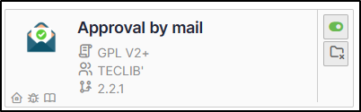
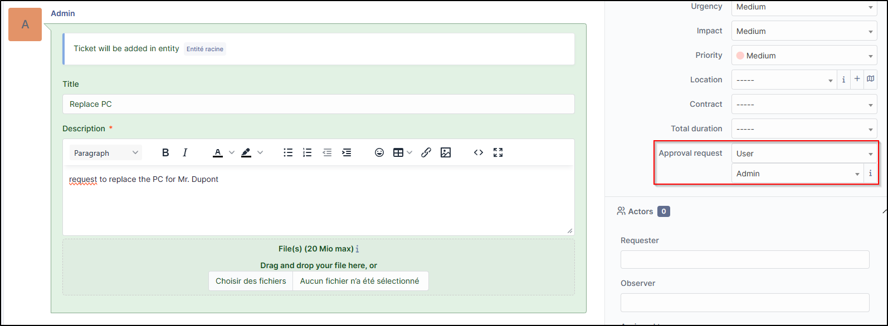
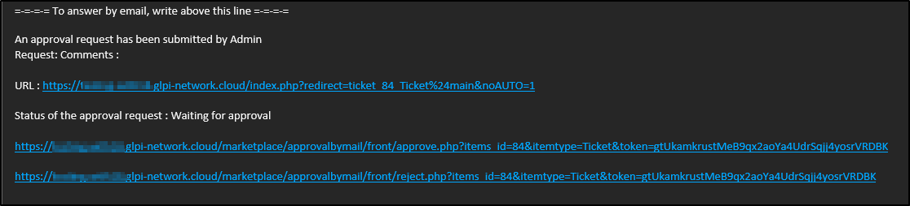
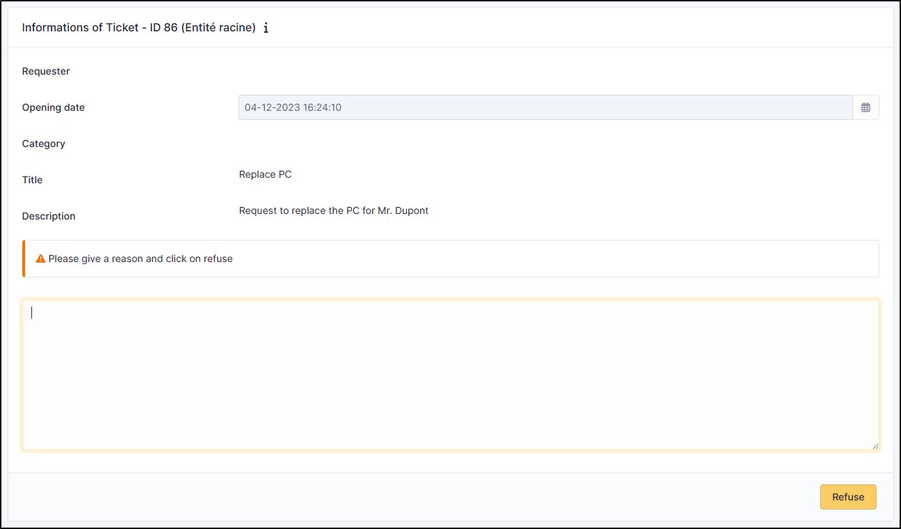
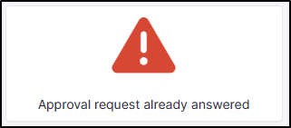

Approbal by mail
================

Requirements (on-premise)
-------------------------

============ =========== ===========
GLPI Version Minimum PHP Recommended
============ =========== ===========
10.0.x       8.1         8.2
============ =========== ===========

.. note::
   `standard license <https://services.glpi-network.com/#offers>`__ (or higher) is required. This plugin is also available from the `Cloud <https://glpi-network.cloud/>`__.

Install the plugin
------------------

-  Go to the marketplace. Download and install the plugin **ApprovalByMail**.

Using the plugin
----------------

Once activated, there are no specific settings to be made (apart from the notification layout, if you wish, via **Setup > Notifications > Notification templates**. The template is **Tickets validation**)

-  In a new ticket, enter the name of the person or group receiving the approval request.

An email will be received with the option of **Validating** or **Refusing** the request. This contains 3 links (if no changes have been made to the model).

-  The ticket reminder
-  The acceptance link
-  The refusal link

-  When the form is validated, you are redirected to GLPI with a
   notification of acceptance:

-  If the form is refused, a comment will be requested to validate the
   refusal:

-  It is not possible to reply 2 times to the validation, an error
   message will be displayed:

FAQ
---

If you have any questions about using the plugin, please consult `our faq <https://faq.teclib.com/04_Plugins/Approval_mail/>`__