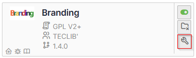
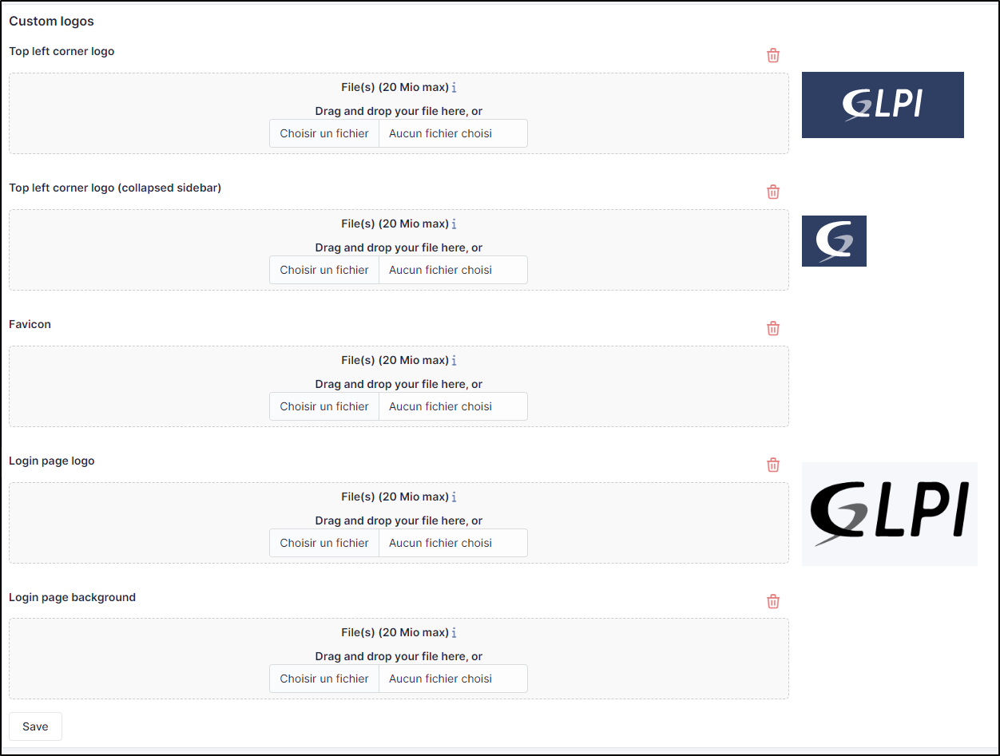
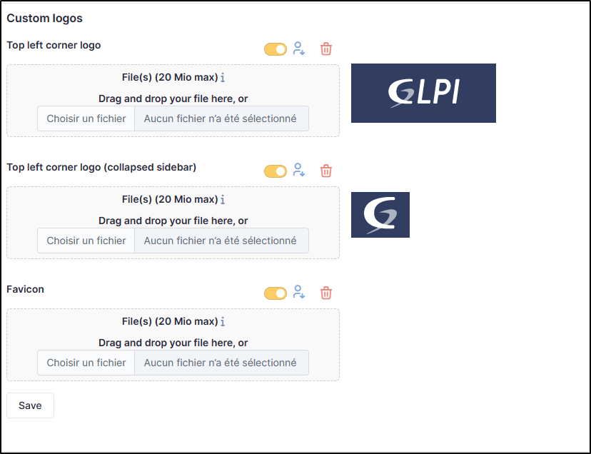

Branding
========

Requirements (on-premise)
-------------------------

============ =========== ===========
GLPI Version Minimum PHP Recommended
============ =========== ===========
10.0.x       8.1         8.2
============ =========== ===========

.. note::
   A `basic licence <https://services.glpi-network.com/#offers>`__ (or higher) is required. This plugin is also available from the `Cloud <https://glpi-network.cloud/fr/>`__.

Install the plugin
------------------

-  Go to the marketplace. Download and install the **Branding**
   plugin.

Customize your instance
-----------------------

-  Go to **administration > entities** > **branding** tab

Here you can replace :

-  the logo at top left (including folded bar)
-  the logo on the login page,
-  the background of the login page,
-  the icon in the browser bar

Custom by entity
----------------

You can modify certain elements by entity:

-  the logo at top left (including folded bar)
-  the icon in the browser bar

Other customisations are common to all entities

Recommendations
---------------

-  **Top Left corner logo** - This can be changed according to the
   desired entity It is the logo you see when your GLPI page is opened
   and the left sidebar is expanded

Default recommended size: **100x55 pixels**

-  **Lop Left corner logo** (collapsed sidebar) - This can be changed
   according to the desired entity It is the logo you see when your GLPI
   page is opened and the left sidebar is collapsed.

Default recommended size **40x40 pixels**

-  **Favicon** It is the logo you see next to the page title at the
   beginning of your browser’s the tab.

Default recommended size: **16x16 or 32x32 pixels**

-  **Login page logo** It is the logo you see before you login. It
   appears with the fields to fill with your username and password

Default recommended size: **220x130 pixels**

-  **Login page background** It is the image you can add as a background
   at the login page.

Default recommended size: **It depends on the usual size of your screens**. The bigger, the better. (Make sure not to surpass the maximum upload limit for files)
