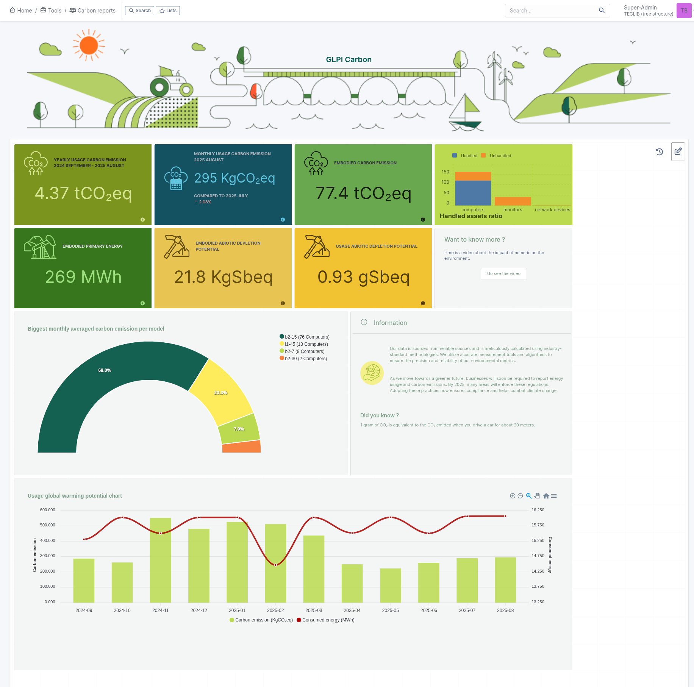

Carbon reports
==============

A dashboard is available and customizable.
Several types of data are available such as monthly carbon emissions, biggest monthly averaged carbon emissions per model, handled assets ratio, etc.

This dashboard works like the classic GLPI dashboard and can be customized in the same way.

