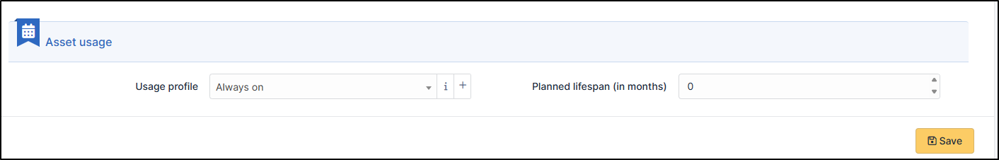
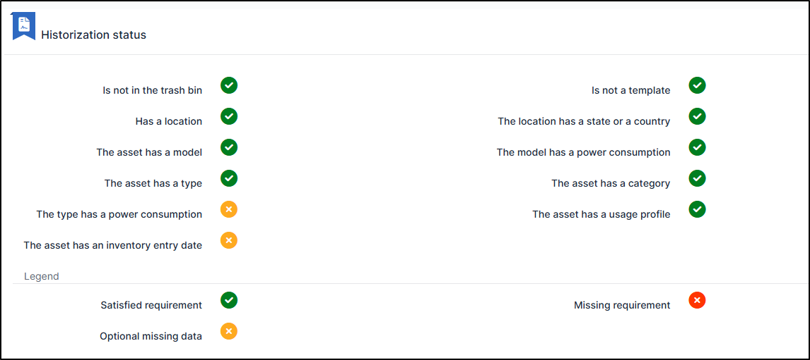
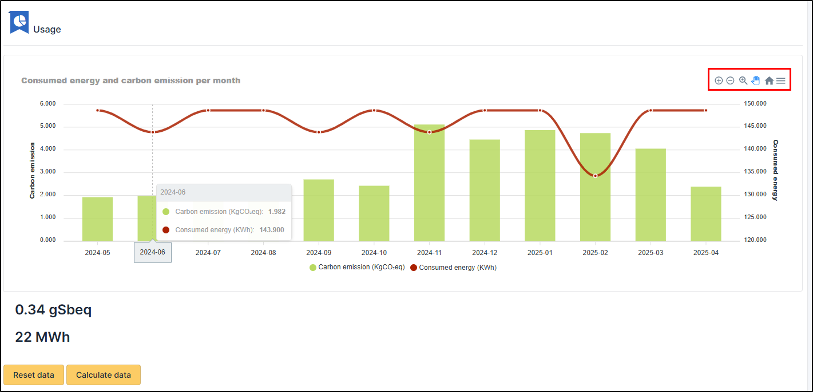
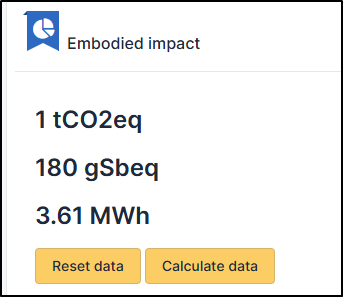

Reading datas
=============

In each asset, an Environmental impact tab is now visible.

Asset usage
-----------

You can (for computers) select the appropriate profile as well as the planned lifespan (in months)

Historization status
--------------------

The logging status tells you whether all specifications are correctly met, ensuring that the data sent by Carbon is as accurate as possible.

If an item is in red, the plugin will operate in a degraded manner, providing less accurate, aggregated estimation information.
Data in orange are optional items with a slight impact on data quality

Usage
-----

A graph displays energy consumption and carbon emissions per month

* Consumption in kWh appears in red
* Carbon emissions in KgCO₂eq in green

Using the toolbar at the top right, you can:

* Zoom in/out on a specific period
* Zoom through a selection
* Scroll
* Return to the initial presentation
* Export (SVG, PNG, CSV)

Additional data, ``gSbeq``, is available.
These are grams of antimony equivalent. This index is used to measure the depletion of abiotic resources (rare earths, minerals, etc.).

You can reset and calculate this data with the corresponding buttons

Embodied data
-------------

