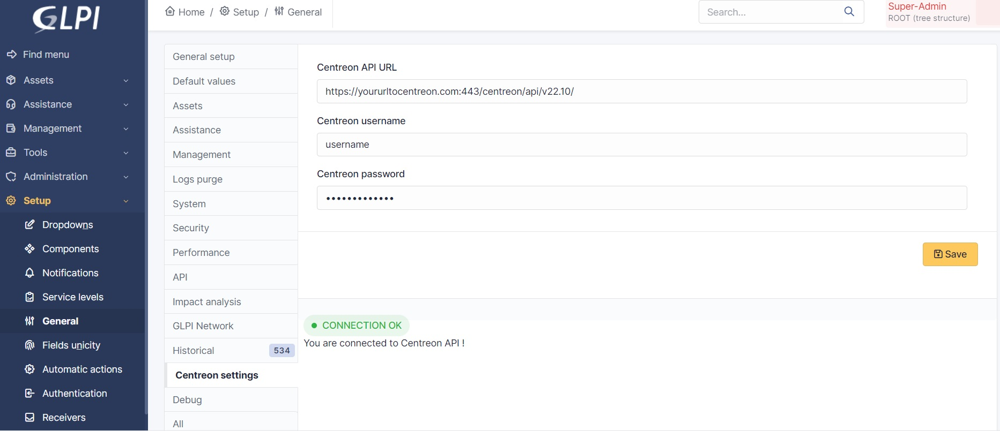
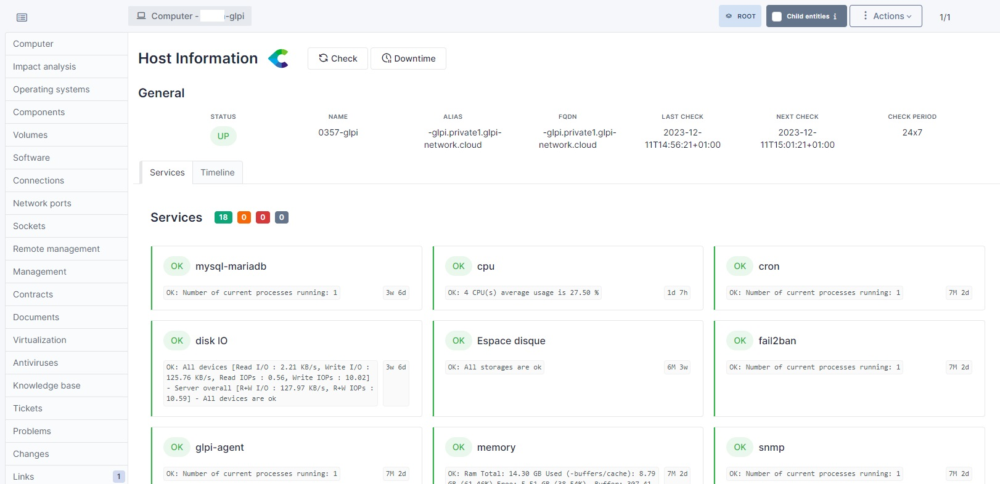
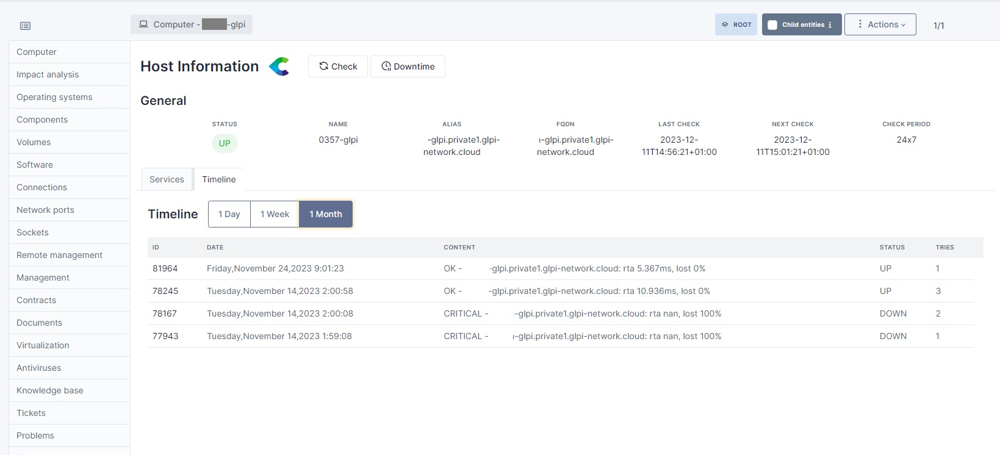

Centreon Plugin Documentation
=============================

* Sources link: `<https://github.com/pluginsGLPI/centreon>`_
* Download: `<https://github.com/pluginsGLPI/centreon/releases>`_

Requirements
------------

PHP >= 7.4.0
GLPI >= 10.0.0

Features
--------

Centreon is a network, system, applicative supervision and monitoring tool.
Centreon plugin allows you to see general information about hosts and their services on your GLPI interface,
as long as the items are both in GLPI and Centreon.

You can perform 3 main actions :

* Acknowledge a problem
* Schedule a downtime
* Trigger a host check,

and you can also see the timeline of the host.

Installation
------------

* Uncompress the archive
* Move the ``centreon`` folder to ``<GLPI_ROOT>/plugins`` directory
* Navigate to the **Configuration > Plugins** page,
* Install and activate the plugin.

Usage
-----

You need to configure the plugin before using it. To do so, go to the **Setup > Plugins > Centreon** page.
You will need to fill the following fields :

* **Centreon URL** : The URL of your Centreon interface, following by the number of the port, and the API version to use
* **Centreon Username** : The username of your Centreon account
* **Centreon Password** : The password of your Centreon account

Then, it will create automatically a new SQL table named ``glpi_plugin_centreon_hosts``.
This table will contain all the hosts that are both in GLPI and Centreon.
A new tab is created on the host page, so you can see the information about the host.

