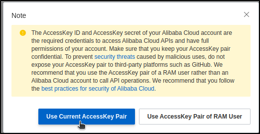
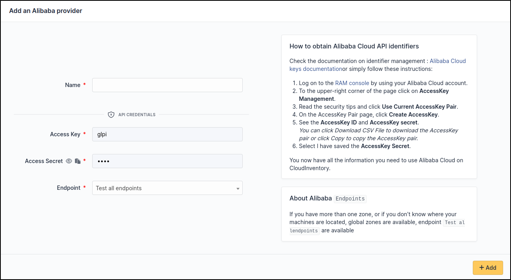

Alibaba
~~~~~~~

Create credentials
^^^^^^^^^^^^^^^^^^

Check the documentation on identifier management : `Alibaba Cloud keys documentation <https://www.alibabacloud.com/help/en/ram/user-guide/create-an-accesskey-pair>`_

Or simply follow these instructions:

* Log on to the `RAM console <https://ram.console.aliyun.com/?spm=a2c63.p38356.0.0.4f8b4688KexBmn>`_ and sign in with your Alibaba Cloud account.
* Move the pointer over the profile picture in the upper-right corner of the page that appears and click **AccessKey Management**.
* In the Note message, read the security tips and click **Use Current AccessKey Pair**.

* On the **AccessKey Pair** page, click **Create AccessKey**.
* In the Create AccessKey message, view the **AccessKey ID** and **AccessKey secret**.

  *You can click Download CSV File to download the **AccessKey** pair or click **Copy** to copy the **AccessKey** pair.*
* Finally select I have saved the **AccessKey Secret**.

Setup GLPI
^^^^^^^^^^

Go to ``Adminsitration`` > ``Cloud inventory`` > ``+Add``

