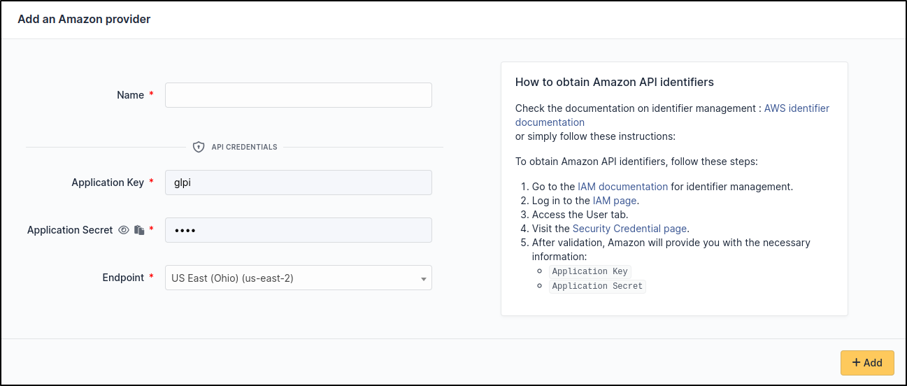

Amazon
~~~~~~

Create credentials
^^^^^^^^^^^^^^^^^^

Check the documentation on identifier management : `AWS identifier documentation <https://docs.aws.amazon.com/IAM/latest/UserGuide/id_credentials_access-keys.html>`_

Or simply follow these instructions:

* Go on the IAM page and sign in with your account : `IAM <https://us-east-1.console.aws.amazon.com/iamv2/home#/home>`_
* Go on User tab : `User tab <https://us-east-1.console.aws.amazon.com/iamv2/home#/users>`_
* Check this page : `Security credential page <https://us-east-1.console.aws.amazon.com/iamv2/home#/users/details/USER?section=security_credentials>`_

After validating the form, ``Amazon`` will give you the following information :

* ``Application Key``
* ``Application Secret``

Setup GLPI
^^^^^^^^^^

Go to ``Adminsitration`` > ``Cloud inventory`` > ``+Add``

