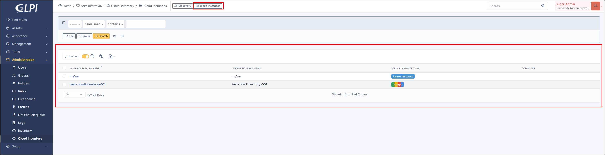
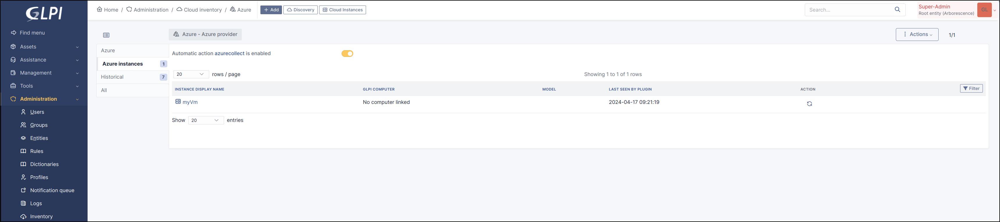
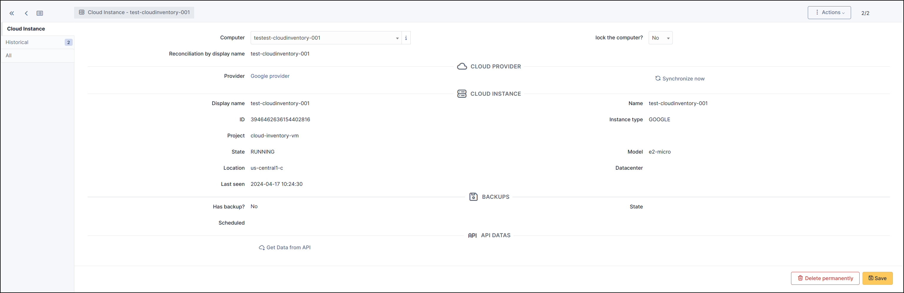
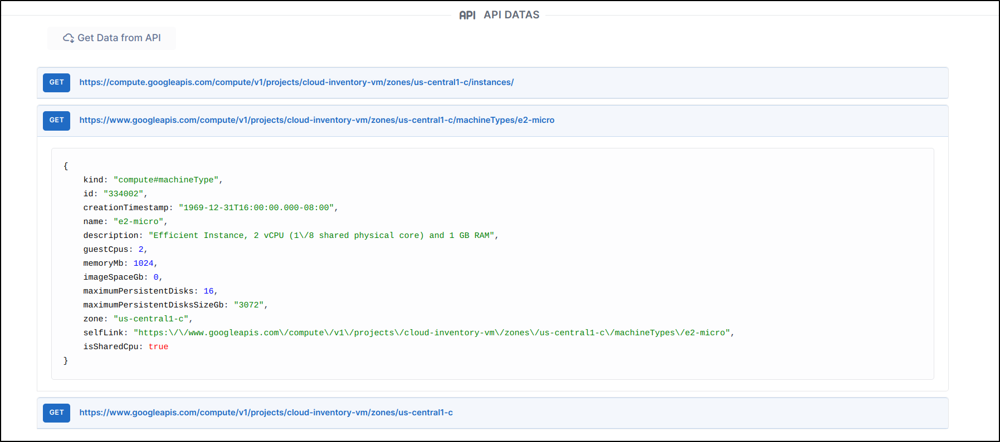

Cloud Instance
--------------

Each cloud asset found is registered in the plugin in a ``CloudInstance`` object

* You can find the list of ``CloudInstance`` here

* Or from the provider (and dedicated tab)

.. note:: The ``refresh``  action lets you manually execute synchronisation for a CloudInstance

.. note:: The status of the related `CronTask` is displayed (see :doc:`CronTask <crontask>`)
   A button allows you to ``activate`` or ``deactivate`` it

   .. figure:: images/automatic_action.png
      :alt: Enable automatic collect
      :scale: 70 %

* Click on ``CloudInstance`` link to get more information :

.. warning:: Synchronised ``Cloud Instances`` are automatically assigned to the same ``entity`` as the ``Provider`` from which they originate.

* **GLPI Computer**

  * Related GLPI Computer found
  * Reconciliation type for this `CloudInstance` (name or MAC)

.. note:: **Unknown GLPI computer**

 There are several reasons for this :

 * The computer does not yet exist in GLPI (you can then install the GLPI agent to bring it up and then restart the discovery of cloud instances to make the link).
 * Reconciliation (using the MAC or the name of the cloud instance) couldn't find a computer.
 * Check that the MAC address or name exists in GLPI
 * You can manually select the corresponding computer (Don't forget to lock the computer to prevent the next discovery from overwriting your selection.)
 * Contact us to improve the reconciliation method

* **Provider**

  * provider name (link to GLPI provider form)
  * Button to synchronize this instance now

* **Cloud Instance**

  * Instance name
  * Instance display name
  * Instance ID
  * Project ID
  * Projcet name
  * Model
  * State
  * Location
  * Datacenter

* **Backups**

  * Has backup ?
  * Backup state
  * List of backups
  * Scheduled

A final section, ``API data``, gives you direct access to the ``API`` information for related ``Cloud Instance``.

