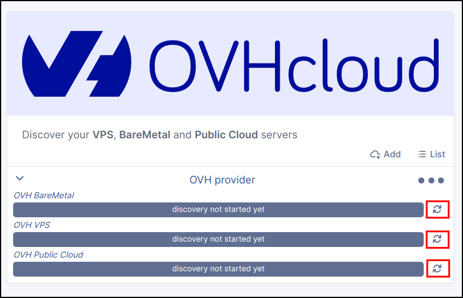
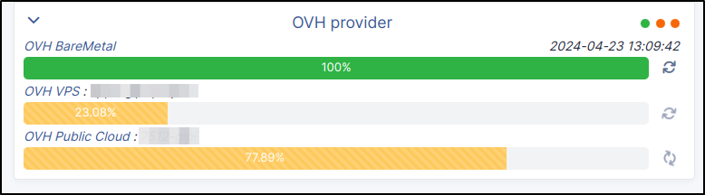
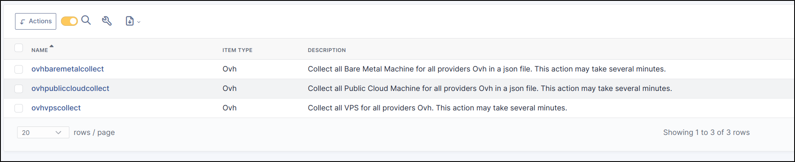

Discovery
---------

Now that our provider has been created into GLPI, we can start working on the cloud inventory.

* For each provider you can manually trigger synchronisation here :

* You will be able to visualize the progress of the discovery.

* Or simply configure related automatic actions (you can filter by provider name (e.g. OVH)) (see see :doc:`CronTask <crontask>`)

