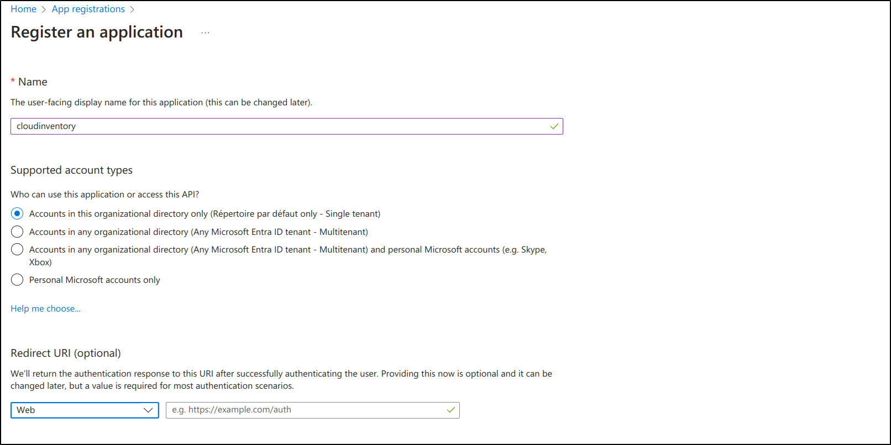
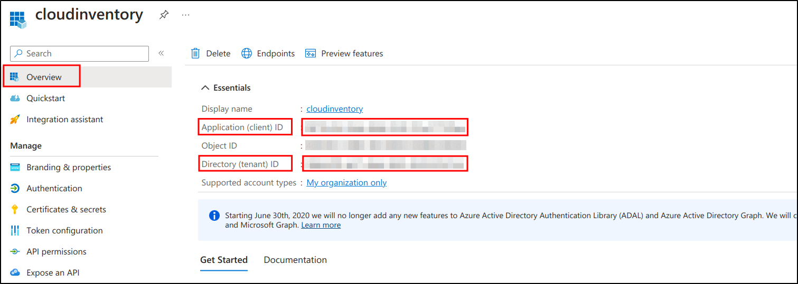
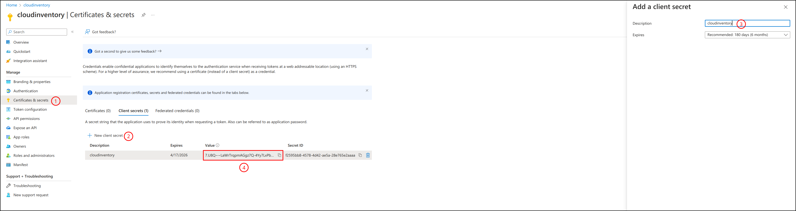
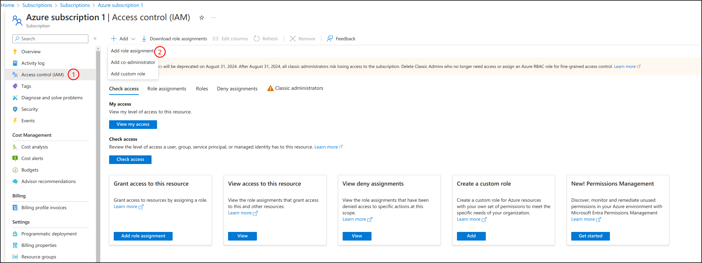
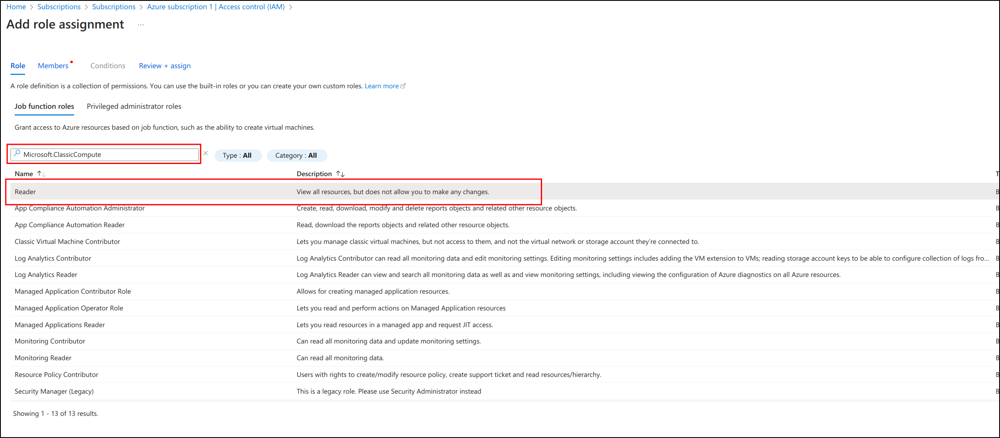
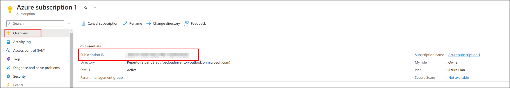
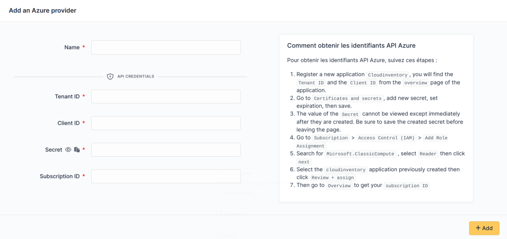

Entra
~~~~~

Create credentials
^^^^^^^^^^^^^^^^^^

How to get your ``Tenant ID`` and ``Client ID``

* Go to your Tenant and register a new application

* Go to Overview to get ``Tenant ID`` and ``Client ID``

* Go to ``Certificates and secrets``
* Add ``New client secret``
* Define ``expires``
* Then saved

The ``Secret`` value will be displayed (4)

.. warning:: Client secret value cannot be viewed, except for immediately after creation. Be sure to save the secret when created before leaving the page

* Go to ``subscription`` > ``Access Control (IAM)`` > ``Add Role Assignment``

* Search for ``Microsoft.ClassicCompute``
* select ``Reader``
* then ``next``

* Select ``cloudinventory`` (application) previously created
* Then click on ``Review + assign``

Setup GLPI
^^^^^^^^^^

Go to ``Adminsitration`` > ``Cloud inventory`` > ``+Add``

