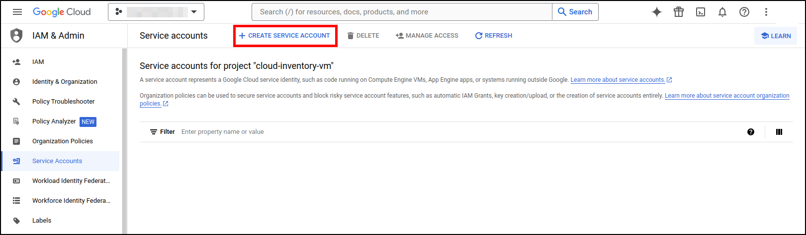
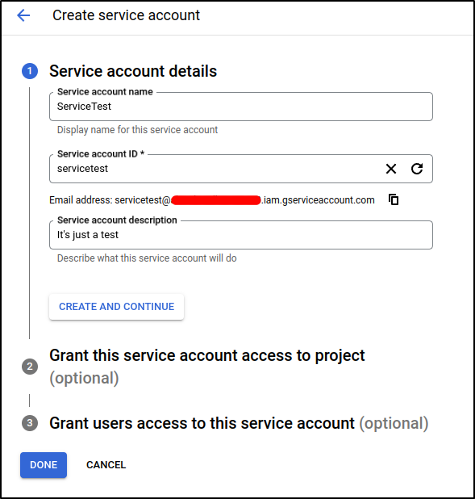
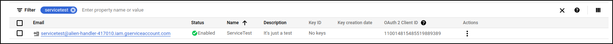
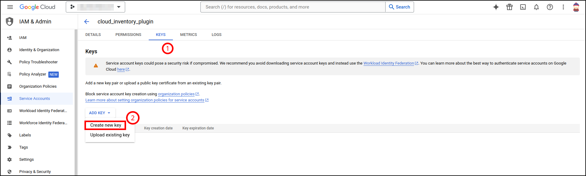
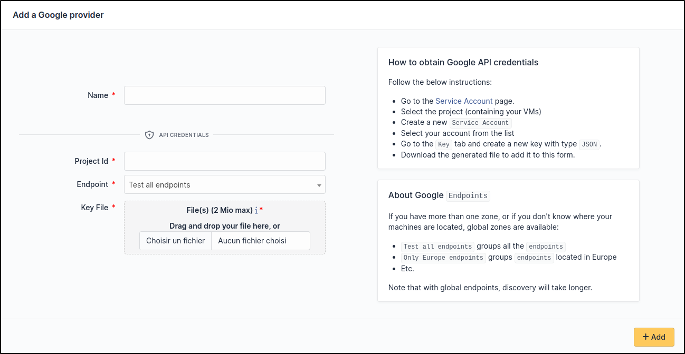

Google
~~~~~~

Create credentials
^^^^^^^^^^^^^^^^^^

Check the documentation on identifier management : `How to manage your key <https://cloud.google.com/anthos/run/docs/securing/service-accounts?hl=fr>`_

Or simply follow these instructions:

* Go to the `Service Accounts <https://console.cloud.google.com/iam-admin/serviceaccounts?hl=fr&_ga=2.193077034.605580056.1710501828-763263516.1710237390>`_ page in **Google Cloud Console**
* Select the **Project** on which your **Virtual machine** was created
* Create a new **Service Account**

* Fill in the required information, then click on ``Done``

* Select your account on the list

* Choose JSON type

Now your key file has been downloaded to your computer

Setup GLPI
^^^^^^^^^^

Go to ``Adminsitration`` > ``Cloud inventory`` > ``+Add``

