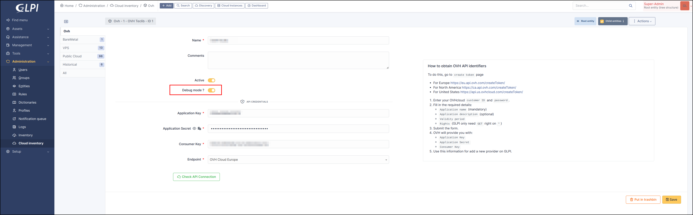

Log
---

If debug mode is enabled for a dedicated provider

A new log file will be automatically created and will contain various information following execution of the synchronisation

Ex : for ``Ovh`` provider and ``VPS`` synchronisation a file named ``ovh-{{instance-type}}-{{provider_name}}-error.log`` will be created in the ``glpi/files/_log/`` folder and will contain the errors encountered during its execution

