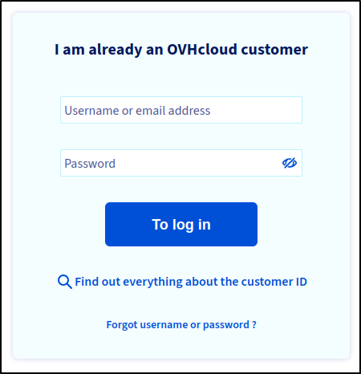
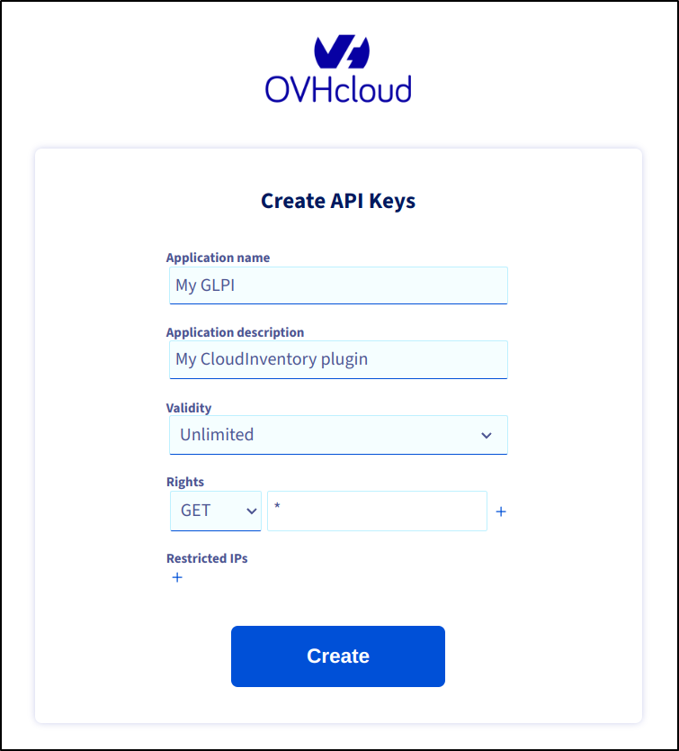
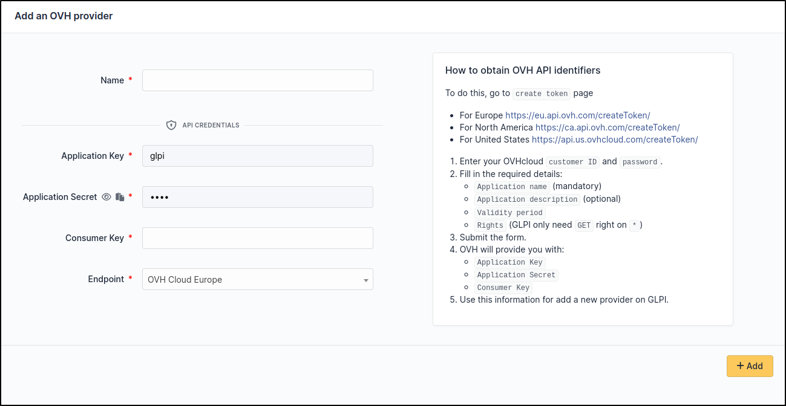

OVH
~~~

Create credentials
^^^^^^^^^^^^^^^^^^

* To obtain credential, click the following link:

  * For Europe `<https://eu.api.ovh.com/createToken/>`_
  * For North America `<https://ca.api.ovh.com/createToken/>`_
  * For the United States `<https://api.us.ovhcloud.com/createToken/>`_

* Sign in with your account

To access the ``Create API Keys`` form

* Fill in the following information :

  * An ``Application name`` (mandatory)
  * An ``Application description`` (optionnal)
  * A ``validity`` period.
  * The ``Rights`` to restrict the use of the application to certain APIs

    GLPI only needs the ``GET`` right on ``*`` (to authorise all OVHcloud APIs)

* After submitting, ``OVH`` will give you :

  * ``Application Key``
  * ``Application Secret``
  * ``Consumer Key``

Setup GLPI
^^^^^^^^^^

Go to ``Adminsitration`` > ``Cloud inventory`` > ``+Add``

