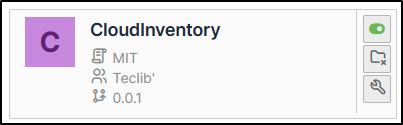

Requirements (on-premise)
-------------------------

============ =========== ===========
GLPI Version Minimum PHP Recommended
============ =========== ===========
10.0.11       8.1         8.3
============ =========== ===========

.. note::
   A `basic licence <https://services.glpi-network.com/#offers>`_ (or higher) is required. This plugin is also available from the `Cloud <https://glpi-network.cloud/fr/>`_.

Install the plugin
------------------

- Go to the marketplace. Download and install the **CloudInventory** plugin.

To know
-------

Currently supported providers and resource types are:

- **OVHcloud**

    - Instances Public Cloud
    - VPS (Serveurs Privés Virtuels)
    - Dedicated servers (Bare Metal)

- **Scaleway**

    - Instances Compute (Machines Virtuelles)
    - Servers Bare Metal
    - Instances Apple Silicon

- **Amazon Web Services (AWS)**

    - Instances EC2 (Elastic Compute Cloud)

- **Microsoft Azure**

    - Virtual Machines

- **Google Cloud Platform (GCP)**

    - Google Compute Engine (Machines Virtuelles)

- **Alibaba Cloud**

    - Elastic Compute Service (ECS)