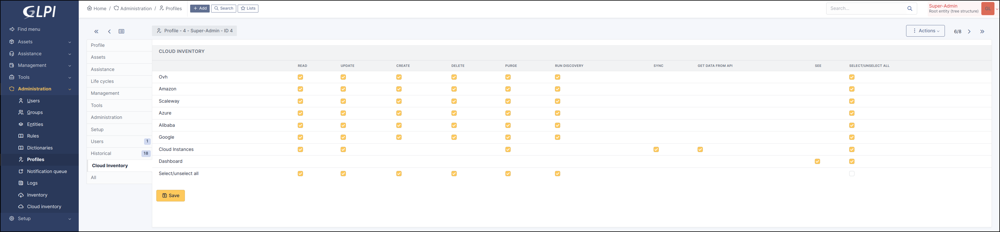

Right
-----

The plugin offers complete rights management.

Go to ``Administration`` > ``Profiles`` > ``Cloud Inventory``

* **Provider**

  * Read
  * Update
  * Delete
  * Purge
  * Run discovery

* **CloudInstance**

  * Update
  * Sync
  * Get date from API
  * Purge

* **Dashboard**

  * See dashbaord

