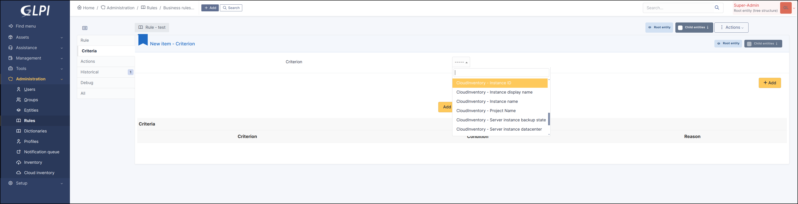

Rules asset
-----------

The plugin adds new criteria to the ``Business Rules for asset``

Each time a computer is updated (manually or dynamically), if it is linked to a ``CloudInstance``, the engine will receive the following data (when available)

* ``CloudInventory - Instance ID``
* ``CloudInventory - Instance Display name``
* ``CloudInventory - Instance Name``
* ``CloudInventory - Project Name``
* ``CloudInventory - Has backup``
* ``CloudInventory - State``
* ``CloudInventory - Location``
* ``CloudInventory - Datacenter``
* ``CloudInventory - Instance type``