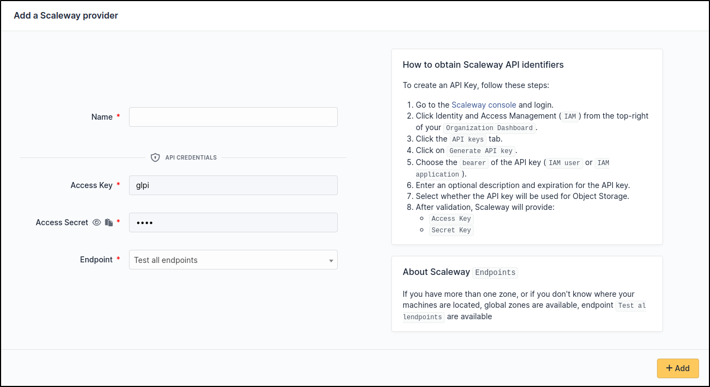

Scaleway
~~~~~~~~

Create credentials
^^^^^^^^^^^^^^^^^^

Check the documentation on identifier management : `How to create API Key <https://www.scaleway.com/en/docs/identity-and-access-management/iam/how-to/create-api-keys/>`_

Or simply follow these instructions:

* Go to Scaleway console and sign in with your account : `<https://console.scaleway.com/login>`_
* Click **Identity and Access Management (IAM)** from the top-right of your `Organization Dashboard <https://console.scaleway.com/organization>`_
* Click on the **API Keys** tab.
* Click on **Generate an API key**.
* Choose the **owner** of the API key (**IAM user** or **IAM application**).
* Enter a description (optional) and an expiry date for the API key.
* Select whether the API key will be used for Object Storage → choose **No**

After validating the form, ``Scaleway`` will give you the following information

* ``Access Key``
* ``Secret key``

Setup GLPI
^^^^^^^^^^

Go to ``Adminsitration`` > ``Cloud inventory`` > ``+Add``

