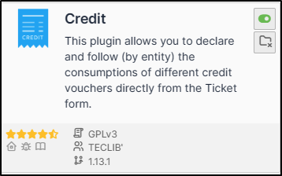
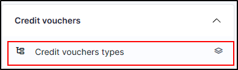
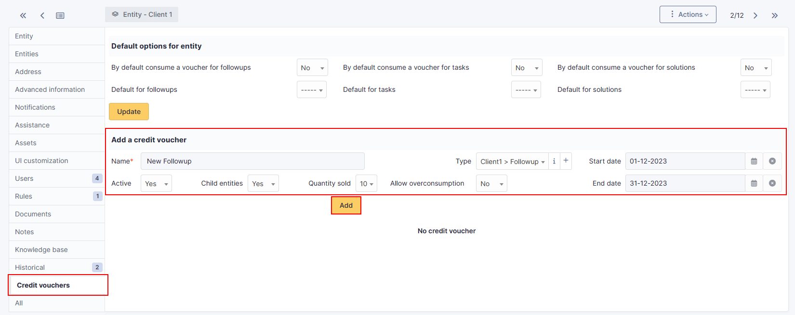
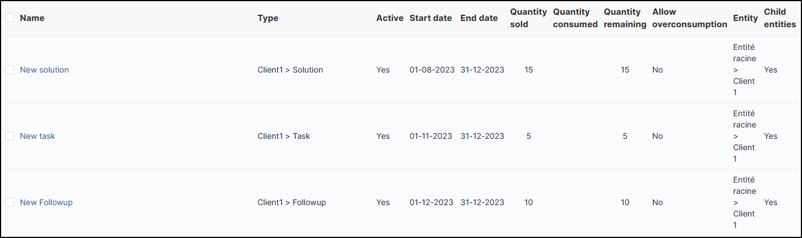
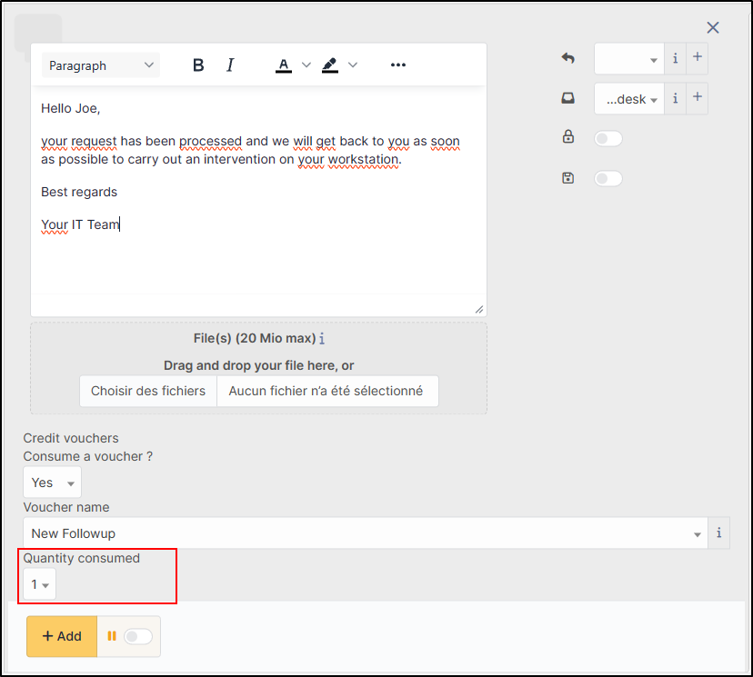
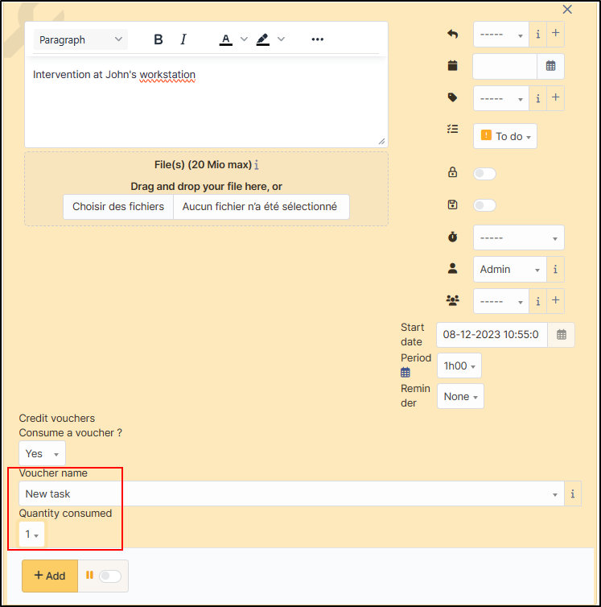
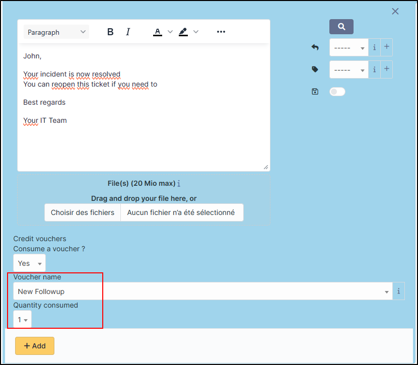
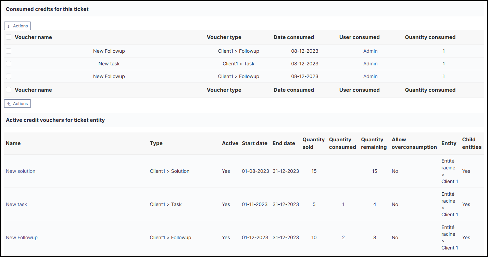
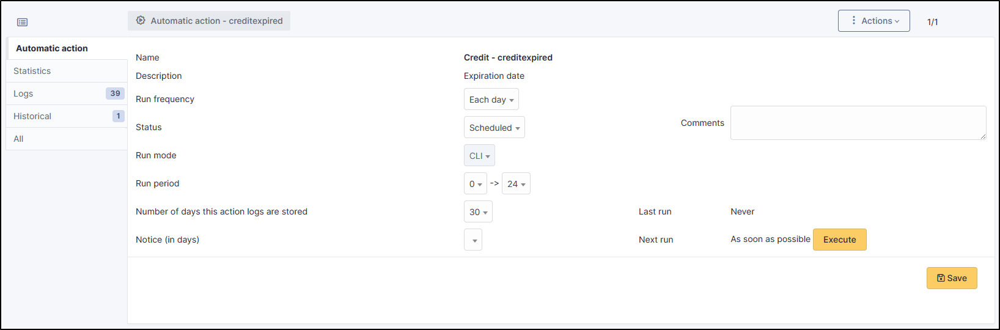

Credit
======

Sources
-------

* Sources link: `<https://github.com/pluginsGLPI/credit>`_
* Download: `<https://github.com/pluginsGLPI/credit/releases>`_

Requirements (on-premise)
-------------------------

============ =========== ===========
GLPI Version Minimum PHP Recommended
============ =========== ===========
10.0.x       8.1         8.2
============ =========== ===========

.. note::
   This plugin is available without a GLPI-Network subscription. It is also available in `Cloud <https://glpi-network.cloud/>`__

Install the plugin
------------------

-  Go to the marketplace. Download and install the plugin “**Credit**”.

Setting up the plugin
---------------------

Creating a credit type
~~~~~~~~~~~~~~~~~~~~~~

-  From **Setup > Dropdowns**,
-  click on **Credits** then **Credit types**.

-  Click on **add**.
-  Enter a name representing the type of credit granted

.. figure:: images/Credit-3.png
   :alt:
   :scale: 100 %

Add credit to customer entity(ies)
~~~~~~~~~~~~~~~~~~~~~~~~~~~~~~~~~~

Example : “Case study for this article” We will create 3 types of credit:

   - For a new follow-up
   - For a new task
   - For a new solution

   You can create a single type of credit which will group together the 3, it depends on the management of each case.

-  In **Administration > Entities**, select the entity that will receive the credits.
-  Go to the **Credit** section
-  In the section **Add a credit**, enter a name for the new credit
-  Define the type of credit created earlier
-  The start and end dates of the credit
-  Activate it,
-  Make it available or not in the child entities (note that if you are in the parent entity, it will be accessible to all entities)
-  The quantity of credit sold
-  The authorisation to overconsume or not
-  Click on **add**

Here, we’ll do the same for the 3 types of credit (followup, task and solution)

It is therefore possible to enter different values (number of credits, validity, overconsumption, etc.) for each credit:

Define default values
~~~~~~~~~~~~~~~~~~~~~

-  In **Administration > Entities**, select the entity that will receive the credits
-  Go to the **Credit** section
-  In the **Default options for entity** section
-  Select the type of credit by action

  .. figure:: images/Credit-6.png
   :alt:
   :scale: 100 %

-  Click on **Update**

.. warning::
   "Caution Indicating credit types does not allow automatic settlement. It pre-selects the credit but it must be settled by the technician.

Counting credits
----------------

When a ticket is created, you can choose whether or not to deduct the
corresponding credits.

In our example, we have chosen to deduct each action.

-  If we are doing a **follow-up**, we can deduct the credit assigned by default:

-  The same for a **task**:

-  And for a **solution** :

In the **Credit** section of the ticket you can see a summary of credits spent and remaining

Modify a credit on a ticket
---------------------------

Increase or decrease a granted credit
~~~~~~~~~~~~~~~~~~~~~~~~~~~~~~~~~~~~~

You can modify credits on a ticket if a readjustment is necessary.

-  From the ticket in question, go to the **credit** section
-  Select the credit you wish to adjust
-  Click on **Actions**
-  Click on **Update**
-  Click on **Quantity consumed** then add the desired quantity
-  Click on **Send**

.. note::
   See how to proceed
      .. figure:: images/Credit-11.gif
         :alt:
         :scale: 100 %

Delete deducted credits
~~~~~~~~~~~~~~~~~~~~~~~

-  From the ticket in question, go to the **Credit** section
-  Select the credit you wish to delete
-  Click on **Actions**
-  Click on **Delete permanently**
-  Click on **Send**

.. note::
   See how to proceed
      .. figure:: images/Credit-12.gif
         :alt:
         :scale: 100 %

Credits will be automatically reallocated in the credit bank

Including an expired credit
---------------------------

If the credit has expired, it will not be proposed in the list of available credits. You will not be able to deduct it. You will need to change the end date of the credit to be able to use it again.

Notification of expired credits
-------------------------------

An automatic action is available to notify you when a credit has expired.

-  From **Setup > Automatic actions**, modify the **creditexpired** action to suit your needs.
-  Click on **Save**

You can of course customise the notification to suit your needs (**Setup > Notifications > Notifications > credit expired**)

