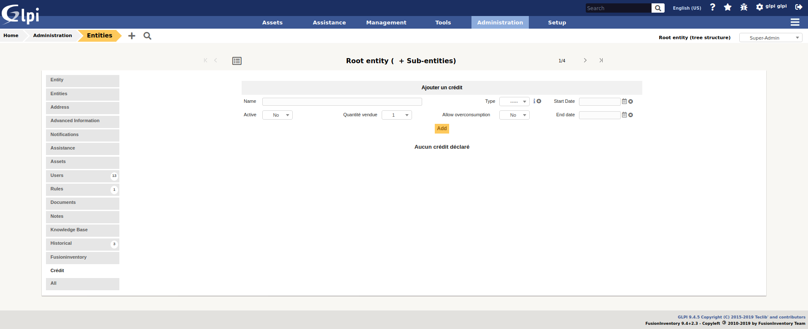
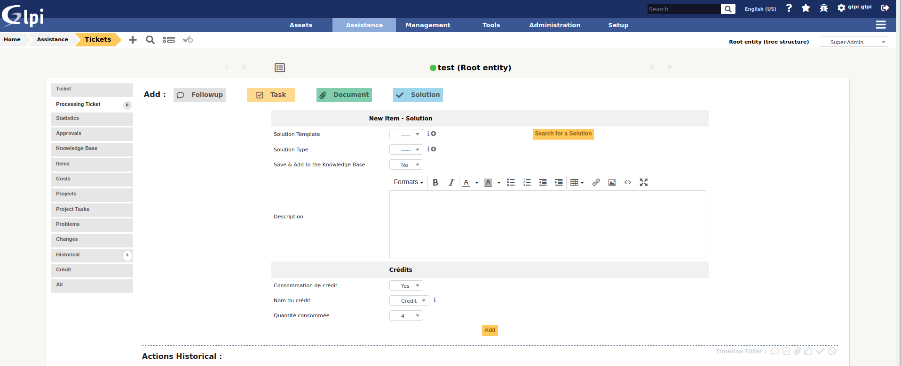
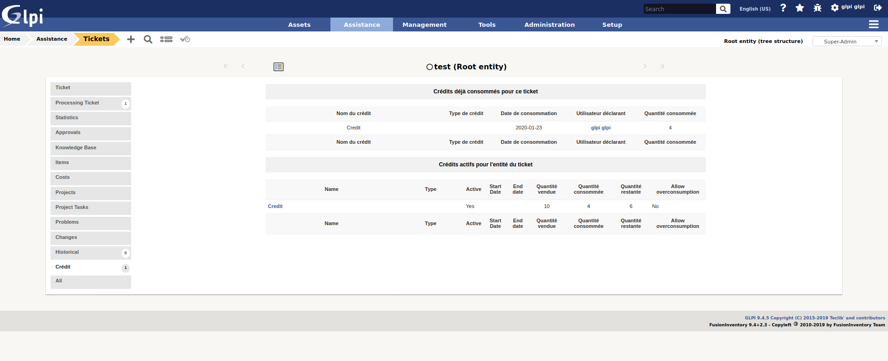

Escalade
========

* Sources link: https://github.com/pluginsGLPI/credit
* Download: https://github.com/pluginsGLPI/credit/releases

Requirements for latest version
-------------------------------

This plugin requires :

* PHP 7.2 or higher
* GLPI >= 9.4

Features
--------
This plugin allows you to declare and follow (by entity) the consumptions of different credit vouchers directly from the Ticket form.

To do it, you must follow these steps:

* Creation of different types of credit vouchers (as GLPI dropdown);
* Creation, in Entity tab, of the credit vouchers available for these entities;
* Declaration / Modification / Deletion of a consumption in the Ticket form and tab;
* Consultation of the vouchers sold, the remaining credits, credits consumptions from the Ticket form or from Entity tab.

Configuration
-------------

The plugin will create required tables in the database  automatically. Those tables will be updated along with the plugin.

Plugin usage is quite simple:

You will access the credit configuration from the *Administration* > *Entities*.

* Name : add name to credit
* Type : Define a type
* Start / End date : Define duration of credit
* Active : Display credit on ticket form or not
* Quantity : quantity spend
* Allow overconsumption : allow or not over consumptin (if yes, check is bypass)

Credit consumption
------------------

When you solved a ticket, solution form have field to to consume credit

Credit report
-------------

On the ticket form, click on the *Credit* tab to view a report on credit consumption

