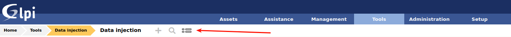
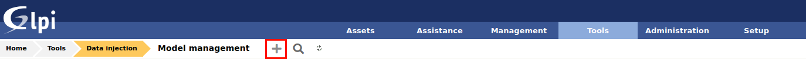
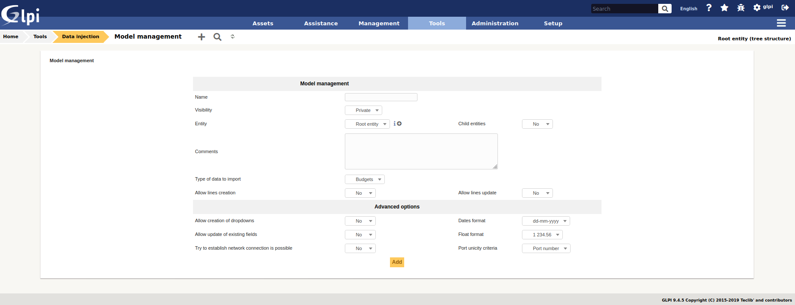
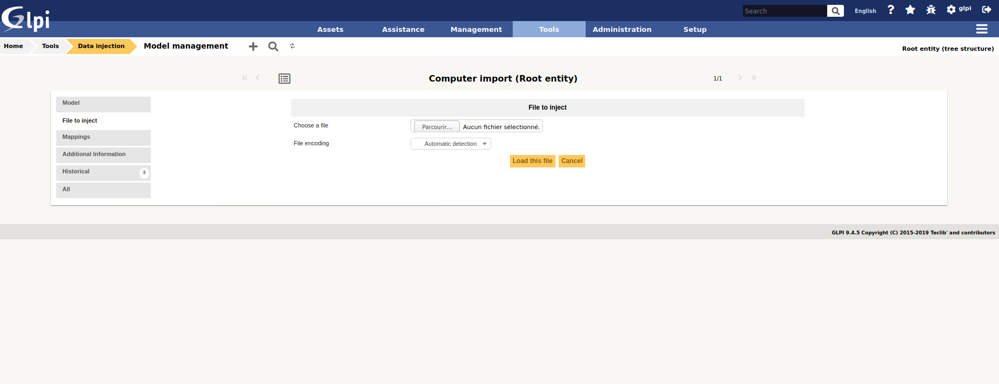
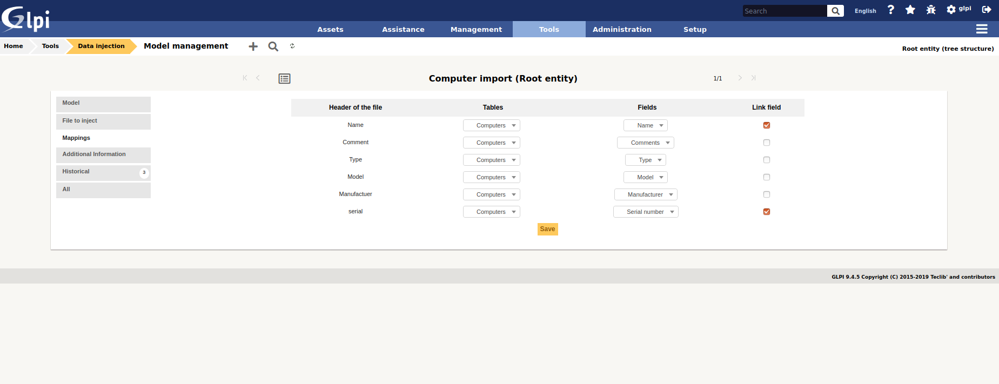
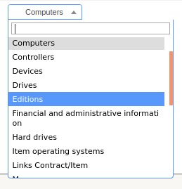
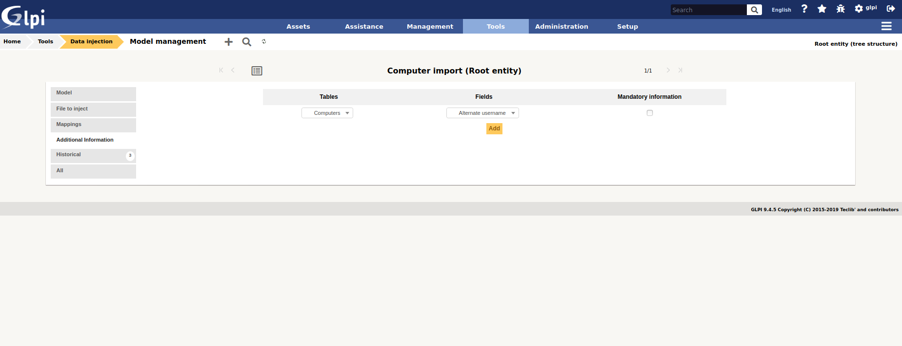
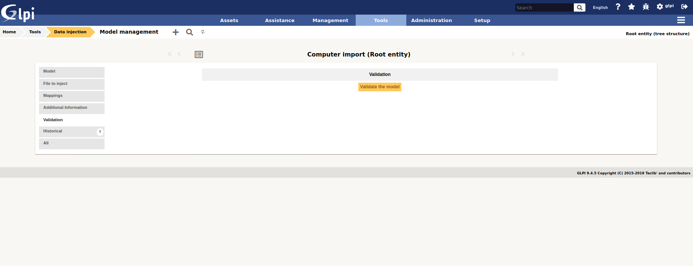
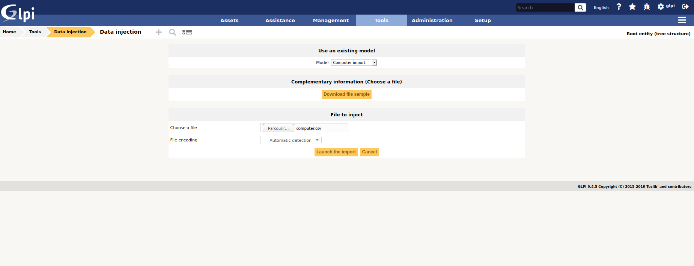
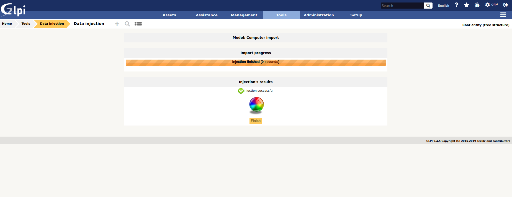

Datainjection
=============

* Sources link: https://github.com/pluginsGLPI/datainjection
* Download: https://github.com/pluginsGLPI/datainjection/releases

Requirements for latest version
-------------------------------

This plugin requires :

* PHP 7.2 or higher
* GLPI >= 9.4

Features
--------

This plugin allows data import into GLPI using CSV files.

It allows to create models of injection for a future re-use. It's been created in order to:

* Import data coming from others asset management softwares
* Inject electronic delivery forms

Data to be imported using the plugins are:

* Inventory data (except softwares and licenses),
* Management data (contract, contact, supplier),
* Configuration data (user, group, entity).

Install the Plugin
------------------
* Uncompress the archive.
* Move the ``escalade`` directory to the ``<GLPI_ROOT>/plugins`` directory
* Navigate to the *Configuration > Plugins* page,
* Install and activate the plugin.

Configuration
-------------

You will access the datainjetion configuration from the *Tool* > *File injection*.

Clic here to manage model

Create new model
----------------

Fist step you need te create model, for this example we import Computer

Clic here to create new model

And fill form

* Name : define a model Name
* Visibility : is private or not for other user
* Entity / sub entity : model visibility for entity
* Comments : model comment
* Type of data : type of data to import
* Allow lines creation : yes or not
* Allow lines update : yes or not
* Allow creation of dropdowns : if dropdown value not exist, let's create It
* Dates format : date format in CSV file
* Allow update of existing fields : yes or not
* Float format : float format in CSV file
* Try to establish network connection is possible : yes or not
* Port unicity criteria : define unicity field fir port

After model creation it's possible to :
* Define if header is present
* Change file delimitor : default ->  ";"

Inject your CSV file
--------------------

Send to GLPI your CSV file with computer data

content of CSV file for this documentation

::

   Name;Type;Model;Manufactuer;serial
   Desktop-ARTY;Desktop;Dell Inspiton;Samsung;567DFG45DFG
   Laptop-QUER;Laptop;Dell XPS;Samsung;345UKB78DGH

Mapping CSV column and object field
-----------------------------------

For each column of your CSV file you must select the table and the corresponding field in GLPI

.. note::

   You need to define link field.
   The plugin will search on this link field to known if object need to be added or updated

The dropdown list contains other tables, which allows it to import, for example, the financial and administrative informations
during computer import.

Each type of data (Computer, Monitor, User) have differents options to import other data

Additional data
---------------

You can define additional data to be imported, it will be requested during import.

Each can be flag as manatory

Validate model
--------------

After configuration you can validate model

Execute import
--------------

You will access the model from the *Tool* > *File injection*.

Select a model, select CSV file, and run import

Import result
-------------

After import process, plugin show you result, clic on spere to get more details

.. image:: images/result.png

