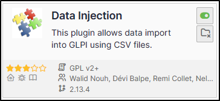
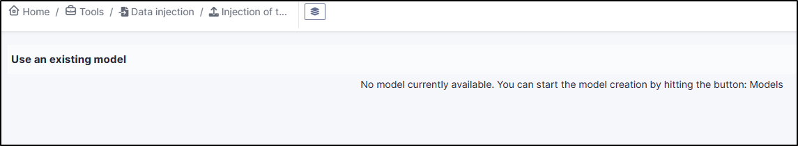
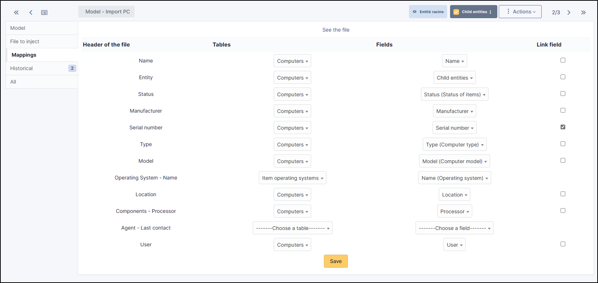
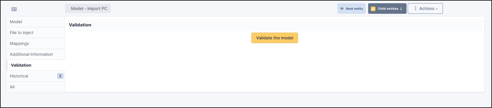
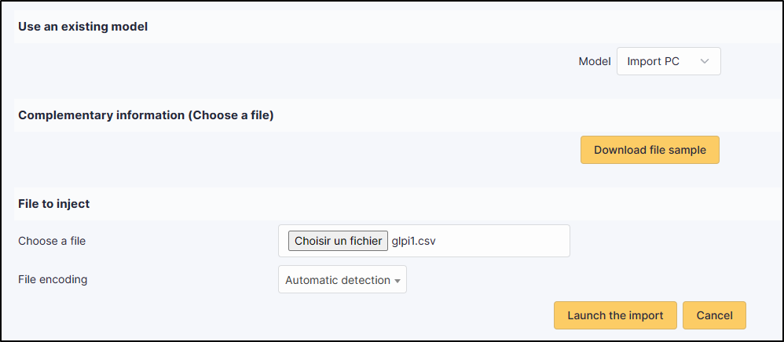
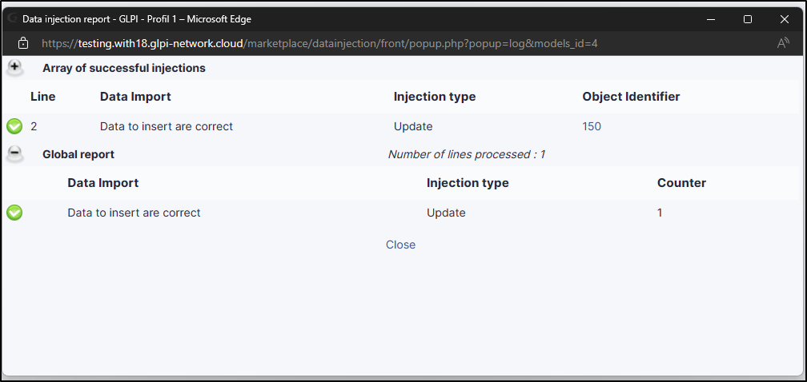
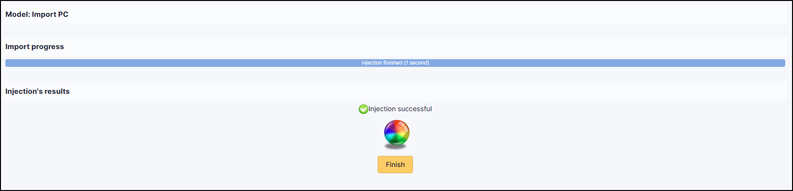

Datainjection
=============

Requirements (on-premise)
-------------------------

============ =========== ===========
GLPI Version Minimum PHP Recommended
============ =========== ===========
10.0.x       8.1         8.2
============ =========== ===========

Sources and download
--------------------

- Sources link: https://github.com/pluginsGLPI/datainjection
- Download: https://github.com/pluginsGLPI/datainjection/releases

Plugin installation
-------------------

.. Note::
   This plugin is available without a GLPI-Network subscription. It is also available in `Cloud <https://glpi-network.cloud/>`__

-  Go to the marketplace. Download and install the plugin **Data Injection**

Rights management
-----------------

Once the plugin has been installed via the marketplace, you can configure rights according to profile:

- From **Administration > Profiles**, select the profile in question
- Go to **Data injection**

For each user profile, you can grant the following rights:

-  **Model management** : Read / Update / Create / Purge
-  **Import file** : Read

Configuration
-------------

You can find the plugin configuration at **Tools > Data injection** The extension is presented in the form of a wizard, each operation is broken down into steps and it is possible to return to the previous step to correct a choice.

Managing or using a model
~~~~~~~~~~~~~~~~~~~~~~~~~

The first step allows you to choose the operation to be carried out, depending on your rights.

-  Use an existing template in the drop-down menu

-  Manage templates to :

   -  Create a new template
   -  Modify an existing template
   -  Delete an existing template
   -  Use an existing template

Creating a template
~~~~~~~~~~~~~~~~~~~

The first step is to create a template if none exists.

-  From **Tools > Data injection**
-  Click on **Template**
-  Click on **Add**

Defining the model
^^^^^^^^^^^^^^^^^^

This step allows you to define the main options for the extension:

-  **Name**: the name that will be visible from the drop-down list
-  **Visibility**: defines whether it will be visible to other users or not
-  **Entity** and **sub-entity**: the template can be visible in the creation entity only (sub-entity set to no) or in the entity and all sub-entity (sub-entity set to yes).
-  **Comment**: a comment for the template.
-  **Type of data to import**: the type of data present in the file to be imported. A file only consists of data of the same type.
-  **Allow lines creation**: tells the plugin to create objects if the line does not correspond to an existing element in the database.
-  **Allow update rows**: tells the plugin to modify existing objects using the data in the file.
-  **Header’s presence**: tells the plugin whether the headings present in the file (location, type of equipment, models, etc.) should be created. Creation will also be limited by the rights of the template user.
-  **Update existing fields**: the extension whether the data in the file can replace fields already filled in.
-  **Date format**: the date format is contained in the CSV file. If the format is incorrect, the date cannot be imported.
-  **Decimal number format**: the format used for the numbers in the CSV file. If the format is incorrect, the numbers cannot be imported.

**After validation of the model**, the following fields are added:

-  **Presence of a header**: indicates whether the first line of the CSV file is a header line, so that you can see the contents of the columns to identify the contents of the columns
-  **File delimiter**: field separator (by default a semicolon)

File to be injected
^^^^^^^^^^^^^^^^^^^

-  From the **File to inject** tab, you need to choose a file on your computer with exactly the same structure as the data already imported.
-  Then define the **encoding** (ISO8859-1 for Windows files, UTF-8 for Linux files. Automatic detection can be used to determine the encoding, but will slow down file processing. We strongly recommend that you always work in UTF-8.)

Once the file has been validated, you will be taken to the **Mappings** tab

Mappings
^^^^^^^^

This stage is essential. It defines, for each column in the file, the corresponding field in the database. The columns are identified by the content of the header line (presence defined in the previous step) or by
their position (starting from 0). A separator error (in the previous step) will result in an incorrect split. The **View file** button is used to preview the first lines of the file and check their content and the
interpretation made by the plugin.

For each column, you can choose

-  **Do not retrieve data from this column** (leave the **choose a table** option)
-  **Choose a table**: the data type defined in step 2 or the financial information
-  **Choose a field**: which will be populated by the import
-  **Link field**: to indicate that this column will be used to check the existence of the data in the database and to choose between creating a new object or update. Candidate fields are, for example, the
   **Serial number**, the **Name** or the **Inventory number**

.. Warning::
   It is mandatory to define at least 1 linking field.If a field is ticked, it must be entered in your **csv** file used for importing.

.. Note::
   It is possible to define **Comments** or **Notes** as the destination for several columns in the file. Each column will be added to the field on a different line.
   This step is particularly important and a wrong choice could damage the inventory data. It is therefore advisable to test the import on a test database or
   to and reserve this function for advanced users.

Additional information
~~~~~~~~~~~~~~~~~~~~~~

This step is used to define the fields that can/should be populated by the user when a file is injected.For each field, the same value will be used for each line of the file and will take precedence over the
contents of the file.

-  **Table**: the data type defined in step **Matching**
-  **Field**: will be populated by the import
-  **Mandatory information**: whether model user input is mandatory or optional

Example of use :

-  Purchase date when importing a delivery note
-  Comments to define a criterion that can be used in the search engine
   (e.g. IMPORT ON 31/10)

Model validation
^^^^^^^^^^^^^^^^

From the Validation tab, you can confirm the registration. It is still
possible to return to the previous steps to check and correct certain
options.

.. Warning::
   If you are working with a sub-entity, you must select the desired entity before importing.

.. Note::
   Some fields in your CSV file will need to be filled in as Booleans. This is the case, for example, with double-choice fields, such as: “Ports” (serial/parallel/USB) for printers. Instead of entering
   **Yes | No** in your CSV, enter **1 | 0** as appropriate. If these values are not changed, you will see an error in the report indicating that the wrong type of data has been entered.

Using a template
----------------

Choosing a template
~~~~~~~~~~~~~~~~~~~

-  From **Tools > Data injection**, select the template you require from the drop-down list
-  Then enter the path to the CSV file to be injected
-  Specify the **encoding** of the file if you know it. If not, leave on **Automatic detection**
-  Click on **Proceed with import**

Confirmation before import
^^^^^^^^^^^^^^^^^^^^^^^^^^

A popup will ask you to confirm or not the import of the selected file.

Import result
-------------

From this last stage, by clicking on the coloured circle, you can view a report on the import and, in particular, locate any errors

Complete the operation
----------------------

A popup window will ask you whether or not you want to confirm the import of the selected file.
Once the progress bar is full, click on **Finish**

