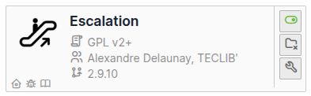
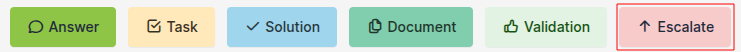

Escalade
========

Requirements (on-premise)
-------------------------

============ =========== ===========
GLPI Version Minimum PHP Recommanded
============ =========== ===========
10.0.x       8.1         8.2
============ =========== ===========

.. Note::
   This plugin is available without a GLPI-Network subscription. It is also available in `Cloud <https://glpi-network.cloud/>`__

Install the plugin
------------------

-  Go to the marketplace. Download and install the plugin **Escalade**.

Assign a ticket
---------------

.. Tip::
   Escalade vs business rules We advise you **to use business rules** to allocate tickets or escalations. This allows you to manage
   more flexibly when changing category, urgency, etc.

.. Note::
   **Escalade** allows tickets **to be escalated only to groups**, and not to live users.

When the plugin is activated, a new option is available from the ticket interface :

Set plugin parameters
---------------------

-  From the plugin, click on the spanner and choose the various options that interest you:

+-----------------------------------+-----------------------------------+
| Action                            | Effet                             |
+===================================+===================================+
| **Remove old assign group on new  | Deletes or not the addition of a  |
| group assign**                    | new group when you assign a new   |
|                                   | one                               |
+-----------------------------------+-----------------------------------+
| **show group assign history       | (*valid only if previous option   |
| visually**                        | is set to* **yes**) Previous      |
|                                   | groups will be visible when a new |
|                                   | group is escalated                |
|                                   |.. figure:: images/Escalade-3.png  |
+-----------------------------------+-----------------------------------+
| **Assign ticket to initial group  | (*valid only if previous option   |
| on solve ticket**                 | is set to* **yes**) Reassigns     |
|                                   | ticket to initial group if a      |
|                                   | group is deleted                  |
+-----------------------------------+-----------------------------------+
| **Escalation history in tasks**   | Keep or not the history of        |
|                                   | escalations in the tasks          |
+-----------------------------------+-----------------------------------+
| **Remove technician(s) on         | Technician(s) will be deleted     |
| escalation**                      | when a new technician is added to |
|                                   | the ticket                        |
+-----------------------------------+-----------------------------------+
| **Ticket status can be changed    | Modify the status of the ticket   |
| after escalation**                | after the escalation. A “do not   |
|                                   | modify” option is also available. |
+-----------------------------------+-----------------------------------+
| **Assign the technical manager on | If a technical manager is         |
| ticket category change**          | declared in an ITIL category,     |
|                                   | he/she will be automatically      |
|                                   | assigned and will receive a       |
|                                   | notification.                     |
+-----------------------------------+-----------------------------------+
| **Assign the technical group on   | If a technical group is declared  |
| ticket category change**          | for an ITIL category, it will be  |
|                                   | automatically assigned and the    |
|                                   | members of the group will receive |
|                                   | a notification                    |
+-----------------------------------+-----------------------------------+
| **Clone tickets**                 | Possibility of cloning tickets    |
|                                   | from the helpdesk interface       |
|                                   | .. figure:: images/Escalade-4.png |
+-----------------------------------+-----------------------------------+
| **Close cloned tickets at the     | Close all cloned tickets when one |
| same time**                       | of them is closed                 |
+-----------------------------------+-----------------------------------+
| **Use the technician’s group**    | If a technician is assigned, his  |
|                                   | group will also be assigned. You  |
|                                   | can choose to take account of the |
|                                   | assignment when the ticket is     |
|                                   | created and/or modified. You can  |
|                                   | also choose to select the first   |
|                                   | or last group to which the user   |
|                                   | is assigned                       |
+-----------------------------------+-----------------------------------+
| **Remove requester(s) on          | Remove requester(s) in the event  |
| escalation**                      | of an escalation. Please note     |
|                                   | that no history is kept, as is    |
|                                   | the case for assigning a group    |
+-----------------------------------+-----------------------------------+
| **Display delete button**         | Displays the option of deleting   |
|                                   | actors from the ticket (ability   |
|                                   | to refine which                   |
|                                   | user/group/supplier by            |
|                                   | requestor/watcher/technician)     |
|                                   |.. figure:: images/Escalade-5.png  |
+-----------------------------------+-----------------------------------+
| **Activate filtering on           | Enables filtering and whether or  |
| allocation groups**               | not escalation to other groups is |
|                                   | possible. *See next chapter for   |
|                                   | more information*                 |
+-----------------------------------+-----------------------------------+

Setting up filtering
~~~~~~~~~~~~~~~~~~~~

Filtering allows you to define which group is able to escalate tickets to other groups. For example, we don’t want N1 support to be able to
escalate to N3 directly. The escalation to N2 must be mandatory.

-  From **Administration > Groups**, select one of the groups
-  In **escalade**, add the groups to which this one will be able to escalate tickets.

.. Warning::
   This option can be useful, but it requires all groups to be set up. If, for example, the **technician N1** group can escalate
   tickets to the **technician N2** group, you need to ensure that the **technician N2** group can escalate tickets to the **technician N3** group and
   also to the **N1** group, so that a ticket can be escalated if necessary.

Example :

   * **Joe** user is **affected** to group **Groupe 1**

   .. image:: images/filter_group.png
       
       

   * **Groupe 1** is configured to allow ticket escalation only to **Groupe 2**

   .. image:: images/group_escalation.png

   * **Joe** user can **only reassign** ticket to **Groupe 2** because it's assign to Groupe 1

   .. image:: images/ticket_filter_group.png

   * For other users not assign to **Groupe 1**, they can't reassign group to ticket (groups are not proposed in the list of assignation)

   .. image:: images/ticket_filter_group_empty.png

   * You can **bypass** this behavior per user

   .. image:: images/bypass_user.png

Ticket's search engine
----------------------

Plugin add three new search option

.. image:: images/searchoption.png

* Group concerning by escalation

Ex : get all tickets actually escalated to group **Groupe 1**

* Number of escalation

Ex : get all tickets with more than ten escalation

* Number of escalation between two groups

Ex : get all tickets with more than 2 escalations between two groups

Central page
------------

New dashlet to display ticket solved to close and assign to you group

New dashlet to display not solved ticket where your groups was not actually assign but was in the past

.. image:: images/central_follow.png

