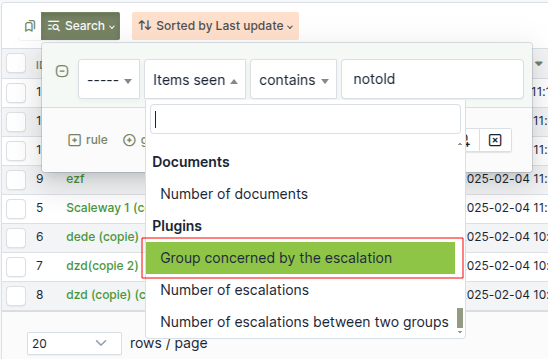

Escalade
========

* Sources link: https://github.com/pluginsGLPI/escalade
* Download: https://github.com/pluginsGLPI/escalade/releases

Requirements for latest version
-------------------------------

This plugin requires :

* PHP 7.2 or higher
* GLPI >= 9.4

Features
--------

Escalade plugin aims to simplifier the ticket escalation process in GLPI.
It also adds a graphical historical for assigned groups.

Install the Plugin
------------------
* Uncompress the archive.
* Move the ``escalade`` directory to the ``<GLPI_ROOT>/plugins`` directory
* Navigate to the *Configuration > Plugins* page,
* Install and activate the plugin.

Usage
-----

The plugin will create required tables in the database  automatically. Those tables will be updated along with the plugin.

Plugin usage is quite simple:

* configure plugin

You will access the plugin configuration from the *Setup* > *Plugins* > *Escalade*.

Configuration
-------------

* Remove old assign group on new group assign

When this option is enabled, plugin remove old group when new group is assign to ticket

* Show group assign history visually

When this option is enabled, plugin display display group assign history

* Escalation history in tasks

When this option is enabled, the plugin adds a private task containing the escalation information fore each escalation

.. image:: images/task_escalation.png

* Remove technician(s) on escalation

When this option is enabled, the plugin remove assign technician when escalation is performed

* Ticket status after an escalation

When this option is enabled, the plugin change ticket status when escalation is performed

* Assign ticket to initial group on solve ticket

When this option is enabled, the plugin assign fisrt group assigned to ticket

* Assign the technical manager on ticket category change

When this option is enabled, the plugin assign fisrt group assigned to ticket

* Assign the technical group on ticket category change

When this option is enabled, the plugin assign the technical group of categroy selected from ticket

* Clone tickets

When this option is enabled, the plugin gives the possibility to clone a ticket and to link it the initial ticket

* Close cloned tickets at the same time

When this option is enabled, at the closing of a ticket, cloned and linked tickets are also closed

* Use the technician's group

When this option is enabled, the plugin assign fist or latest group of technician assign to ticket

* Display delete button

Display or not delete button for group, user or supplier switch type (requester, watcher, assigned to)

* Enable filtering on the groups assignment

When this option is activated, the plugin filters the groups displayed in the dropdown list

   * Example

      * 'glpi' user is affected to group 'groupe 1'

      .. image:: images/filter_group.png

      * 'groupe 1' is configured to allow ticket escalation only to 'group 2'

      .. image:: images/group_escalation.png

      * 'glpi' user can only reassign ticket to 'groupe 2' because it's assign to 'groupe 1'

      .. image:: images/ticket_filter_group.png

      * For other users not assign to 'groupe 1', they can't reassign group to ticket

      .. image:: images/ticket_filter_group_empty.png

      * You can "bypass" this behavior per user

      .. image:: images/bypass_user.png

Ticket's search engine
----------------------

Plugin add three new search option

* Group concerning by escalation

Ex : get all tickets actually escalated to group "groupe 1"

* Number of escalation

Ex : get all tickets with more than ten escalation

* Number of escalation between two groups

Ex : get all tickets with more than 2 escalations between two groups

Central page
------------

New dashlet to display ticket solved to close and assign to you group

.. image:: images/central_closed.png

New dashlet to display not solved ticket where your groups was not actually assign but was in the past

