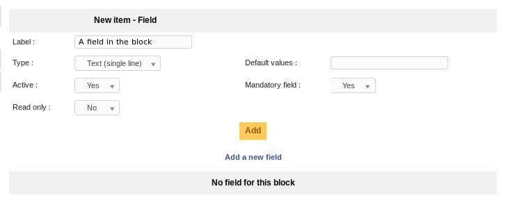

Fields
======

Sources
-------

* Sources link: `<https://github.com/pluginsGLPI/fields>`_
* Download: `<https://github.com/pluginsGLPI/fields/releases>`_

Requirements (on-premise)
-------------------------

============ =========== ===========
GLPI Version Minimum PHP Recommended
============ =========== ===========
10.0.x       8.1         8.2
============ =========== ===========

.. Note::
   This plugin is available without a GLPI-Network subscription. It is also available in `Cloud <https://glpi-network.cloud/>`__

Sources
-------

* Sources link: https://github.com/pluginsGLPI/fields
* Download: https://github.com/pluginsGLPI/fields/releases

Fields plugin allows to add additional fields on various items GLPI manages: tickets, computers, users, ...

Features
--------

* Add containers block on various items,
* Add fields into blocks,
* Display blocks in an existing tab or in their own tab,
* Many fields types available,
* Fields can be flagged as required,
* Manage profiles ACLs per container,
* ...

Install the Plugin
------------------

* Uncompress the archive.
* Move the ``fields`` directory to the ``<GLPI_ROOT>/plugins`` directory
* Navigate to the *Configuration > Plugins* page,
* Install and activate the plugin.

Usage
-----

The plugin will create required tables in the database and some files on disk (into ``<GLPI_ROOT>/files/_plugins/fields``) automatically. Those files and tables will be updated along with the plugin.

Plugin usage is quite simple:

* create a block linked with some items,
* create fields in this block.

You will access the plugin configuration from the *Setup* > *Aditionnal fields* menu.

Adding a new block
^^^^^^^^^^^^^^^^^^

* `Label`: the label of the block that will appears on items forms,
* `Type`: type of display, one of:

  * `Add tab`: will add a new tab on the item form containing the block,
  * `Insertion in the form`: will add the block at the end of the main item form,
  * `Insertion in the form of a specific tab`: will add the block at the end of a specific tab of the item.

* `Associated item type`: a list of items types on which the block will be added,
* `Active`: whether the block is active or not.

.. note::

   You can add only one block of the type `Insertion in the form` for an associated item type.

Inserting a block in a specific tab is only possible for one item:

Once a block have been created, it is possible to change its label or is active flag, but not its type or associated items list.

Profiles
++++++++

You can refine profiles access on the block using the `Profiles` tab from the block. You will be able to choose either `No access`, `Read` or `Write` for every existing profile.

Adding a new field
^^^^^^^^^^^^^^^^^^

* `Label`: the label of the block that will appears on items forms,
* `Type` field type, one of:

  * `Header`: an header label, for visual distinction,
  * `Text (single line)`: a single line (``input/@type="text"``) of text,
  * `Text (multiples lines)`: a multiline (``textarea``) text,
  * `Number`: a single number (no text allowed),
  * `Dropdown`: a configurable dropdown list, values are configured from the main GLPI dropdown configuration you can find in *Setup* > *Dropdowns* menu,
  * `Yes/No`: a dropdown list with only `Yes` and `No` values,
  * `Date`: a standalone date with a date picker,
  * `Date & time`: a date field with a date picker and a time dropdown field (step is configured from GLPI core),
  * `Users`: list of users.

* `Active`: whether the block is active or not,
* `Read only`: flag this field as read only,
* `Default values`: default field values,
* `Mandatory field`: flag this field as mandatory.

.. warning::

   Of course, you will need to pay attention playing with the various options... For example, if you flag a field as mandatory and as read only, and if you do not provide a default value, form validation will fail.

   Another example: you should not set a text default value for a number field... That kind of things ;)

Once fields have been created, you can reorder or edit them from the Fields tab of the block:

And see what it should look like on a `User` item for example:

Search
------

All fields that have been added are available in the attached items search forms.

Simplified Interface
--------------------

Only blocks attached to tickets and with the type `Insertion in the form` will be displayed in the simplified interface of ticket creation. Of course, it will also take care of current profile rights!

Translations
------------

.. versionadded:: 1.4.0

Plugin itself is translated using `the transifex services <https://www.transifex.com/teclib/glpi-plugin-plugin-fields>`_; but you aslo can translate the label values for blocs and fields; the process is identical on both those ones:

On the block form, choose the *Translations* tab:

On block creation, a new translation with current language and value set as label will be created; you can add as many translations as you want.

Dropdown values can be translated using the core's dropdown configuration.

.. warning::

   As of GLPI 9.1.1; some issues on the core side prevent dropdown plugin values to be translated; the possibility has been deactivated in the plugin. It will be enabled again once the core has been fixed.

Entities
--------

If you are using entities in your GLPI instance, a block will be displayed only if the entity it is attached to is compatible with the one of the item it applies to.

When you create or edit a block in multi entities mode, you'll have to choose if the block will be available in children entities:

As an example, let's say our entities have the following structure:

* ``root``

  * ``A``

    * ``C``

  * ``B``

The following table will tell you in wich cases the block is displayed or not:

============ =============== =========== ===============
Block entity Recursive block Item entity Block displayed
============ =============== =========== ===============
A            Yes or No       A           Yes
A            Yes or No       B           No
A            Yes             C           Yes
A            No              C           No
============ =============== =========== ===============
