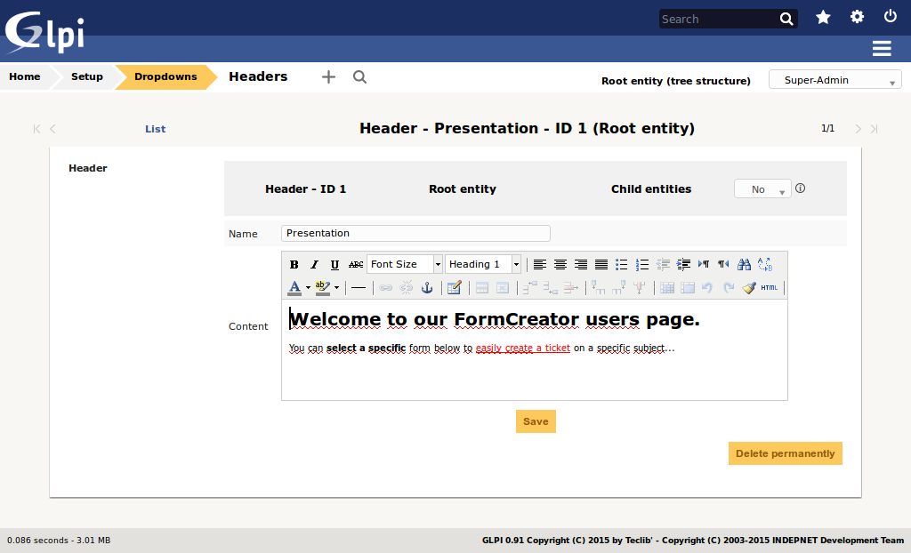
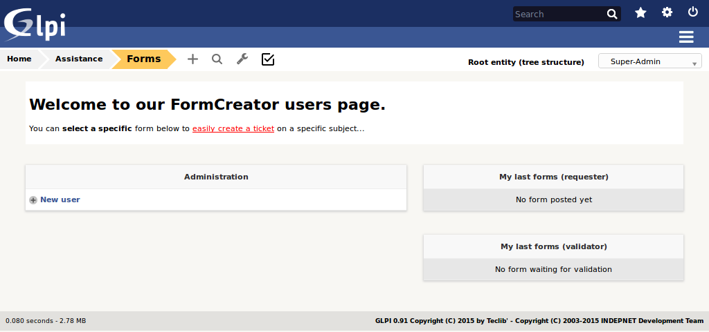
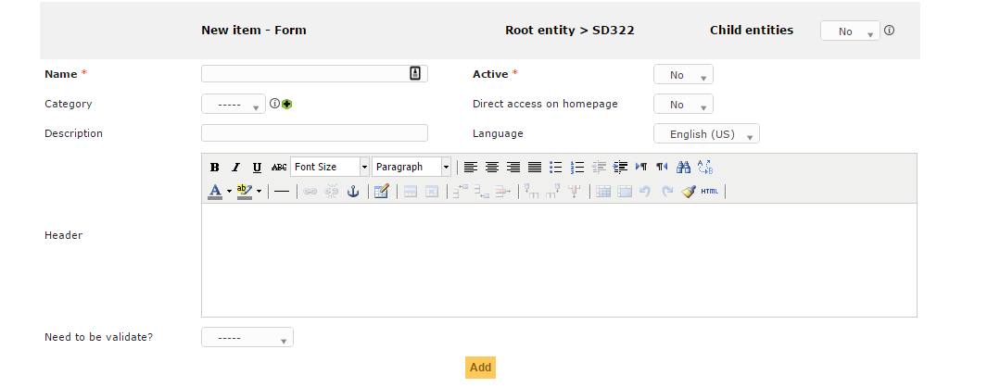

Configuration and usage
-----------------------

Headers
^^^^^^^

**Menu** : `Setup > Dropdowns : Forms > Headers`

Headers are rich texts _(text with presentation: bold, italic, titles, colors, etc.)_ which are defined per entities.  
They can be translated since GLPI 0.85 like all other dropdowns  
_(Dropdowns translation must be enabled on GLPI general configuration page: Setup > General : General setup > Translate dropdowns = Yes)_.

These texts are shown on the users forms list, over the forms.  
It can be used to indicate some general advertisement over all the forms below.

Configuration
+++++++++++++

Render
++++++

Categories
^^^^^^^^^^

**Menu** : `Setup > Dropdowns : Forms > Form categories`

Form categories allow you to arrange your forms list.

You can add or edit categories generally from the Setup menu : `Setup > Dropdowns`.

You can also add new categories directly from the form page like all GLPI dropdowns.

They are defined by entities and can be translated since GLPI 0.85 like all other dropdowns.

.. note::

   Dropdowns translation must be enabled on GLPI general configuration page `Setup > General`, `General setup > Translate dropdowns = Yes`

Configuration
+++++++++++++

.. image:: images/categories-config.png

Render
++++++

.. image:: images/categories-front.png

Questions
^^^^^^^^^

After the creation of a form, create fields for for the user to fill out.

The name of the questions will appear on the left and the field type selected on the right

The Description will be under the filed input.

Based on question type options will be based on type chosen.

If validation is desired, it can be implemented following `PHP Regular Expressions <http://php.net/manual/reference.pcre.pattern.syntax.php>`_.

Helpdesk
^^^^^^^^

The plugin can provide its own design for helpdesk.

To enable it, edit an entity, open the **Forms** tab and set the field **Use Form creator's helpdesk** to **Yes**. This setting handled inheritance from parent entity to children entities.

Users using the simplified interface will benefit a new interface allowing them to:

* browse forms and FAQ with the unified interface
* follow the process of their requests
* book assets
* view their feeds

Forms with **Direct access on homepage** enabled and **FAQ items** in the **Knowledge base** will will appear in the interface. Users may search by browsing the categories on the left of the screen, and may also search for forms or FAQ with a natural language search engine.

FAQ items needs to be associated to knowledge base categories. The knowledge base categories must be associated to form categories (available in Setup > Dropdowns > Form categories) to show their content. 
