Forms configuration
===================

Form creation
-------------

.. note::
    The right to create forms is available in the GLPI's profiles. Refer to the end of this document to know how to set this right.

.. note::
    Forms must be created in the entities where they are intended to be available. A form may be available in its entity and all sub entities if the field **Child entities** is set to **Yes**.

1. Navigate to **Administration > Forms**.

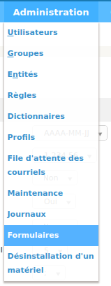

2. Click on the button to add a form **+**

Following fields must be populated:

* **Name**: Name of the form.
* **Active**: A form is inactive by default. You need to explicitly activate it when it is ready to use.
* **Category**:
   * In the simplified interface, categories are used to store forms by group.
   * If you want to use the **service catalog** you must use form categories.

.. note::
    Form categories are plugin's dropdowns. You can add form categories directly when editing a form use the **+** next to category field. You can do the same from **Configuration > Dropdowns > Form category**.

* **Direct access on homepage**: Direct access to the form from the GLPI's simplified interface.
 **Description**: displays in the list forms.
 * **Language**: by default a form is set to the language of its creator. The form will be available only to users using the same language as the form. Choose **All languages** to make the form available to users without language restriction.
* **Header**: displays when the form is displayed.
* **Need to be validate**: If **Yes** a list of validators is displayed. This is a list of GLPI users (with the right **Validate an incident** or **Validate a request** (in its profile) on an compatible entity with the form's entity. The list of validators is a multiple choice list. If no validator is selected all of them are submitted when the form is being used.
* **Default form in service catalog**: if **Yes** the form will display in the service catalog without being filtered by the current category or keywords.

When all fields are filled, click on the **add button** at the botoom of the page.

Sections
---------

After clicking on the tab **Question** the following page displays:

You must create a first **section**. Sections are intended to organize questions in the form.

Questions
---------

Click on the link **Add a question** in a section of your choice.

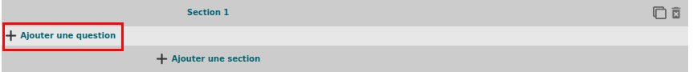

The following page displays:

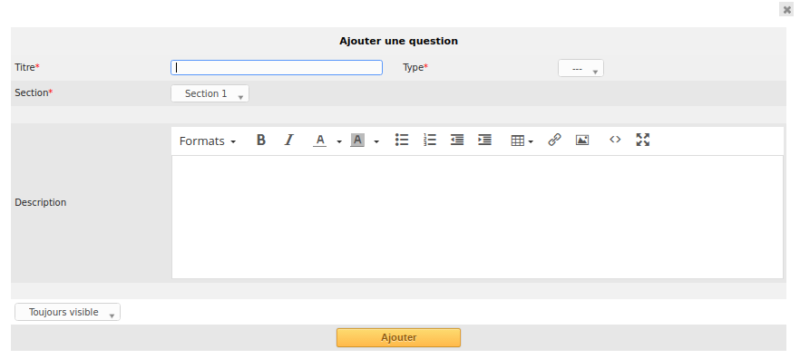

A question is made of:

* a title: this is the label of the question in the form.
* a type: see list below.
* a section: the section containing the question. You can move a question to an other section with this field.
* a description; it is displayed under the question in the form. Use it as a hint for the requester, telling him which content is expected.
* a dropdown list **Show field**

 .. image:: images/show_field.png

It submits the following choices:

* **Always visible**: the field is always displays
* **Hidden unless**: The question is hidden except if answers to other questions matches a condition.
* **Displayed unless**: The question is displayed except if the answers to other questions matches a condition.

Conditions may be multiple. To add or remove a condition two buttons are available:

 .. image:: images/question_condition_buttons.png

 .. note:: **List of pictograms**

 * The **circle** allows you to make a question mandatory |circle_mandatory|, or optional |circle_optional|.
 * **Arrow up** and **arrow down** allow you to r eorder questions in a section.
 * Clicking on a question allow you to edit it.
 * **Two stacked squares** allows you to duplicate a question or a whole section.
 * The **recycle bin** allows you to delete a question or a whole section.

Types of question
-----------------

There are about twenty types of quetions available. Depending on the choosen type, you need to provide additional informations.

.. note::

 * **Required**: **Yes**/**No**. When running the form a red star shows next to label of questions requiring an input.
 * **Default values**: its content depends on  the type of the question.
 * **Range Min/Max**: Restricts the value to the given range when runnung the form.
 * **Additional validation (Regular expression)**: You may set a custom regex with a regular expression. Use it when other restriction methods cannot satisfy your needs. FormCreator automatically adds /^ on the beginning and $/ at the end. Therefore you cannot specify modifiers.

Actors
^^^^^^

 .. image:: images/actor_field.png

This field allows you to choose one or several users:

* in GLPI, available in **Administration > Users**
* not in GLPI, by typing an email address

IP Address
^^^^^^^^^^

This field is hidden and collects the IP address of the form requester. It does not shows in the form.

Checkboxes (multiple choices)
^^^^^^^^^^^^^^^^^^^^^^^^^^^^^

 .. image:: images/checkboxes_field.png

 .. image:: images/checkboxes_form.png

Add a line per value in **Values**. Default values may be set in **Default values**, one per line. If this field is empty, no checkbox will be ticked.

Radio buttons (one choice only)
^^^^^^^^^^^^^^^^^^^^^^^^^^^^^^^

 .. image:: images/radios_field.png

 .. image:: images/radios_form.png

Add a line per value in **Values**. A default value may be set in **Default value**. If this f ield is empty, no radio will be selected.

Hidden field
^^^^^^^^^^^^

This field is hidden and allows to retrieve an arbitrary value when generating the target (ticket or change).

Email
^^^^^

The answer to this type of field must be a syntaxically valid email address.

Data / Datetime
^^^^^^^^^^^^^^^
 .. image:: images/datetime_field.png

This field allows to select a date or datetime from a mini calendar.

Description
^^^^^^^^^^^

This field only displays informations. Use it to give more details about a question.

Integer
^^^^^^^

This field must be an integer value. Note you may use a regular expression to tighter restrict the answer.

File
^^^^

 .. image:: images/file_field.png

This  field allows the requester to upload a file.

Float
^^^^^

This field must be an float value. Note you may use a regular expression to tighter restrict the answer.

Dropdown
^^^^^^^^

This field allows the user to choose a value among those available in a dropdown from GLPI (in **Configuration > Dropdowns**).

 .. image:: images/dropdown_field.png

GLPI Object
^^^^^^^^^^^

This field allows you to build a dropdown from a GLPI object among those abvailable in the menus:

* Assets
* Assistance
* Management
* Tools
* Administration

Select (one choice onnly)
^^^^^^^^^^^^^^^^^^^^^^^^^

This field allows you to create a dropdown list and set its items. Items are added one per line in **Values**. Default value may be set in **Default value**. If there is no default, no item is selected by default.

LDAP select
^^^^^^^^^^^

This field allows you to create a dropdown list with objects from a LDAP directory:

 .. image:: images/ldap_form.png

Multiselect
^^^^^^^^^^^

This feild allows you to create a dropdown list with ability to select multiple items. Values are added one per line in the field **Values**. You may set default values, one per line in *Default values**. Ifg no default value is set then no item will selected by default.

Tags
^^^^

This is an hidden field to ass a tag to the form for future processing.

Text
^^^^

This field allows you to input a single line of text.

Urgency
^^^^^^^

This field allows you to select an urgency defined in GLPI.

Text area
^^^^^^^^^

This field allows you to input several lines of text.

Targets
-------

Three values are available:

* **Public access**: Anyone may acces the form; you may use it in an intranet.
* **Private access**: Users having a GLPI account may acces the form.
* **Restricted access**: Only users having the specified profiles may access the form.

Destinations
^^^^^^^^^^^^

There are two types of destinations for a form:

* Generation of one or several tickets
* Generation of one or several changes

To create a destination click on the link **Add a destination**

 .. image:: images/add_destination.png

The following page displays:

 .. image:: images/add_destination_form.png

Choose a destination type, then fill the form which dynamically displays.

Ticket destination
''''''''''''''''''

 .. image:: images/destination_ticket.png

* **Name**: Name of the destination
* **Ticket title**: By default, this is the name of the destination. You may change it and use tags the form provides.
* **Description**: By default the description is **##FULLFORM##**. It means the description will be populated with all questions and answers of the form. You may change the description. It is always rendered as simple text when the destination is generated. Available tags are displayed at the bottom of the page, in the section **List of available tags**.

  .. image:: images/tag_list.png

* **Destination entity**: Defines the destination entity of the destination ticket

 .. image:: images/destination_entity_dropdown.png

* **Ticket template**: A ticket template may be used to define the content of the destination  ticket.
* **Due date**: To define a due date forthe  generated ticket.
* **Ticket category**: To assign a category to the generated ticket.
 * **Category from template or None**: If a ticket template is used, the category of the template will be used. If there is no ticket template, or if the template does not defiles a category, no category will be affected to the ticket.
 * **Specific category**: Defines a category to the ticket from available categories.
 * **Equals to the answer to a question**: defines the category from a answer in the form

* **Urgency**: allows to define urgency in the generated ticket. Available choices are:
 * **Urgency from template or Medium**: If a ticket template is used and it sets an urgency, it will be used for the generated ticket. Medium for other cases.
 * **Equals to the answer to the question**! The urgency is set from the answer of a quetion in the form.

.. note:: You may create several destinations for a single form. Several tickets or changes will be generated when  the form is validated.

Change destination
''''''''''''''''''

 .. image:: images/destination_change.png

* **Name**: Name of the destination
* **change title**: By default, this is the name of the destination. You may change it and use tags the form provides.
* **Description**: By default the description is **##FULLFORM##**. It means the description will be populated with all questions and answers of the form. You may change the description. It is always rendered as simple text when the destination is generated. Available tags are displayed at the bottom of the page, in the section **List of available tags**.
* **Impacts**: Works as **Description**.
* **Control list**: Works as **Description**.
* **Deployment plan**: Works as **Description**.
* **Backup plan**: Works as **Description**.
* **Checklist**: Works as **Description**.
* **Destination entity**: Defines the destination entity of the destination ticket
* **Due date**: To define a due date forthe  generated ticket.
* **Change category**: To assign a category to the generated change.
 * **None**: No category assigned.
 * **Specific category**: Defines a category to the change from available categories.
 * **Equals to the answer to a question**: defines the category from a answer in the form
* **Urgency**: allows to define urgency in the generated change. Available choices are:
 * **Medium**: If a ticket template is used and it sets an urgency, it will be used for the generated ticket. Medium for other cases.
 * **Equals to the answer to the question**! The urgency is set from the answer of a quetion in the form.

Preview
-------

This tab allows you to view how the form will be rendered and test it without activating it.

Form answers
------------

This tab shows all answers saved for the form.

.. image:: images/form_answers.png

When viewing a specific answer, you may print it

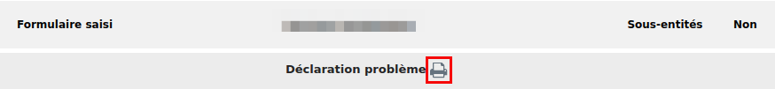

Import / export, duplication and transfer
-----------------------------------------

It is possible to achieve some operations on forms from **Massive actions**:

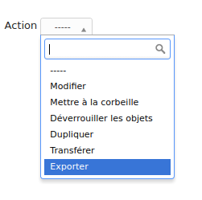

You must first show the list of forms, tick one or more forms on which  you want to apply an action, and click on the **Action** button.

Available actions are:

* **Duplicate**: Duplicate selected form(s).
* **Transfer**: Transfer selected form(s) to an other enrity.
* **Export**: Export selected form(s) into a file to import them in an other server.

Importing form is available from the following button:

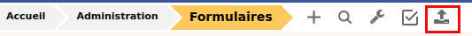

A file is expected to proceed the import.

Running forms
=============

Helpdesk > Forms
----------------

Forms are displayed as shown below:

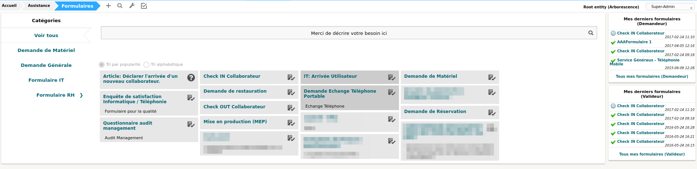

* on the left there are categories
* in the middle: the list of forms and FAQ items (from the KB) related to the current category
* on the right: list of answers to forms related to the user

Service catalog in place of simplified interface
------------------------------------------------

The service catalog replaces the simplified interface for ticket creation. Declaring a request or an incident may  be done in different ways:

* by choosing directly a category which will display the list of FAQ items from the knowledge base and the forms related to  the category,
* by typing a few words about the need in the search bar, which will filter forms anf FAQ items,
* the user may also display all articles and forms on the same page

Here is a sample:

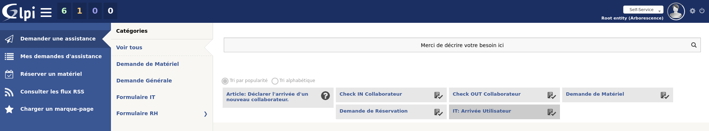

It is made of:

* links to ticket: in progress / waitiing / to be validated / closed:
 .. image:: images/service_catalog_ticket_counters.png
* request for assistance

 .. image:: images/service_catalog_overview_2.png

  1. Search field to filter forms ans FAQ items
  2. Link to access forms and FAQ items
  3. Go back to the root of category tree
  4. Category choice
  5. a FAQ item
  6. forms

* My assistance requests

This part displays the list of current requests for the user.

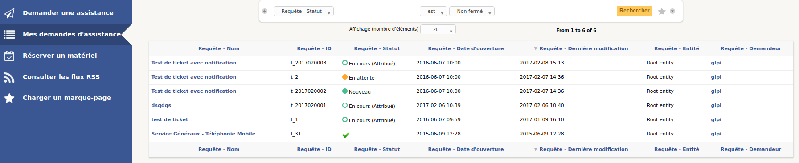

Depending on the mode applied to the entity (**service catalog simplified** or **service catalog extended**) two displays are avaiable:

  Extended, with tabs on the left:
  
  .. image:: images/service_catalog_ticket_extended.png

  Simplified: without tabs
  
  .. image:: images/service_catalog_ticket_simplified.png

Execution of a form
-------------------

To execute a form, click on its name, fill its fields and send it with the button |send_button|.

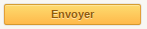

Each field is validated depending on its type while the requester fills the form, and when he sends it. If a va is required an additional field named **Choose a validator** will display at the end of the form, containing a dropdown with the validators allowed by the designer of the form. This field is mandatory.

Workflow without validation
---------------------------

A form without validation, once filled, creates the targets as sool the user clicks on the |send_button|.

Workflow of a form with validation
----------------------------------

A form with validation has a intermediate step.

* an email notification is sent to the validator, asking him to validate the form.
* In GLPI, the validator sees all his forms to validate

  * Either in this window
  
    .. image:: images/forms_to_validate.png
    
   * |icon_pending|: form to validate
   * |icon_validated|: validated form
   * |icon_refused|: refused form

    .. |icon_pending| image:: images/icon_pending.png
    .. |icon_validated| image:: images/icon_validated.png
    .. |icon_refused| image:: images/icon_refused.png

  * Either from the top menu with the tick button

    .. image:: images/tick_button.png

    * By acceding the form to validate, the validator sees the form as it was filled by ith author.
    * If the validator accepts it targets of  the form (one or several tickets and changes) are geenrated.
    * It the validator refuses, no target is generated. The author of the form may submit again the form by modifying it. It will be sent again to the same validator.

Printing a form
---------------

You may print the form currently displayed with the button located on the right of the form's title.

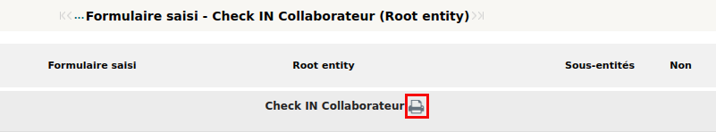

Service Catalog activation
--------------------------

The replacement of the simplified interface by the serice catalog is done on a per entity basis. The setting is available by choosing an entity in **Administration > Entity**.

In teh entity, open the tab **Forms**. You can choose the **Helpdesk mode**:

* service catalog **simplified**: without tabs for tickets
* service catalog **extended**: with tabs on tickets
* GLPI helpdesk: the simplified interface of GLPI

Right management: Administation > Profile
-----------------------------------------

Right management for the plugin is available in the profiles.

Rights list:

* **Administration > Entity: Update**: create and modify forms
* **Assistance > Validations: Validate an incident / Validate a request**: Validate forms
