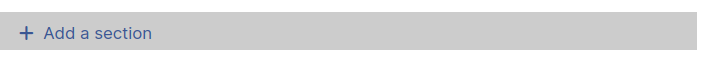
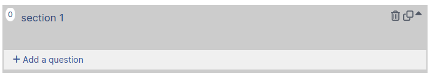
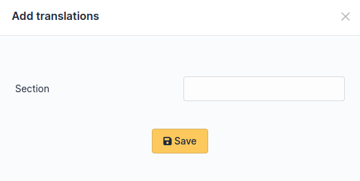
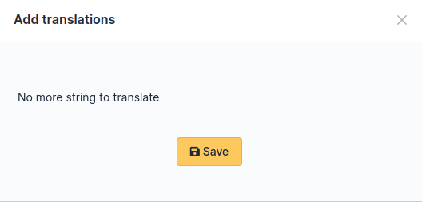

Forms configuration
===================

Form creation
-------------

.. note::
    The right to create forms is enabled to the profiles having the right to update entities in GLPI. Refer to the documentation of GLPI to know how to setup this right.

.. note::
    Forms must be created in the entities where they are intended to be available. A form may be available in its entity and all sub entities if the field **Child entities** is set to **Yes**.

1. Navigate to **Administration > Forms**.

.. image:: images/administration_menu.png

2. Click on the button to add a form **+**

Following fields must be populated:

* **Name**: Name of the form.
* **Active**: A form is inactive by default. You need to explicitly activate it when it is ready to use.

It is recommended to fill the Category field:

* In the simplified interface, categories allow to tidy forms by Blocks.
* If you want to use the **service catalog** you must use form categories.

.. note::
    Form categories are plugin's dropdowns. You can add form categories directly when editing a form using the **+** next to category field. You can do the same from **Configuration > Dropdowns > Form category**.

* **Direct access on homepage**: Direct access to the form from the GLPI's simplified interface.

* **Description**: displays in the list forms.
* **Language**: by default a form is set to the language of its creator. The form will be available only to users using the same language as the form. Choose **All languages** to make the form available to users without language restriction.

* **Header**: displays when the form is displayed.
* **Need to be validate**: If **Yes** a list of validators is displayed. This is a list of GLPI users (with the right **Validate an incident** or **Validate a request** (in its profile) on a compatible entity with the form's entity. The list of validators is a multiple choice list. If no validator is selected all of them are submitted when the form is being used.
* **Default form in service catalog**: if **Yes** the form will display in the service catalog without being filtered by the current category or keywords.

When all fields are filled, click on the **add button** at the bottom of the page.

.. note::
    Deleting a form is possible only if there are no associated answers. To delete a form, delete all its answers first from the **Form answers** tab.

Sections
---------

After clicking on the tab **Question** the following page displays:

You must create a first **section**. Sections are intended to organize questions in the form.

.. image:: images/section_creation.png

It is possible to setup conditions to show the whole section, based on the answers provided to questions located in other sections of the form.

Questions
---------

Click on the link **Add a question** in a section of your choice.

The following page displays:

.. image:: images/add_question_form.png

A question is made of:

* a title: this is the label of the question in the form.
* a type: see list below.
* a section: the section containing the question. You can move a question to an other section with this field.
* a description: it is displayed under the question in the form. Use it as a hint for the requester, telling him which content is expected.
* a dropdown list: **Show field** to enable a condition

 .. image:: images/show_field.png

It submits the following choices:

* **Always visible**: the field is always displays
* **Hidden unless**: The question is hidden except if answers to other questions matches a condition.
* **Displayed unless**: The question is displayed except if the answers to other questions matches a condition.

Conditions may be multiple. To add or remove a condition two buttons are available:

 .. image:: images/question_condition_buttons.png

.. note:: **List of pictograms**

 * The **circle** allows you to make a question mandatory

 .. image:: images/question_picto_mandatory.png

 , or optional

 .. image:: images/question_picto_optional.png

 * **Arrow up** and **arrow down** allow you to reorder questions in a section.
 * Clicking on a question allow you to edit it.
 * **Two stacked squares** allows you to duplicate a question or a whole section.
 * The **recycle bin** allows you to delete a question or a whole section.

Questions are organized on a 4 columns array. You can resize width of questions, reorder them using drag and drop and put up to 4 questions on the same row.

Types of question
-----------------

There are about twenty types of questions available. Depending on the chosen type, you need to provide additional information.

.. note::

 * **Required**: **Yes**/**No**. When running the form a red star shows next to label of questions requiring an input.
 * **Default values**: its content depends on  the type of the question.
 * **Range Min/Max**: Restricts the value to the given range when running the form.
 * **Additional validation (Regular expression)**: You may set a custom regex with a regular expression. Use it when other restriction methods cannot satisfy your needs. Don't forget to specify the delimiters of the regex. You may add any modifier after the closing delimiter.

Actors
^^^^^^
 .. image:: images/actor_field.png

This field allows you to choose one or several users:

* in GLPI, available in **Administration > Users**
* not in GLPI, by typing an email address

Checkboxes (multiple choices)
^^^^^^^^^^^^^^^^^^^^^^^^^^^^^

 .. image:: images/checkboxes_field.png

 .. image:: images/checkboxes_form.png

Add a line per value in **Values**. Default values may be set in **Default values**, one per line. If this field is empty, no checkbox will be ticked.

Date / Datetime / Time
^^^^^^^^^^^^^^^^^^^^^^^
 .. image:: images/datetime_field.png

This field allows to select a date, a datetime or a time from a mini calendar.

Description
^^^^^^^^^^^

This field only displays information. Use it to give more details about a question.

Dropdown
^^^^^^^^

This field allows the user to choose a value among those available in a dropdown from GLPI (in **Configuration > Dropdowns**).

 .. image:: images/dropdown_field.png

Email
^^^^^

The answer to this type of field must be a syntactically valid email address.

File
^^^^

 .. image:: images/file_field.png

This  field allows the requester to upload a file.

Float
^^^^^

This field must be a float value. Note you may use a regular expression to tighter restrict the answer.

GLPI Object
^^^^^^^^^^^

This field allows you to build a dropdown from a GLPI object among those available in the menus:

* Assets
* Assistance
* Management
* Tools
* Administration

Hidden field
^^^^^^^^^^^^

This field is hidden and allows to retrieve an arbitrary value when generating the target (ticket or change).

.. note::
   This type of questions never shows on a form.

Hostname
^^^^^^^^^^^^

This field is invisible. It allows to get the hostname of the computer used by the requester, assuming the DNS is able to properly resolve it from its IP address

Integer
^^^^^^^

This field must be an integer value. Note you may use a regular expression to tighter restrict the answer.

IP Address
^^^^^^^^^^

This field is hidden and collects the IP address of the form requester. It does not show in the form.

LDAP select
^^^^^^^^^^^

This field allows you to create a dropdown list with objects from a LDAP directory:

 .. image:: images/ldap_form.png

.. note::
   This type of questions cannot be used to fill actors of a target.

Multiselect (multiple choice)
^^^^^^^^^^^^^^^^^^^^^^^^^^^^^

This field allows you to create a dropdown list with ability to select multiple items. Values are added one per line in the field **Values**. You may set default values, one per line in *Default values**. If no default value is set then no item will be selected by default.

Request type
^^^^^^^^^^^^

This field is a dropdown with "Incident" or "Request" choices. It can be used to set the request type of a ticket being generated by the form.

Radio buttons (one choice only)
^^^^^^^^^^^^^^^^^^^^^^^^^^^^^^^

 .. image:: images/radios_field.png

 .. image:: images/radios_form.png

Add a line per value in **Values**. A default value may be set in **Default value**. If this field is empty, no radio will be selected.

Select (one choice only)
^^^^^^^^^^^^^^^^^^^^^^^^

This field allows you to create a dropdown list and set its items. Items are added one per line in **Values**. Default value may be set in **Default value**. If there is no default, no item is selected by default.

Tags
^^^^

This is a hidden field to add a tag to the form for future processing.

.. note::
  This type of field is only available when the plugin **Tag** is installed and enabled.

Text
^^^^

This field allows you to input a single line of text.

Text area
^^^^^^^^^

This field allows you to input several lines of text.

Urgency
^^^^^^^

This field allows you to select an urgency defined in GLPI.

Conditions
----------

Conditions are expressions involving questions and sections which are evaluated in order to determine

* if a question is displayed
* if a section is displayed
* if the submit button of a form is displayed
* if a target (see below) must be generated

Available operators in an assertion are:

* equals
* not equals
* less than
* greater than
* less than or equal
* greater  than or equal
* is visible
* is not visible
* matches a regular expression

The condition expression can be used with the following rules:

* **Hidden unless**: the item is hidden or not generated except when the expression is true
* **Displayed unless**: the item is displayed or generated except when the expression is true

Access types
------------

Three values are available:

* **Public access**: Anonymous users may access the form; you may use it in an intranet.
* **Private access**: Users having a GLPI account may access the form.
* **Restricted access**: Only users having the specified profiles may access the form.

When a form is set to **Public access** it is possible to enable a simple captcha. This captcha should prevent spamming if a form is accessible from internet.

.. Note:: Captchas are not enabled by default on anonymous forms. Administrators need to enabled them explicitly depending on how the form may be accessible from an hostile network such Internet.

Targets
-------

There are three types of targets for a form:

* tickets
* changes
* problems

It is possible to generate any number of targets from a single form. Mixing types of targets is also possible.

To create a target click on the link **Add a target**

 .. image:: images/add_target.png

The following window is then displayed:

 .. image:: images/add_target_form.png

Choose a target name and type, then validate. The new target is created and is available for tuning.

Preview
-------

This tab allows you to view how the form will be rendered and test it without activating it.

.. note::
    Submitting answers from the preview will be actually saved, and will generate targets if the form is not configured with validation.

Form answers
------------

This tab shows all answers saved for the form.

.. note::
    To delete a form, all its answers must be deleted first. A warning shows at the bottom of the main tab of a form as a reminder.

Categories
----------

**Menu** : `Setup > Dropdowns : Forms > Form categories`

Form categories allow you to arrange your forms list. Forms are displayed when they belong to the selected category or any sub category. When a form does not have any category, it is displayed when no category is selected or when the user selects "view all".

You can add or edit categories generally from the Setup menu : `Setup > Dropdowns`.

You can also add new categories directly from the form page like all GLPI dropdowns.

They are defined by entities and can be translated since GLPI 0.85 like all other dropdowns.

.. note::
   Dropdowns translation must be enabled on GLPI general configuration page `Setup > General`, `General setup > Translate dropdowns = Yes`

.. note::
   Categories may be associated to `Knowledge base categories`. This link is necessary to allow FAQ entries to show along your forms.

Configuration
^^^^^^^^^^^^^

Render
^^^^^^

.. image:: images/categories-front.png

Questions
---------

After the creation of a form, create fields for the user to fill out.

.. image:: images/question_creation.png

The name of the questions will appear on the left and the field type selected on the right.

The Description will be under the input field.

Additional options may be displayed depending on the currently selected question type.

If validation of the input is desired, it can be implemented following `PHP Regular Expressions <http://php.net/manual/reference.pcre.pattern.syntax.php>`_.

If you want to show or hide questions depending on the answers of other questions, use the *show fields* area when editing a question. In the version 2.5.0 you may use more complex expressions checking for the content of several questions, and use logic operator **OR** and **AND**. The precedence of boolean operators applies, meaning that **AND** has precedence over **OR**.

Translation
-----------

In some cases a form should be available in several languages. Choose first in which language a form should be created. This language should be english (US or UK) or the language that most of target users understand. This is the fallback language if no alternative is found.

This language is also used as reference in the translation process. Then be sure that the chosen language is readable by the user who will translate the form.

To translate a form open the tab **Form languages**, then create all languages you need to provide to users.

.. image:: images/translation_add_language.png

Choose a language added to the form and click it to begin or resume translation, then select the tab **Translations**. Click the button **New translation** and a popup dialog will open and show a string to translate. Type the translation, and click save or validate with **Enter** on your keyboard.

If another string must be translated, it will show immediately. If no more string needs to be translated, a message will show instead.

When you close the dialog the list of translated strings is refreshed. You can edit a translation by clicking on it, delete one or several translations with the checkboxes on the left of the list and the **Delete** button**. You can also filter the list with the filter input box.

