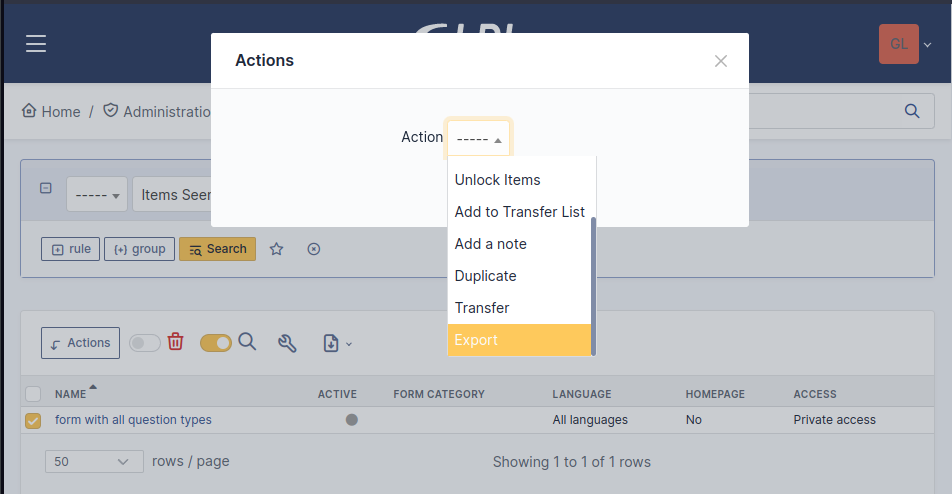
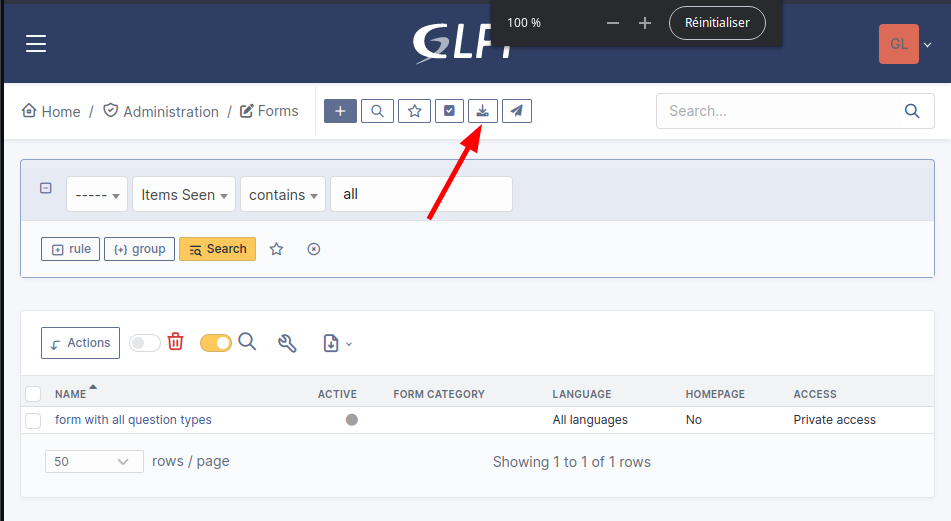
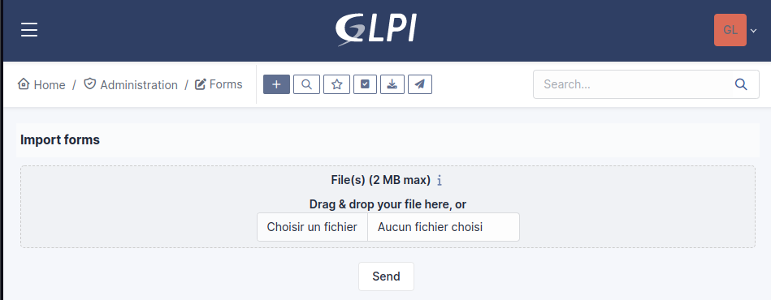

Exporting and importing forms
-----------------------------

Abstract
^^^^^^^^

Formcreator allows exporting and importing forms between instances of GLPI.

This feature is designed to let administrators develop forms on a testing environment and copy them on a production environment.

When a form is being imported the plugin searches for a matchng form in the database. This is done with the help of a random identifier created when a new form is instanciated. Each sub object (sections, questions, conditions, targets) also have a random identifier. This helps the plugin to find a matching item and update it if necessary. Thanks to this mechanism Formcreator is able to update a form when it is imported more than once.

Limitations
^^^^^^^^^^^

A form may contain relations to objects of GLPI itself (mostly users, groups, categories, entities). There is currently no reliable way to maintain relations between forms and GLPI's objects or assets accross instances. It is therefore highly recommended to develop forms on a testing environemnt with a reasonably recent copy of the production database.

The export / import feature does not support importing forms accros different versions of Formcreator. The version 2.10 shows a warning if it detects a attempt of importing forms from a previous version. In version 2.11 such imports are not allowed.

Exporting forms
^^^^^^^^^^^^^^^

1. Navigate to **Administration > Forms**

2. Use massive actions to export one or more forms. Clicking on  the **Post** button will start the download of a JSON formated file. This file contains all forms selected for the export.

Importing forms
^^^^^^^^^^^^^^^

1. Navigate to **Administration > Forms**

2. Use the toolbar to import forms.

3. Select one or more JSON files created with the same version of Formcreator and validate.

4. Depending on the complexity and the quantity of forms the process may be slow. Please be patient.

5. Carefully check the messages when the import completes. You may get warnings and errors.

Import behavior
^^^^^^^^^^^^^^^

Entities
""""""""

When Formcreator imports a form, it checks that the entity of the form exists and the user has right to update entities. If not, the form is ignored and trigger a warning.

Form categories
"""""""""""""""

Form categories are created if they don't exist yet.

Users and groups
""""""""""""""""

The users and groups found in target actors must exist. If not, the import of the form will stop with an error, leading to an incomplete form. Other forms will be imported.

