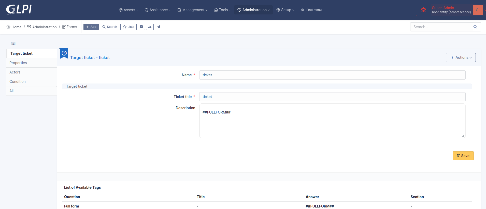
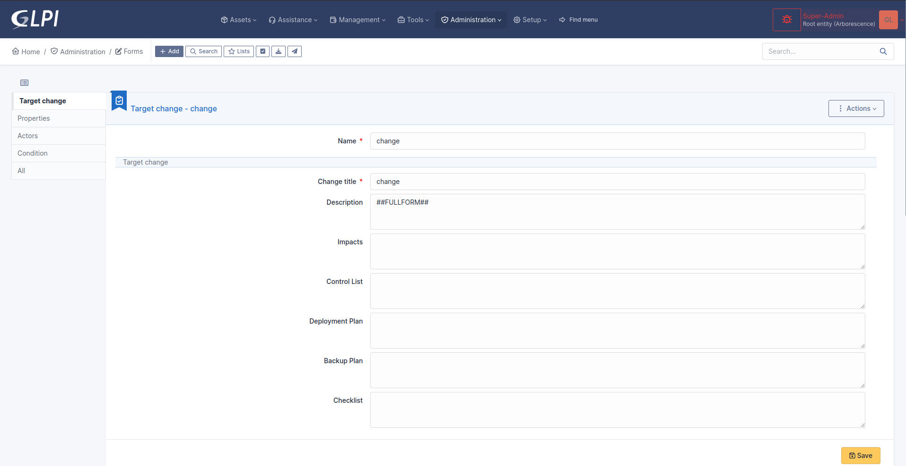

Targets
-------

Targets are objects generated by FormCreator submission. If a form requires validation, the targets are delayed until approbation.

.. Note::
    Targets are currently tickets only.

A target ticket defines the ticket generated by  the form. You may have several targets per form.

Open the tab `Destination` and create a target with a name and a type (currently ticket only).

Target ticket
^^^^^^^^^^^^^

A target ticket generates a ticket.

The ticket is build from scratch or from a ticket template available in GLPI. You may

* customize the name of the target ticket to distinguish it from possible other targets,
* customize the title and description of the ticket using questions and answers,
* set tne destination entity of the generated ticket,
* set a time to resomve (formerly due date),
* set the type of ticket (request or incident),
* set the associated elements,
* set the category,
* set the urgency,
* set the location,
* assign tags to the ticket if the plugin `Tags` is available,
* link the generated ticket to other tickets
* define actors of the ticket.
* define conditions to meet to generate the target ticket

.. Note::
    Setting an urgency, a category or a location (specific or from a question) overrides the urgency defined in a ticket template (if any)

Destination entity
""""""""""""""""""

Many choices are avaialble:

* Current active entity: the entity of the requester who fills a form,
* Default requester's entity: the default entity defined for the user who fills the form,
* First dynamic requester's entity (alphabetical): sorts all dynamic entities of the requester alphabetically and selects the first one,
* Last dynamic requester's entity (alphabetical): sorts all dynamic entities of the requester alphabetically and selects the last one,
* The form's entity: the entity where is located the form being filled by the requester,
* Default entity of the validator: the default entity of the validator who validates the request,
* Specific entity: an entity set by the form's designer,
* Default entity of a user type question answer: the default entity of a user choosen by the requester in a question.
* From a GLPI object > Entity type question answer: the entity choosen by the requester from a question.

.. Note::
    Default requester's entity may be not set, then there is a risk to generate tickets in the root entity.

.. Note::
    Default entity of the validator may be not set, then there is a risk to generate tickets in the root entity.

.. Note::
    Dynamic requester's entity requires user synchronization, then there is a risk to generate tickets in the root entity.

Ticket template
"""""""""""""""

Sets predefined setings for the ticket from a template. All settings defined in the target ticket will override the values found in the template.

Request type
""""""""""""

Sets the type of the generated ticket

* Default or from a template: value set by GLPI when no type is set, or from a template, if any and if this template defiines a type
* Specific type: either request or incident,
* Equals to the answer to the question: the value is  set from a request type question.

Associated elements
"""""""""""""""""""

Sets associated elements to the generated ticket

None : self explanatory,
Specific asset: an asset set by the designer of the form,
Equals to the answer to a question: an asset set by the requester, from a question
Last valid answer: an asset set by the requester, from the last visible question eligible for this purpose

Category
""""""""

Sets the category of the generated ticket

* Category fro template or none: sets the category from a template if any and if this template has a predefined category. None in all other cases,
* Specific category: a category set by the form's designer,
* Equals to the answer to a question: a category choosen by the requester,
* lastr valid answer: a category from the last visible question of type category,

Urgency
"""""""

* Urgency fro template or none: sets the urgency from a template if any and if this template has a predefined urgency. None in all other cases,
* Specific urgency: an urgency set by the form's designer
* Equals to the answer to a question: a category choosen by the requester,

Location
""""""""

* Location fro template or none: sets the location from a template if any and if this template has a predefined loation. None in all other cases,
* Specific location: a location set by the form's designer
* Equals to the answer to a question: a category choosen by the requester,

Condition to show the target
""""""""""""""""""""""""""""

The form's designer may restrict creation of the ticket depending on conditions.

Target change
^^^^^^^^^^^^^

A target change generates a change

The change is built from scratch. You may

* customize the title, description, imapct, control list, deployment path, backup plan and checklist fields using questions and answers,
* set the urgency from a value or a question
* choose the entity of the change among many policies
* set the time to resolve
* define the actors of the change
* set the category of the change
* define conditions to meet to generate the target ticket

Target description templating
^^^^^^^^^^^^^^^^^^^^^^^^^^^^^

Target ticket and target change both have description template. By default the template uses the tag ``##FULLFORM##``. This tag is a default template where all questions and sections are displayed in the same order as the form.

Each question has 2 tags

* ``##question_x##`` which is replaced by the label of the question. X is the ID of the question.
* ##answer_x## which is replaced by the answer to a question. X is the ID of the matching question.

Questions of type dropdown support more complex expression like ##answer_x.name##. X still means the ID of a question. the word after the dot is the name of a property available in the search options of the itemtype of the dropdown question.

As an example, consider a dropdown question shows locations. The itemtype set by the form designer is "Location". The designer can render in the target many fields of the location selected by the requester, such address, postcode, state, building, and many other data. To find them, the admin may rely on the list available in the search filters for a location.
