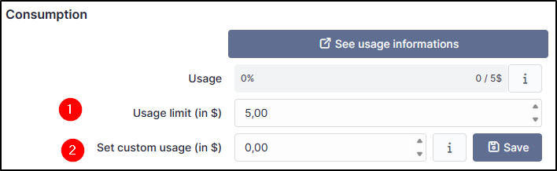
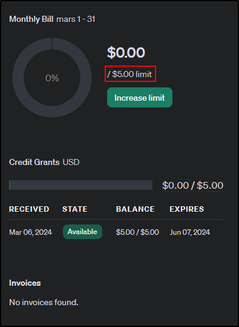

Consumption
-----------

It is possible to limit the use of the API by specifying a limit that must not be exceeded

1.  To limit usage and avoid overruns, specify a value that must not be exceeded. If this limit is exceeded, the plugin will no longer function until this value is increased.
2.  Enter the actual value of your API key (https://platform.openai.com/usage). This value must be updated when the plugin usage data is not coordinated with the real API value.

