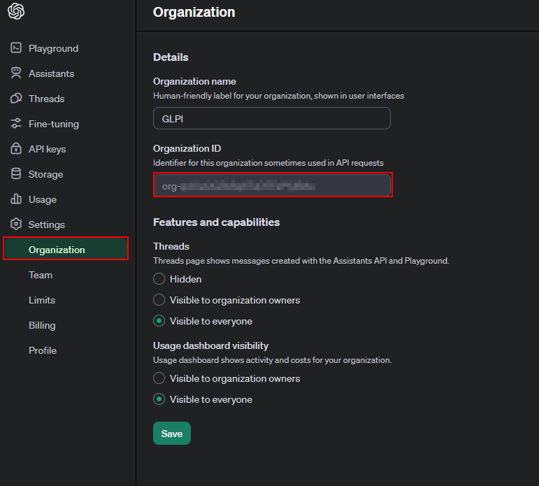

Create an organization
----------------------

After creating an OpenAI account, your can create an organization from your account settings under the **Organization** tab or by accessing the page directly at https://platform.openai.com/account/organization.

Keep the **Organization ID** value, as you will need to insert it in the GLPI AI plugin configuration.

