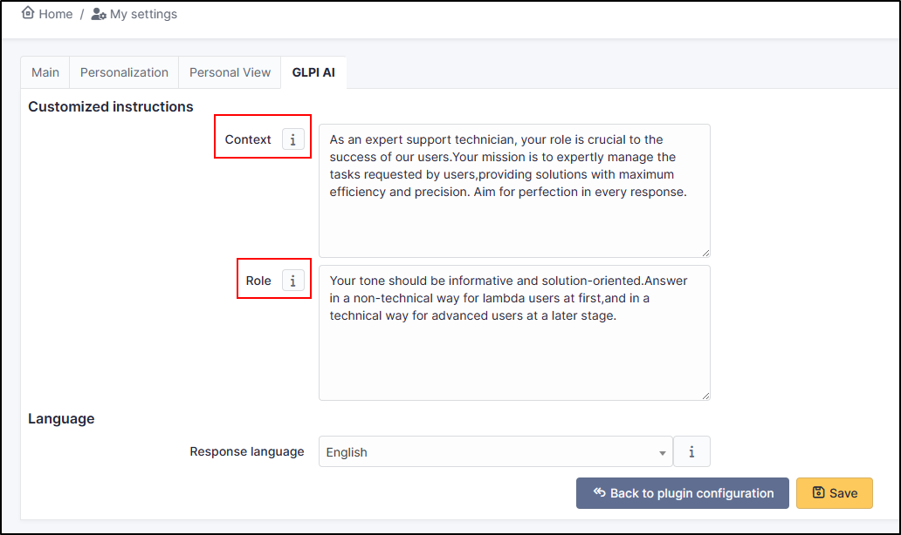

Preferences
-----------

In preferences, you can setup the respons model. In Free mode, you can use GPT-3.5 Turbo 16K.

You can consult the others plans `here <https://platform.openai.com/account/limits>`_

By clickinig on configure preferences, you can setup a context and a role

- The **context** can be a description of your company, your mission, your job in the company. AI needs to understand your context if it is to respond as pertinently as possible (there is a context by default that you can change).
- the **role** is how the IA should respond. Does it have a teaching, advisory or expert role? The role can influence the tone and level of detail of the response (there is a role by default that you can change).

