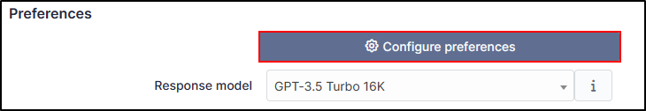

Preferences
-----------

In preferences, you can set up the response model. In Free mode, you can use the GPT-3.5 Turbo 16K model.

You can find information regarding the other plans and plan limits `here <https://platform.openai.com/account/limits>`_

By clicking on **Configure preferences**, you can setup a context and a role.

- The **Context** can be a description of your company, your mission, your job in the company. AI needs to understand your context if it is to respond as pertinently as possible (there is a context by default that you can change).
- The **Role** is how the AI should respond. Does it have a teaching, advisory or expert role? The role can influence the tone and level of detail of the response (there is a role by default that you can change).

