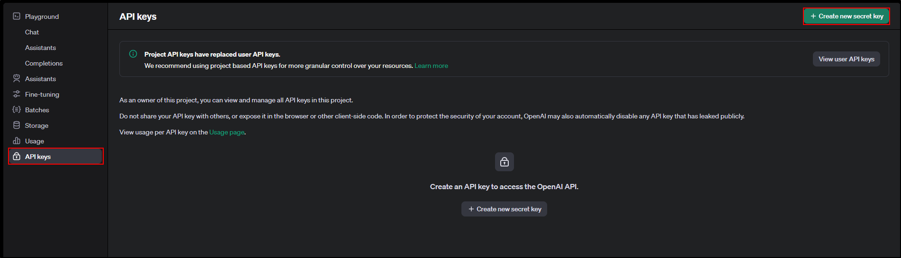
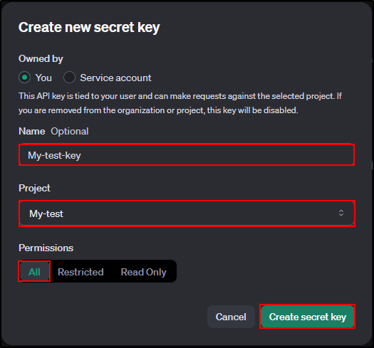
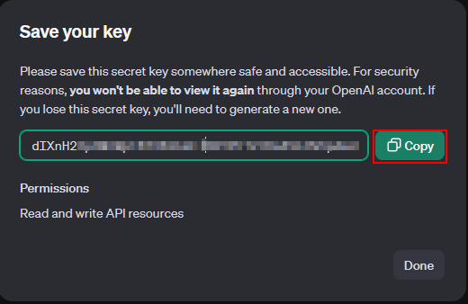

Create a secret
----------------

- From this URL https://platform.openai.com/api-keys
- Click on **Create a new secret**

- Give a name to your secret
- Click on **Create secret key**

Copy the secret value that is generated as you will need it later to configure the plugin.

