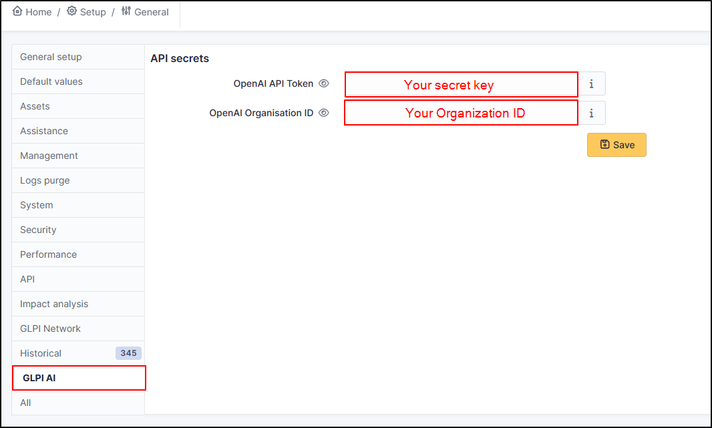
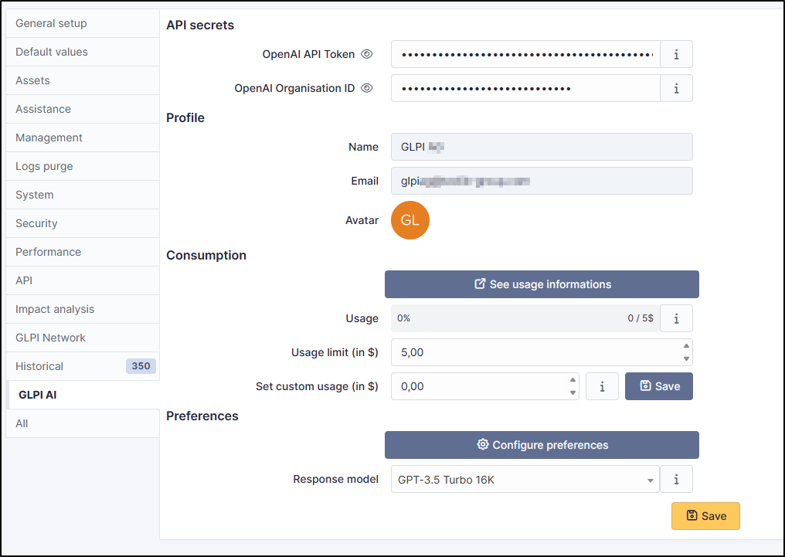

Set up GLPI
-----------

- In GLPI, go to **Setup > General > GLPI AI**
- Fill in the fields with the values copied previously

- If your configuration is correct, you will be able to see your account entries, your consumption and your preferences.

