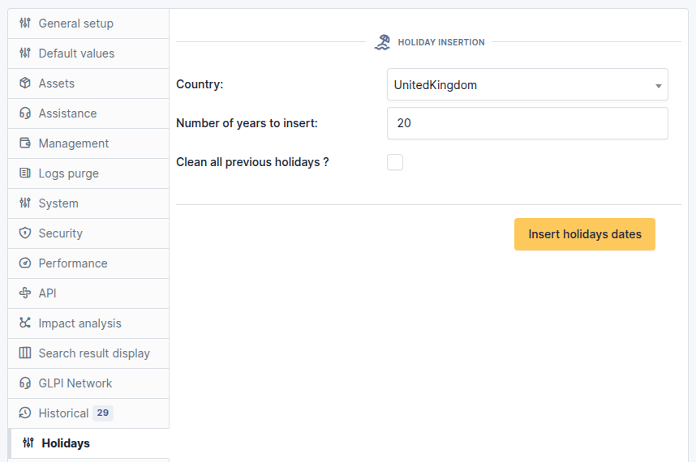

Holidays
========

Requirements (on-premise)
-------------------------

============ =========== ===========
GLPI Version Minimum PHP Recommended
============ =========== ===========
10.0.x       8.1         8.2
11.0.x       8.2         8.4
============ =========== ===========

.. include:: ../include/basic_subscription.rst

Install the plugin
------------------

-  Go to the marketplace. Download and install the **Holiday** plugin.

Set up the plugin
-----------------

-  From **Setup > General**, in the **Holiday** tab, enter :

   -  The **Country** concerned
   -  The **Number of years to insert**
   -  **Clean all previous holidays** or not
   -  Then click on **Insert holiday dates**

Delete a holiday date/period
----------------------------

The list of holiday days can be viewed and modified

-  From **Setup > Dropdowns**,
-  enter **Closing** and click on **Closing times**

.. figure:: images/Holiday-3.png
   :alt: list of holidays
   :scale: 100 %

The list of days appears. Let’s assume that the company considers that
Easter Monday is not a day off.

-  In the search box, enter **Easter** then **Search**
-  Select all the entries
-  Click on **Actions**
-  Delete permanently

.. figure:: images/Holiday-4.gif
   :alt: mass removal
   :scale: 45 %

FAQ
---

If you have any questions about using the plugin, please consult `our FAQ <https://faq.teclib.com/04_Plugins/Holiday/>`_

