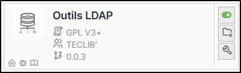
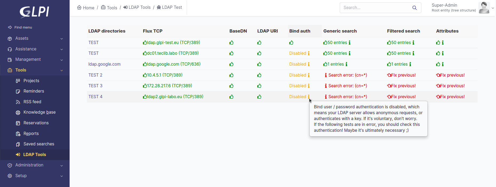

LDAP Tools
==========

Requirements (on-premise)
-------------------------

============ =========== ===========
GLPI Version Minimum PHP Recommended
============ =========== ===========
10.0.x       8.1         8.2
============ =========== ===========

.. include:: ../tabs/basic_subscription.rst

Install the plugin
------------------

-  Go to the marketplace. Download and install the plugin **LDAP Tools**.

Using the plugin
----------------

From **tools > LDAP Tools**, if you have synchronised LDAP directories, they will appear directly.

Each directory has a number of tests which may or may not be validated
depending on your configuration:

-  `Flux TCP`
-  `BaseDN`
-  `LDAP URI`
-  `Bind Auth`
-  `Generic search`
-  `Filtered search`
-  `Attributes`

As soon as one of the tests fails, the following tests will not be performed. You must start by correcting the 1st anomaly before the other tests are run.
