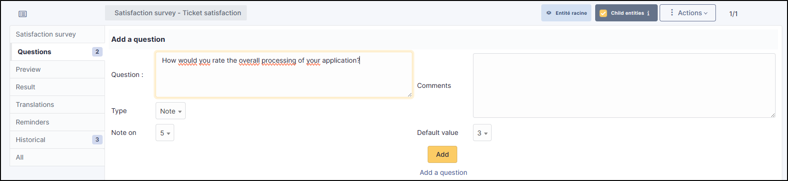
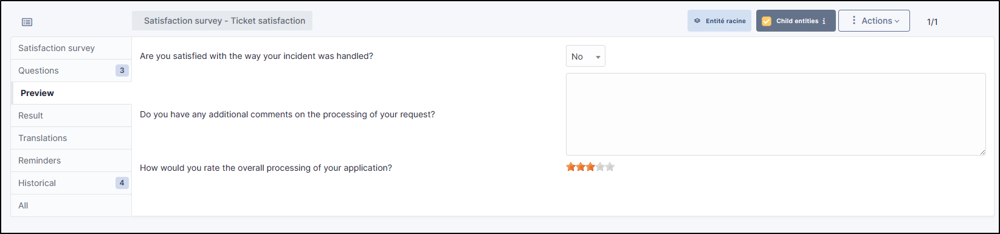
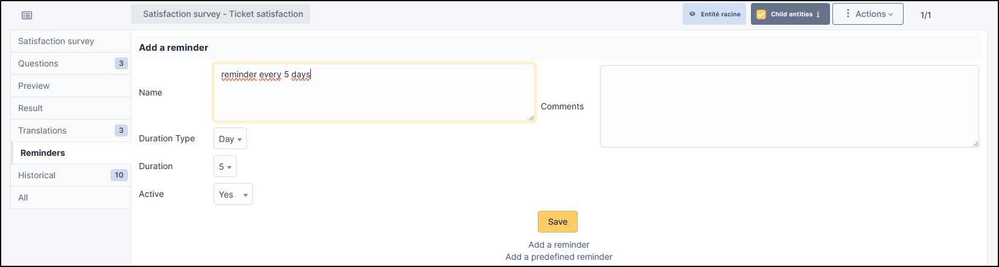

More satisfaction
=================

Requirements (on-premise)
-------------------------

============ =========== ===========
GLPI Version Minimum PHP Recommended
============ =========== ===========
10.0.x       8.1         8.2
============ =========== ===========

.. note::

   A `basic licence <https://services.glpi-network.com/#offers>`_ (or higher) is required. This plugin is also available on `Cloud <https://glpi-network.cloud/fr/>`__.

Install the plugin
------------------

-  Go to the marketplace. Download and install the plugin **More satisfaction**

.. figure:: images/Satisfaction.png
   :alt: install the plugin

Create a survey
---------------

- Once installed, go to **Administration > Satisfaction survey**
- Click on **Add**
- Name your survey and set it as active
- Also remember to tick the sub-entity box if you want it to be available to all child entities
- Then click on **Add**

.. Warning::
   It is only possible to create one survey per entity. If you wish to create several for different entities, remember to position yourself in the appropriate entity and do not tick the sub-entity box 

   .. figure:: images/Satisfaction-2.png
      :alt: sub entity
      :scale: 100 %

Create a question
-----------------

- Enter your survey and go to the **Question** tab
- Click on Add a question
- Select the type of question **Yes/No** and enter the text that suits you
- Then click **Add**

Create a text field
-------------------

- In the question tab, click on **Add a question**
- Select the **Text** type
- Enter the text to be displayed and click **Add**

Create a note
-------------

- In the question tab, click on **Add a question**
- select the **Note** type
- You can select a score up to 10 and set a default value
- Click on "Add" when you are happy with your settings

Preview
-------

The preview tab allows you to see what users will receive once their ticket has been closed

Translation
-----------

You can translate each of the questions asked in the questionnaire into the language of your choice

- Go to the **Translations** tab
- Choose the language you want and then, question by question, write the translation

Schedule reminders
------------------

In the event of a non-response to the survey, you can send out reminders to follow-up with the user. You can create your own reminder or select a predefined one

Customised reminder
~~~~~~~~~~~~~~~~~~~

- Go to the **Reminders** tab
- Click on **Add a reminder**.
- Enter a :
    - **Name**
    - **Type of duration (day or month)**
    - The **duration** of the reminder
    - **Activate** your reminder

Predefined reminder
~~~~~~~~~~~~~~~~~~~

- Go to the **Reminders** tab
- Click on **Add a predefined reminder**
- You will have 3 options to choose from:

-  1 week: reminder every 7 days,
-  2 weeks: reminder every 14 days.
-  1 month: monthly reminder.

- Select the option that suits you and click on **Add**

Limit the number of reminders
~~~~~~~~~~~~~~~~~~~~~~~~~~~~~

- In the **Setup maximum number of days to send reminder** section, enter a limit for the **Maximum number of days to send a reminder**

**Example** : If a person has not responded after 3 reminders, GLPI will no longer send reminders and the satisfaction survey will then remain unanswered

Set up the automatic action
---------------------------

Survey reminders are sent via an automatic action already created by the plugin. Make sure that this is activated and set up correctly

- Go to **Setup > Automatic actions**
- Select the **SatisfactionReminder** action.

.. figure:: images/Satisfaction-11.png
   :alt: automatic action
   :scale: 70 %

FAQ
---

If you have any questions about using the plugin, please consult `our FAQ <https://faq.teclib.com/04_Plugins/Satisfaction_survey/>`_

