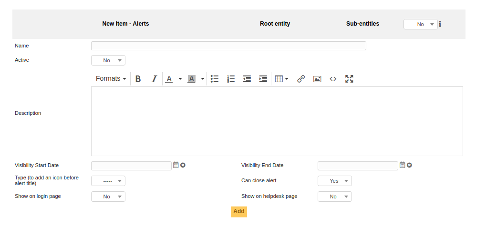
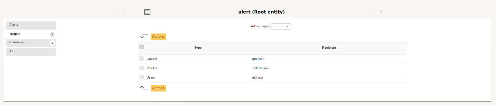
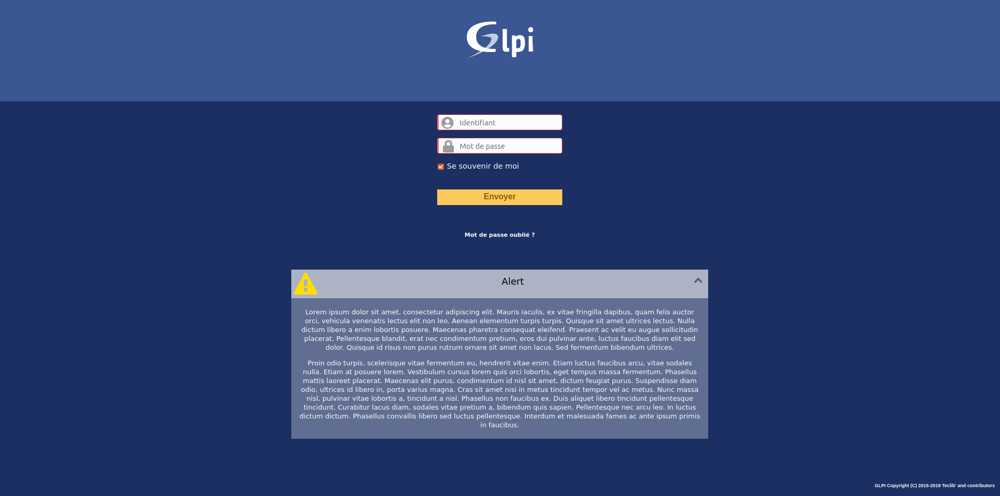
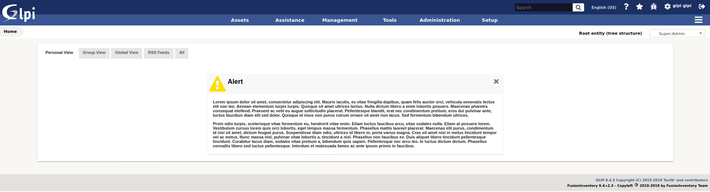

News
====

.. list-table::
   :header-rows: 1

   * - Download
     - Sources
   * - `<https://github.com/pluginsGLPI/news/releases>`_
     - `<https://github.com/pluginsGLPI/news>`_

Requirements (on-premise)
-------------------------

============ =========== ===========
GLPI Version Minimum PHP Recommended
============ =========== ===========
10.0.x       8.1         8.2
============ =========== ===========

.. note::
   This plugin is available without a GLPI-Network subscription. It is also available in `Cloud <https://glpi-network.cloud/>`__

Features
--------

This plugin allows to display alerts messages on GLPI homepage and / or login page.

* Create alert with rich text as for notes.
* Choice of begin/end publication date.
* Manage alerts by entity.
* Target : display alerts by profile / group / user.

Install the Plugin
------------------
* Uncompress the archive.
* Move the ``news`` directory to the ``<GLPI_ROOT>/plugins`` directory
* Navigate to the *Configuration > Plugins* page,
* Install and activate the plugin.

Usage
-----

The plugin will create required tables in the database  automatically. Those tables will be updated along with the plugin.

Plugin usage is quite simple:

* configure alerts

You will access the plugin configuration from the *Tools* > *Alerts*.

Create alerts
-------------

* Name : display as talert title
* Active : is active or not
* Description : content of alert
* Visibility start / end : period of Visibility
* Type : type of alert (General, Information, Warning, Problem)
* Can close alert : User can close alert ?
* Show on login page : display or not alert on login page
* Show on helpdesk page : display or not alert on helpdesk page
* Sub-entity : display or not on sub-entity

Targets
-------

You can define target by type

* Group : for all users of group
* Profil : for all users with profile
* User : for specifi user

Display on login page
---------------------

Display on helpdesk page
------------------------

FAQ
---

If you have any questions about using the plugin, please consult `our FAQ <https://faq.teclib.com/04_Plugins/News/>`__
