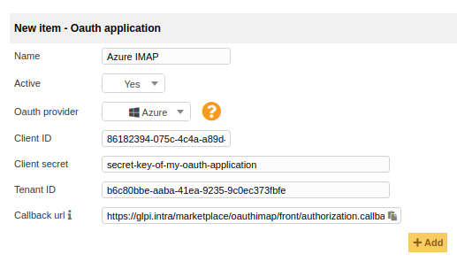
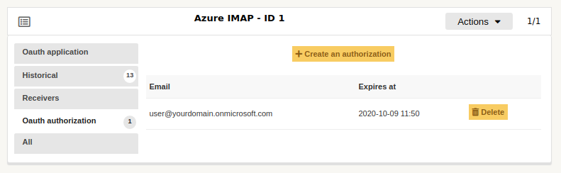
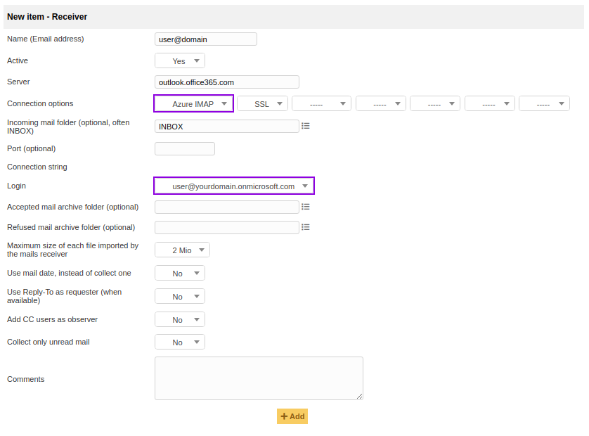

Oauth IMAP
==========

* Sources link: https://github.com/pluginsGLPI/oauthimap
* Download: https://github.com/pluginsGLPI/oauthimap/releases

Features
--------

This plugin supports Oauth connection for emails receivers.

Supported mail services:

* `G Suite and Gmail <https://developers.google.com/gmail/imap/xoauth2-protocol>`_,
* `Azure AD <https://docs.microsoft.com/en-us/exchange/client-developer/legacy-protocols/how-to-authenticate-an-imap-pop-smtp-application-by-using-oauth>`_.

Install the Plugin
------------------

Plugin is available inside GLPI marketplace.

You can also install it manually:

* Uncompress the archive.
* Move the ``oauthimap`` directory to the ``<GLPI_ROOT>/plugins`` directory.
* Navigate to the *Configuration > Plugins* page.
* Install and activate the plugin.

Configure your Oauth application
--------------------------------

To be able to connect to a mailbox using Oauth authentication, you first need to configure your *Oauth application*:

- Register an external application on service provider management console;
- Create an item in *Setup > Oauth applications* using *id* and *secret* of your provider application;
- Copy callback url from the plugin configuration and fill it in the provider console (GLPI will be called back after authentication process).

Create an authorization
-----------------------

Once your Oauth application created, you will need to create an authorization that will be used to authenticate on your mailbox.
To do so, go in the *Oauth authorization* tab of your Oauth application, and click on *Create an authorization*.

You can create an authorization for each of the mailboxes you want to use in mail receivers.
When you create an authorization for a mailbox, previously existing authorizations for this mailbox are discarded.

Configure your mail receiver
----------------------------

To authenticate via Oauth on your mail receiver, you have to change the configuration of your mail receiver:

- choose your Oauth application in the first dropdown of *Connection options*;
- then choose an existing authorization in the *Login* dropdown of select *Create authorization for another user*.

