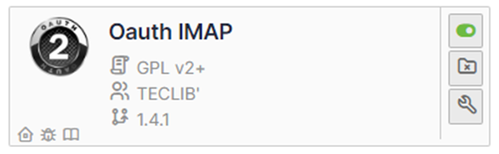
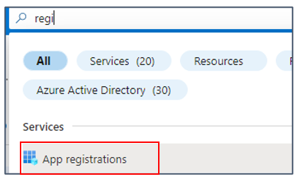
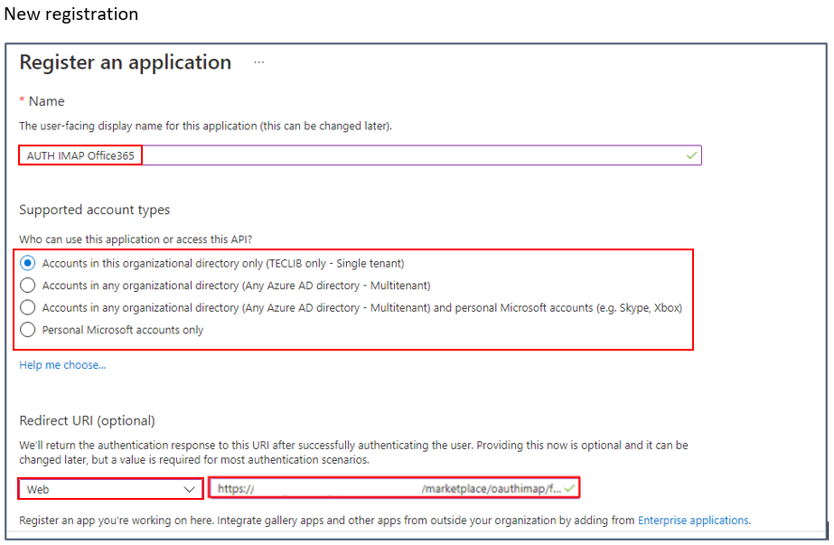
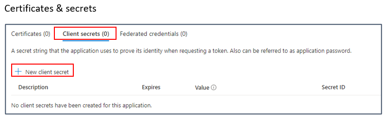
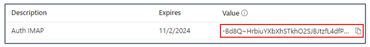
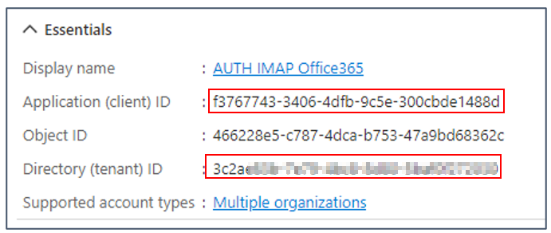
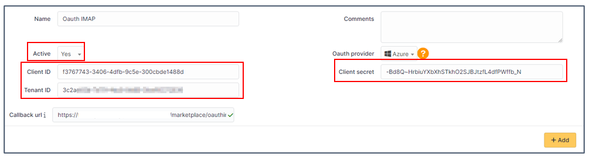
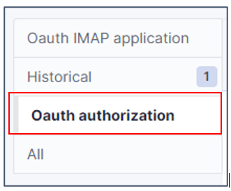
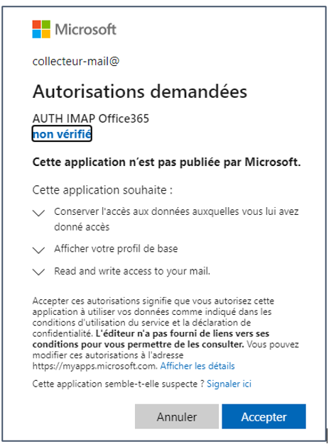
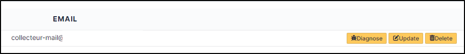

OAuth IMAP
==========

.. note::
   Microsoft is gradually removing the TLS 1.0 and 1.1 protocols for all Microsoft 365 applications. In order to keep your collector running, you need to add the **Oauth IMAP** plugin, which is available in the marketplace.

.. tip::
   The Oauth tokens for the collector, retrieved during authentication with Azure by the OauthIMAP plugin, are “offline” tokens that delegate authorisation to a third-party application (GLPI). These tokens provide a renewal code that will be used by the application to renew them automatically without user intervention. You will therefore not be asked to re-authenticate after the 1st authorisation request.

Source and Download
-------------------

* Sources link: https://github.com/pluginsGLPI/oauthimap
* Download: https://github.com/pluginsGLPI/oauthimap/releases

Requirements (on-premise)
-------------------------

============ =========== ===========
GLPI Version Minimum PHP Recommended
============ =========== ===========
10.0.x       8.1         8.2
============ =========== ===========

.. Note::
   This plugin is available without a GLPI-Network subscription. It is also available in `Cloud <https://glpi-network.cloud/>`__

Supported mail services
-----------------------

OAuth IMAP support :

- Gmail : https://developers.google.com/gmail/imap/xoauth2-protocol?hl=fr
- Entra : https://learn.microsoft.com/fr-fr/power-platform/admin/connect-gmail-oauth2

Install the plugin
------------------

-  Go to the marketplace. Download Oauth IMAP and enable it

-  Open the `Azure Portal <https://portal.azure.com/#home>`__ for your tenant
-  In the search box type **registration**
-  then select **App registrations**

Here are the configuration steps including configuration phases on the Entra side.

Register your Entra application
-------------------------------

Create the application
~~~~~~~~~~~~~~~~~~~~~~

-  Click on **New registration**
-  Enter the desired name, select the type of account supported then enter the redirection URL (present in the configuration of the plugin from your GLPI interface:
   https://XXXXXXXXXXXXXX/marketplace/oauthimap/front/authorization.callback.php) specifying the **Web** option
-  Then click on **Register**.

Add a secret
~~~~~~~~~~~~

-  In the **Certificates and secrets** tab
-  Click on **Client secrets**
-  Then **New client secret**

-  Enter a description and then an expiration date
-  A secret **value** is then generated. Keep this value well because once you have left this page, it will no longer be recoverable

-  Return to the **Overview** tab and **copy** the following values ​​and the secret seen above

Setup GLPI
----------

-  Now go back to your GLPI interface **Setup > Application Aouth IMAP** and indicate the information collected previously :

-  Click **Add**
-  Now in the **Oauth authorization** tab, click **Create an authorization**

-  When you click on **Create authorization**, you will be redirected to the Microsoft services sign-in page
-  Enter the email address and password of the account that will be used for the collector
-  You will also need to accept the necessary permissions related to the plugin.

FAQ
---

If you have any questions about using the plugin, please consult `our faq <https://faq.teclib.com/04_Plugins/OAuth_IMAP/>`__