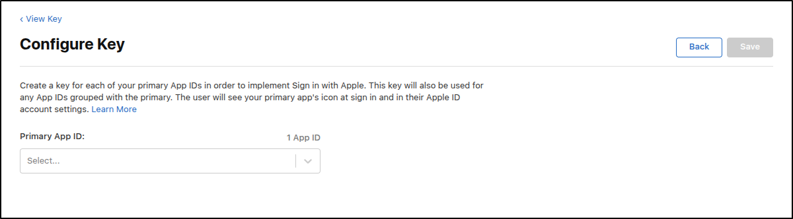

Apple
-----

Create a new identifier
~~~~~~~~~~~~~~~~~~~~

* Go to this page to configure the `Apple provider <https://developer.apple.com/account/resources/certificates/list>`_
* Create a new “Identifier” in ``identifiers`` tab

* Select ``Apps IDs``

* Then continue
* Select ``type`` => ``App``

* Then continue
* Select ``Sign in with Apple`` capability

.. figure:: images/apple_sign_in.png
    :alt: Select sign in Apple
    :scale: 55 %

* ``Team ID`` can be found here (1)
* ``Client ID`` can be found here (2)

Key File and Key ID
~~~~~~~~~~~~~~~~~~~

* Go here to create `Key file <https://developer.apple.com/account/resources/authkeys/list>`_

* Give a name and description (1)

* Select ``Sign in with Apple``
* Click on ``Configure`` (2) to select ``Apps ID`` previously created

After registering your app you will be able to get :

* ``Key FIle`` (1)
* ``Key ID`` (2)

You now have all the information you need to create your provider on the OauthSSO plugin.

.. warning:: **Please note**: the processing of the Apple identifier and key may take some time on Apple’s side, potentially up to 48 hours.

Warning about fetching users informations
~~~~~~~~~~~~~~~~~~~~~~~~~~~~~~~~~~~~~~~~~~

.. note:: User information retrieved from the identity provider is currently limited in terms of data richness and completeness.
    For now, only the ``email``, ``subject identifier`` (sub), ``firstname``, and ``lastname`` can be retrieved from the identity provider.

.. warning:: Concerning ``firstname`` / ``lastname`` fetching.
    Please note that this information is only available **during the user's first login**, provided that the user **consents to sharing their information**.
    For subsequent logins, **only the user identifier** will be retrieved.

