Entra
-----

Register your application in Entra
~~~~~~~~~~~~~~~~~~~~~~~~~~~~~~~~~~

First, register your application with your Entra Active Directory (Entra AD) client. This will provide you with an application ID for your application and allow it to receive tokens.

-  Connect to the `Entra portal <https://entra.microsoft.com/#home>`__
-  Choose your Entra AD tenant by selecting your account in the top right corner of the page. Then select the **Change directory** navigation bar, then the desired tenant
-  Skip this step if you only have one Entra AD tenant under your account or if you have already selected one

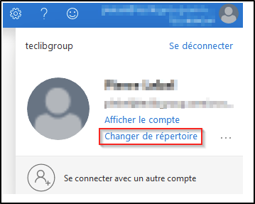

-  In the Entra Portal, search for and select **Entra Active Directory**
-  From the left-hand **Active Directory** menu
-  select **Application Registrations**
-  Then **New Registration**.

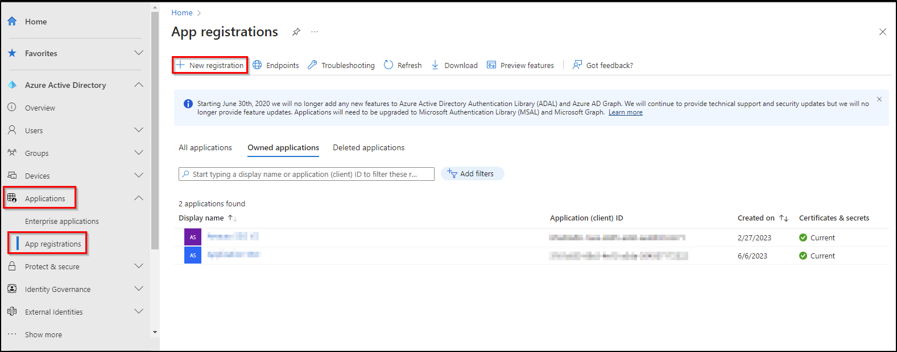

-  Enter **web** in the redirect URI and paste the return URL of your GLPI instance:

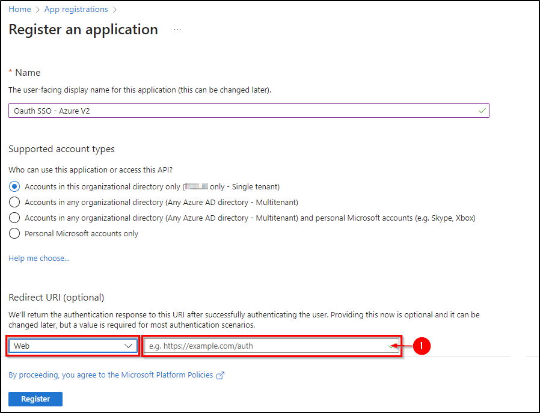

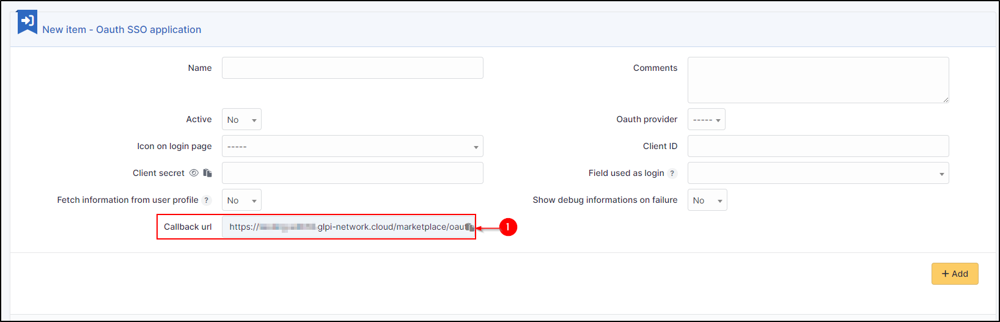

Secret and certificate
~~~~~~~~~~~~~~~~~~~~~~

-  In the **certificates and secrets** tab, create a new secret that will need to be transferred to your Oauth SSO application on the GLPI side:

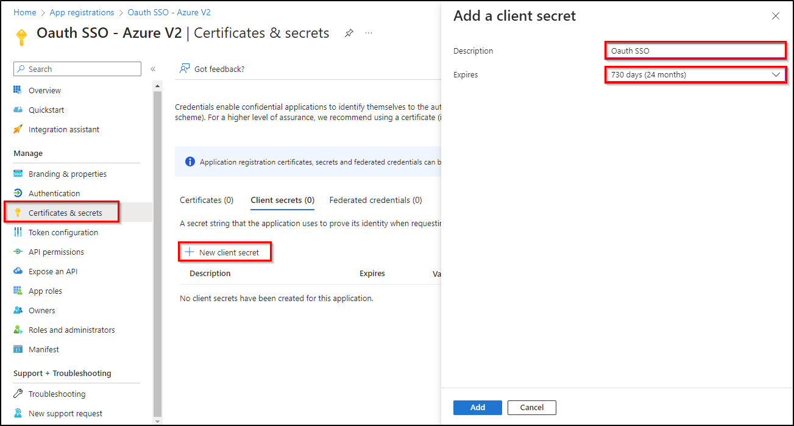

.. Warning::
   When you click on **add**, **the secret will only be available once**. As soon as you leave this page, **the secret will be hidden** and we will no longer be able to access it. Remember to **store it in a safe place** as we will need it later

   .. figure:: images/oauth-Entra-5bis.png
      :alt:
      :scale: 100 %

Claims
~~~~~~

.. Warning::
   If you are using **SSO V2**, an additional step is required. The **claims** on the Entra side **must be entered manually** and should preferably be of type **ID**.

- In the **Token configuration** tab
- Click on **Add an optional claim**
- Add the 4 claims below:

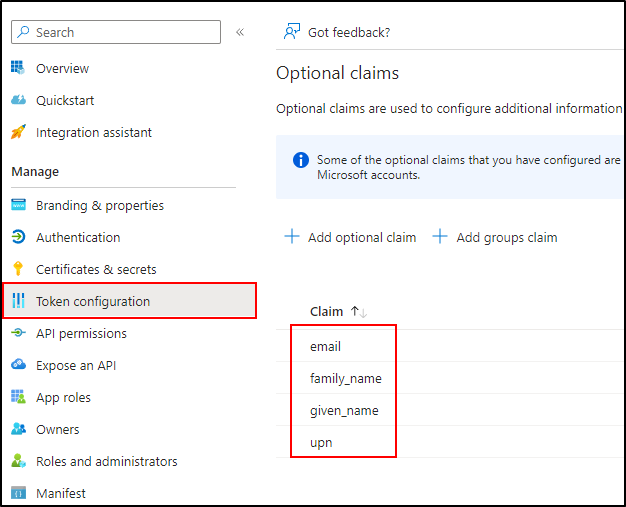

API authorisations
~~~~~~~~~~~~~~~~~~

GLPI must be able to read user information in order to use it for connection
- In **API permissions**
- Click on the API already present (Microsoft Graph for our example)

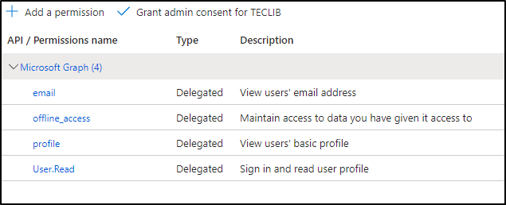

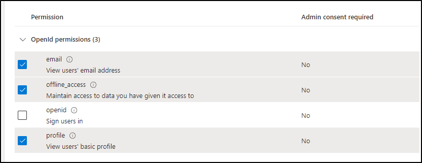

Select :

- email
- offline_access
- profile
- user.read

-  Then remember to save your changes.

Setup GLPI
~~~~~~~~~~

-  Entra AD provides a description with the essential information you need:

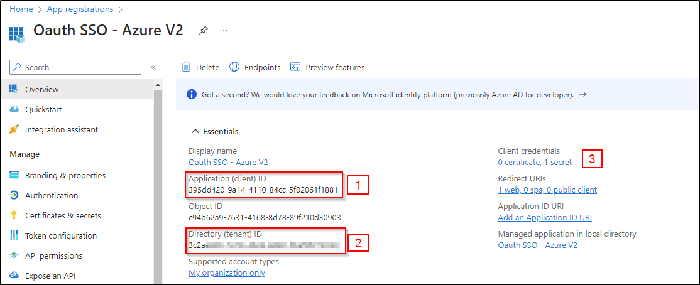

-  Specify an application **name** visible to end users.

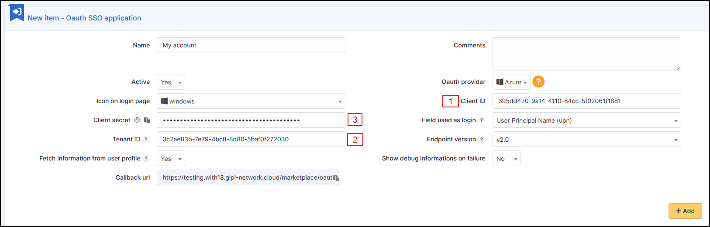

Copy the values from the fields above:

- Application ID
- The holder ID
- The **value** of the secret copied in the previous step

.. Warning::
   Please check that the **value** of the secret is filled in correctly.If the ID of the secret is copied, your application will fall into error.

Explanation of ID field
~~~~~~~~~~~~~~~~~~~~~~~

-  3 values are available in this insert:

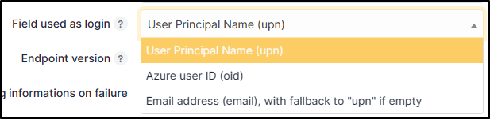

1) **User Principal Name (UPN)**: this option will show the full username of the user logging in (nom.prenom@mondomaine.com for example). If you want only the username to be visible (without the @mondomaine.com, see the **XXXXXXXXXX** paragraph).
2) **Entra user ID (OID)**: this option takes the object ID from the Entra AD. This ID will be used for the user login

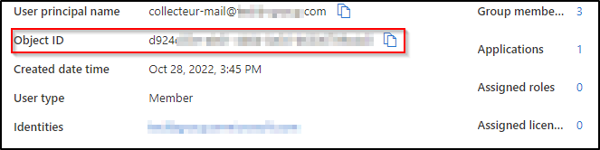

3) **Email address**: This option specifies the user’s email address. This field will be used for the login. If it is empty, the UPN will be used.

If you need to find your application in the Entra portal, select **Application subscriptions**, then **Display all applications**.
