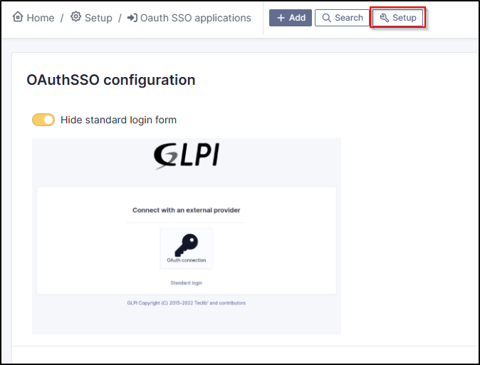

Forcing SSO authentication
--------------------------

Using the Oauth SSO application configuration, you can mask the internal database connection field to **force** the connection with your SSO application

(setup > Oauth SSO applications > setup)

